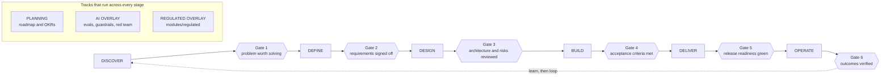

# Product Manager OS

**Run a product from discovery to sunset: gated templates, PM canon cards, and AI skills that work without AI.**

Six stages, six gates, a knowledge layer with named attribution, fill-in templates for every artifact a product needs, and optional AI layers stacked on top. It is a document system first and an AI system second. Every template works with a text editor and a pencil. The AI layers, boot prompts, skills, agents, and model routing, are accelerants on a format that stands without them.

Every prompt here is a file you can read. There is no wrapper, no account, and no hosted prompt you cannot inspect: this is a versioned prompt library in a git repository, which means you can fork it, diff it, and see exactly what changed between one version and the next. The four ways to run it are below, and the first one uses no model at all.

## Say "start"

The fastest way in is a conversation:

```bash
git clone https://github.com/RizwanZafaris/product-manager-OS.git
cd product-manager-OS
claude        # or any agent CLI that reads AGENTS.md
> start
```

That word wakes the Conductor, the interviewer defined in [os/CONDUCTOR.md](os/CONDUCTOR.md). It asks before it writes. One question at a time, each with a recommended default and lettered options, so most answers cost you one word. A vague answer gets cross-examined, at most twice, then parked visibly instead of accepted quietly. Every accepted answer lands immediately in your product workspace: in the template field it belongs to, and in `products/<name>/STATE.md`, the file that lets any later session, in any runtime, pick up exactly where you stopped. Say "resume" or "where are we" and it does.

The Conductor refuses to advance a stage until the stage's gate checklist passes on evidence, and it never signs; a named human does. No agent CLI at hand? The boot prompt in [system/BOOT-PROMPT.md](system/BOOT-PROMPT.md) runs the same interview in any chat model: you paste STATE.md at session start and save the updated sections it dictates back. And nothing below requires the Conductor at all; everything under it is the same template system, fillable with a pencil.

## The problem, first

A PM's tools are scattered. Discovery lives in one product, specs in another, delivery in a tracker, and judgment nowhere. The strongest open systems each own one segment: spec-kit owns spec-to-code, product-os owns discovery, BMAD owns agentic build. None of them chains discovery through requirements, architecture, delivery, and post-launch verification in one system. None carries a regulated overlay, a canon knowledge layer with named attribution, tiered model routing, or a whole-tree consistency gate.

This repository is the whole loop in one place, and it works without any AI at all. If the model is free-tier, offline, or wrong, the artifacts and gates still function. That is a design rule here, not a hope: graceful degradation is structural.

## The operating loop

One product runs through six stages. Each stage ends at a gate: a named checklist that must pass before the next stage opens. Gates are documents, not ceremonies. A gate passes when its checklist is filled in and signed.



Two tracks run across the loop rather than inside one stage. PLANNING (roadmap, OKRs) feeds every stage. The AI OVERLAY (eval specs, guardrails, red-team review) activates whenever the product itself contains a model. A third overlay, the regulated module, activates when the product operates under a financial or data regulator.

The loop is defined in [os/OPERATING-LOOP.md](os/OPERATING-LOOP.md), the gate checklists in [os/STAGE-GATES.md](os/STAGE-GATES.md), and a narrative walkthrough of a full pass in [os/HOW-TO-RUN-A-PRODUCT.md](os/HOW-TO-RUN-A-PRODUCT.md). Two shorter files answer the questions that come first in practice: [os/WHICH-DOCUMENT.md](os/WHICH-DOCUMENT.md) decides how much document a given decision deserves, and [os/PRODUCT-WORKSPACE.md](os/PRODUCT-WORKSPACE.md) says where the filled artifacts live once you have them.

## Four ways to run it

**Method 1: bare templates, no model.** Clone the repository, copy the template for the artifact you need, fill it in with any editor. The gates are checklists a human works through. Nothing in `knowledge/` or `templates/` depends on any AI layer existing.

**Method 2: any chat model.** Paste [system/BOOT-PROMPT.md](system/BOOT-PROMPT.md) into ChatGPT, Gemini, Claude, or a free model. It installs the operating loop, the gate discipline, the evidence-first rules, the team of roles, and the Conductor mode, with no file access assumed. When the session needs a specific template or role, paste the contents of the file it names, or a role block from [system/ROLE-PROMPTS.md](system/ROLE-PROMPTS.md). Whenever a prompt needs a file, it asks for it by exact repo path; the role blocks in [system/ROLE-PROMPTS.md](system/ROLE-PROMPTS.md) name every file they drive.

**Method 3: agent CLIs.** Claude Code reads [CLAUDE.md](CLAUDE.md), Codex and other agent runtimes read [AGENTS.md](AGENTS.md), and both pick up the procedures in `skills/` and the instruction files in `agents/`. Say "start" for the conducted interview above, or ask for the artifact you need directly; the router maps the request to the right skill and template.

**Method 4: API-driven with OmniRoute.** Point [routing/omniroute.config.json](routing/omniroute.config.json) at an OmniRoute instance and each pipeline stage calls its tier: extraction on a cheap tier, drafting on a coding tier, judgment on a frontier reasoning tier. Setup and the tier doctrine are in [routing/README.md](routing/README.md).

## Quickstart

Ten lines, no tooling.

```bash
git clone https://github.com/RizwanZafaris/product-manager-OS.git
cd product-manager-OS

cat os/OPERATING-LOOP.md            # the six stages and what each gate demands
cat os/WHICH-DOCUMENT.md            # how much document this decision deserves

cp templates/discovery/discovery-document.md my-product-discovery.md
# Fill every field with any editor. Angle-bracket fields are the blanks.
# Delete any section you do not need; an empty section is worse than no section.

cat os/STAGE-GATES.md               # take the filled document to Gate 1
```

A filled example is one file away: [examples/expense-copilot-discovery.md](examples/expense-copilot-discovery.md) is that same template answered end to end, and [examples/checkout-modernization-brownfield.md](examples/checkout-modernization-brownfield.md) shows the templates attached to a product that was already live and already messy.

## Module map

| Directory | Layer | Answers |
|---|---|---|
| [knowledge/](knowledge/INDEX.md) | Knowledge | WHY a method exists and when it misleads |
| [knowledge/roles/](knowledge/roles/INDEX.md) | Roles | WHO each product title is: what it owns, decides, and how it fails |
| [knowledge/domains/](knowledge/domains/INDEX.md) | Domains | WHERE the product plays: what a specific market changes about the loop |
| `templates/` | Templates | WHAT to produce at each stage |
| [learn/](learn/INDEX.md) | Learning | HOW to study the OS on fictional products before running a real one |
| `skills/`, `agents/` | Skills and agents | HOW to produce it with an AI runtime |
| `system/` | System prompts | WHO the model becomes |
| `routing/` | Routing | WITH WHICH model each task runs |
| `os/` | Operating loop | The six stages, the six gates, which document to write, and where filled artifacts live |
| [examples/](examples/README.md) | Worked examples | What a filled artifact looks like, greenfield and brownfield |
| [modules/regulated/](modules/regulated/README.md) | Regulated overlay | What a regulated AI feature must answer before it ships |

Dependencies point downward only. Templates cite knowledge cards, skills cite templates, system prompts cite skills and templates by repo path, routing serves all of them.

## Who you are and where you play

Two knowledge sub-layers answer the questions that arrive before any template does. [knowledge/roles/](knowledge/roles/INDEX.md) is the PM role map: an eight-rung ladder from Associate PM to CPO with the IC and management fork after Senior PM, the specializations, the PM and PMM boundary as a decision table, and what the same title means at a startup versus an enterprise. Rung names are marked directional, because titles are the least standardized vocabulary in software. [knowledge/domains/](knowledge/domains/INDEX.md) is ten market cards, ecommerce through AI products, each naming the gatekeepers who can stop a launch and the metrics practitioners are judged on, plus how each metric lies. Fintech is deliberately a pointer card: its domain pack is the regulated module below. Record your product's domain, or "none", in STATE.md at DISCOVER; the Gate 1 checklist asks for it.

## Learn mode

[learn/](learn/INDEX.md) teaches the OS the only way a document system can be taught: by making you fill it in. Three paths (foundations, transitioning into PM, senior sharpening), each a stepped sequence over fictional products with a capstone at a real gate checklist, a [library](learn/library.md) of attributed one-line book and podcast pointers, and a [tutor skill](learn/skills/tutor/SKILL.md) that quizzes and scores your filled artifacts the way the Conductor cross-examines answers. Practice work lives in `learn/products/<name>/`, never in `products/`, and is labeled as invented evidence throughout. Say "learn" or "quiz me" to enter. The layer depends downward only; delete the folder and the OS loses nothing but the curriculum.

## The regulated module

This repository does not assume a US software company. Discovery and compliance templates ask for markets, jurisdictions, and locales as first-class fields, the planning and roadmap material treats a regulator's calendar as something that outranks a RICE score, and the module below exists because a large share of the world's product work ships into a market with a supervisor in it.

`modules/regulated/` is a verbatim import of the regulated AI PRD system: a section-0 regulatory overlay, eval-set acceptance criteria, guardrails with owners, and its own review gate. Its canonical source is the standalone regulated-ai-prd repository (pre-release; it opens publicly at its v0.1 tag). The citation-bearing files inside it are byte-exact copies, pinned by hash in the quality gate, and are never edited in this repository. Fixes happen in the source repo and are re-copied here. The overlay activates at Gate 2 and Gate 5 whenever the product operates under a financial or data regulator; see [modules/regulated/README.md](modules/regulated/README.md).

## Quality gate

```bash
python3 lint.py --os
```

Standard library only. It enforces, across the whole tree: no banned characters, no banned metric literals, no unowned placeholders outside sanctioned fill-in fields, every relative link resolves, every template carries its Stage/Knowledge/Skill header, every skill has exactly the two required frontmatter fields, the byte-exact regulated files match their pinned hashes, every path named in a system prompt exists, and no secret-shaped strings anywhere. Green means the tree is consistent, not that any document in it is true.

## Versioning and stability

Within a major version, template field names and file paths do not change under you. A copy you filled in last quarter keeps matching the template it came from, and a link you wrote into your own documents keeps resolving. Renaming a field, moving or deleting a linked file, or changing what a gate demands is a breaking change; those happen only on a major version, and each one is named in [CHANGELOG.md](CHANGELOG.md) with the migration beside it. Additions, a new template, a new card, a new section, are minor versions and never disturb a document you already filled.

This is stated because the failure is common enough to plan for: systems in this category ship a redesign, existing users find their filled artifacts no longer match, and the advice on the forum becomes "roll back and stay there". The changelog also carries a known-gaps list, because a release note that only lists wins is marketing.

## What this is not

- **Not a replacement for talking to customers.** The discovery templates demand interview evidence; they do not generate it.
- **Not an autopilot.** Gates are signed by people with the standing to stop a stage. A gate nobody can fail is a ceremony.
- **Not a claim that a model's output is evidence.** Evidence-thin input produces confident-sounding, thin output. The gates exist to catch exactly that.
- **Not legal or regulatory advice.** The regulated module tells you which questions to answer and where the primary text sits, never what the answer is in your entity or license class.

## Scope and sunset

The knowledge layer covers eleven canonical methods with named attribution and an index of eighteen more; it grows slowly and only with attribution. The roles and domains sub-layers follow the same rule, and a domain card graduates to a template pack only when the card proves insufficient in real use. The learn layer covers exactly three paths and one tutor; it is curriculum over the existing tree, adds no infrastructure, and is deleted before it is allowed to rot. The regulated overlay covers exactly what its source repository covers, no more, and inherits that repository's currency policy: citations carry verification dates, and staleness fails the gate rather than looking maintained. If maintenance of this repository stops, an ARCHIVED notice will go at the top of this README with the date, instead of the repository quietly rotting.

## License

MIT. See [LICENSE](LICENSE).
