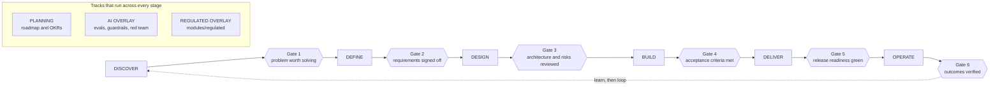

# Product Manager OS

**An evidence-to-decision workspace for technical PMs who need traceability across discovery, PRD and review.** Every claim in a document traces to evidence, every requirement traces back to the discovery that justified it, and every stage advance traces to a named person who signed it, or to a waiver naming who overrode it and why. Payments is the initial pilot segment its regulated overlay and fourteen financial-services domain cards were built against, not a claim of comprehensive compliance for payments or any other regulated industry: read [the regulated module](#the-regulated-module) before you rely on it for one.

A PM's tools are usually scattered: discovery in one product, specs in another, delivery in a tracker, judgment nowhere. This repository is six gated stages, a knowledge layer with named attribution, runnable framework worksheets, a fill-in template for every artifact a product needs, and optional AI layers on top of all of it. It is a document system first and an AI system second: every template works with a text editor alone, and the AI layers, boot prompts, skills, agents, and model routing, are accelerants on a format that stands without them. The exact limit of that claim is in the [quality gate](#quality-gate) section below. How it compares to spec-kit, BMAD-METHOD, Product-Manager-Skills, ChatPRD, and template packs, dated and re-checked 2026-09-15, is in [docs/COMPARISON.md](docs/COMPARISON.md).

## Start Here

One default path, because choosing infrastructure should never be the first thing a new PM does here: the document workspace, no model, no account, nothing beyond Python's standard library.

**See it filled in first.** [examples/expense-copilot-journey.md](examples/expense-copilot-journey.md), the Ledgerline Copilot journey, is the canonical worked example: a fictional expense-report copilot carried from an understood problem through vision, strategy and roadmap to a development-ready handoff at Gate 3, with every artifact, date and decision in one data sheet so nothing in the chain contradicts anything else. Read it before you fill your own; it shows what a filled artifact that would survive a gate review looks like, gaps and all.

**Then run this**, from a clone, to build a real workspace and fill its first artifact:

```bash
git clone https://github.com/RizwanZafaris/product-manager-OS.git
cd product-manager-OS
python3 tools/init_product.py ledgerline --add templates/discovery/problem-framing.md
python3 tools/init_product.py ledgerline --check
```

The first command copies the problem-framing template into `products/ledgerline/discovery/problem-framing.md` and rewrites its links for that destination. Run today against this tree, it printed:

```
copied: templates/discovery/problem-framing.md -> products/ledgerline/discovery/problem-framing.md
   2 link(s) rewritten, 2 relative link(s) re-resolved from the destination and found
     ../../knowledge/INDEX.md -> ../../../knowledge/INDEX.md
     ../../skills/persona-builder/SKILL.md -> ../../../skills/persona-builder/SKILL.md
```

The second command re-resolves every link in the workspace and copies nothing. It printed:

```
products/ledgerline/discovery/problem-framing.md: ok
products/ledgerline/: 1 file(s), 0 broken link(s).
```

**Outcome.** A problem-framing document in your own product workspace, its links pointing at the two knowledge cards it names, ready to fill with an editor. **Next action.** Fill in every square-bracket field, then take it, along with the rest of the DISCOVER inputs [os/STAGE-GATES.md](os/STAGE-GATES.md) names, to Gate 1. `cat os/WHICH-DOCUMENT.md` first if you are unsure how much document this decision deserves.

**To see the runtime enforce all six gates**, read [examples/journey-run.md](examples/journey-run.md): the `pmos` command line answering 54 questions and proving every gate on a fictional product, then refusing to call it complete once a gate's proof changes. `python3 tools/journey_record.py --check` re-runs it and compares, and CI does the same on every commit.

That is the whole default path. Everything past this point, the six-stage loop, the pmos runtime, the Claude Code plugin, model routing, is optional depth you reach for when the default path stops being enough, covered under [Supported paths](#supported-paths) below.

## The operating loop

One product runs through six stages: DISCOVER; DEFINE, which opens with the product's vision, strategy and roadmap before its definition set; DESIGN; BUILD; DELIVER; OPERATE. Each stage ends at a gate, a named checklist worked before the next stage opens. Gates are documents, not ceremonies: a gate passes when its checklist is filled in and signed, and a stage opened without that leaves a waiver on the record saying so.



**Gate 3 is the development-handoff point.** DESIGN closes by handing engineering a development-ready package: `templates/architecture/development-handoff.md`, filled with links to the workspace artifacts that carry each of its nine required sections, then checked with `pmos handoff`. A product is development-ready only once Gates 1 through 3 are approved and none is stale, the handoff artifact exists, every required section links a real artifact or carries an explicit `N/A because` line, and every linked artifact actually resolves; a `Gap:` line or a broken link blocks the designation and names which. That is the mechanism the [Supported paths](#supported-paths) table below calls "development handoff for downstream agents."

Every phase-linked framework, template and filled example, generated from the declarations already in the tree rather than hand-maintained, is in [docs/PHASE-INDEX.md](docs/PHASE-INDEX.md). The loop itself is defined in [os/OPERATING-LOOP.md](os/OPERATING-LOOP.md), the six gate checklists in [os/STAGE-GATES.md](os/STAGE-GATES.md), and a narrative walkthrough of a full pass in [os/HOW-TO-RUN-A-PRODUCT.md](os/HOW-TO-RUN-A-PRODUCT.md).

Two tracks run across the loop rather than inside one stage. PLANNING (roadmap, OKRs) feeds every stage. The AI OVERLAY activates whenever the product itself contains a model, and the regulated overlay activates when the product contains an AI or machine-learning feature and a financial or data regulator applies to it, the scope its two cited instruments actually cover; see [the regulated module](#the-regulated-module) below.

## The complete example journey

[examples/expense-copilot-journey.md](examples/expense-copilot-journey.md), the Ledgerline Copilot journey, is the canonical fictional journey behind this README and behind the Start Here path above. It indexes fourteen artifacts, from the problem framing that opens DISCOVER to the development handoff that closes DESIGN at Gate 3: vision, product strategy and roadmap at DEFINE alongside the PRD and its acceptance criteria; an ADR, a data model, an API contract, a decision log, a dependency register and a risk register at DESIGN; and the development handoff itself, linking all thirteen other artifacts across its nine required sections with no `Gap:` line. Every date, id, and rejected option in the chain is fixed in advance in one data sheet, so a later writer can only contradict it by choice, not by accident, and every figure in it is invented and marked ILLUSTRATIVE. Gate 1 (2026-08-14), Gate 2 (2026-08-28) and Gate 3 (2026-09-11) are each recorded as fictional sign-offs, with a named signer for every line, including the honest gap where one small internal build has the same person sign both of Gate 3's engineering lines rather than inventing a security lead the team does not have.

Two more journeys carry a product further than this one does: [examples/ledgerline-journey.md](examples/ledgerline-journey.md) picks up where the Copilot journey ends and runs PLANNING through OPERATE, including a killed pricing experiment and a post-pivot growth plan, and [examples/sahulat-journey.md](examples/sahulat-journey.md) runs a different fictional product from DISCOVER to a Gate 6 PIVOT. [examples/harbourgate-journey.md](examples/harbourgate-journey.md) takes a brownfield product from Gate 4 through Gate 6 PERSIST and a legacy system's retirement. Read [examples/README.md](examples/README.md) for the full index and how the journeys relate to the single-file, standalone examples that fill one template apiece.

## Supported paths

Six ways to touch this tree, and they give a caller different capabilities: reading a document is not the same operation as approving a gate, and a client that can do one does not necessarily do the other. The full capability matrix, checked per capability and per client against the code that implements it, is in [docs/COMPATIBILITY.md](docs/COMPATIBILITY.md).

| Path | What it gives you | Status |
|---|---|---|
| Plain Markdown, no model | Every template, framework, knowledge card and gate, readable and fillable with any editor | tested: `python3 lint.py --os` runs on every push |
| Obsidian, as a Markdown editor | The same files, plus frontmatter as properties; a full local editor over the tree with no domain validation on the edit itself | supported for reading and editing raw Markdown; it is not a validated client, and an edit made there is checked the same way any other direct edit is, the next time something asks the runtime for status |
| The `pmos` CLI | A local SQLite store, the Conductor interview, approvals bound to artifact content, phase status, and the development handoff, with no model or network requirement | tested: the root unit suites in CI, on Python 3.11 and 3.13 |
| The Claude Code plugin | One slash command per route, generated from the manifest | instruction-only by design: every command hands you a plan and the governing files to read, places no model call of its own, writes nothing, and signs no gate |
| The desktop MCP adapter | A read-only `pmos_status` tool, proven equal to the CLI's own phase report for the same product | tested for generation and for `pmos_status`; a live client's handshake is untested |
| Development handoff, for downstream agents | `pmos handoff` writes `handoff/CONTEXT.md` and `handoff/context-index.json`, so an implementing agent has one file to read rather than the whole workspace | tested: `tests/test_pmos_handoff.py`; the Claude Code plugin's `build-development-handoff` route is instruction-only and tells the agent to run this command itself |

**The Obsidian control-station UI is deferred by the owner, not fixed.** A browser or Obsidian client cannot yet acquire local approval authority through the same validated commands the CLI and agents share; where the matrix above reads "supported" for Obsidian, it means a raw Markdown read or edit outside any validation, which is exactly that gap, not a substitute for the deferred service. `.obsidian/` today configures reading and navigation only: core plugins, no Bases, no community plugin.

<details>
<summary><strong>Advanced: the local runtime, in full, and model routing</strong></summary>

Use the local runtime when you need durable local transactions, queue and memory semantics, policy checks, migration, or offline provenance, beyond what the plain document workspace gives you. It is standard-library Python end to end:

```bash
python3 -m venv .venv
. .venv/bin/activate
python -m pip install --no-index .
pmos init --path ./products/my-product --product-id checkout
pmos status --path ./products/my-product
pmos verify --path ./products/my-product
```

Run today against a fresh copy of this tree, `pmos init` printed (product id and database path are local to the machine that ran it):

```
ok: True
status: initialized
product_id: checkout
onboarding: {"evidence_class": "interview_claim", "next": "submit a real answer with `pmos answer`", "question": "Who exactly has this problem?", "question_id": "DISCOVER-1", "revision": "1:<sha256>", "status": "question"}
verification: {"errors": [], "ok": true}
```

`pmos status` continues with the same information as JSON, plus a `phases` array, one entry per stage, each carrying its state, its unmet gate lines, and the exact next command; `pmos verify` printed `ok: True` with an empty `errors` list. `pmos` creates only local state under `./products/my-product/.pmos/`, out of git, and it does not contact a provider by default. Read [docs/RUNTIME-QUICKSTART.md](docs/RUNTIME-QUICKSTART.md) before migrating an existing workspace, producing a development handoff, or producing a provenance manifest.

**Model routing is optional and off by default.** The runtime can route through a standard-library OpenRouter adapter, or you can keep the existing [routing/omniroute.config.json](routing/omniroute.config.json) setup with OmniRoute. Both are optional provider boundaries the runtime never calls unless you invoke it. Setup, tier doctrine, dynamic discovery, and the free-model limits are in [routing/README.md](routing/README.md); what crosses that boundary and what local controls do not prove is in [SECURITY.md](SECURITY.md).

**Agent CLIs.** Claude Code reads [CLAUDE.md](CLAUDE.md), Codex and other agent runtimes read [AGENTS.md](AGENTS.md), and both pick up the procedures in `skills/` and the instruction files in `agents/`. Say "start" for a conducted interview that lands every accepted answer in your product workspace and in `products/<name>/STATE.md`, or ask for the artifact you need directly. No agent CLI at hand? The boot prompt in [system/BOOT-PROMPT.md](system/BOOT-PROMPT.md) runs the same interview in any chat model: paste `STATE.md` at session start and save the updated sections it dictates back.

</details>

## Documentation navigation

| Ask | Read |
|---|---|
| What stage is my product in, and what does its gate need? | [os/OPERATING-LOOP.md](os/OPERATING-LOOP.md), [os/STAGE-GATES.md](os/STAGE-GATES.md) |
| How much document does this decision deserve? | [os/WHICH-DOCUMENT.md](os/WHICH-DOCUMENT.md) |
| Which framework, template and example feed a given phase? | [docs/PHASE-INDEX.md](docs/PHASE-INDEX.md) |
| What has actually been run, on what, with what result? | [docs/COMPATIBILITY.md](docs/COMPATIBILITY.md) |
| How does this compare to spec-kit, BMAD, Product-Manager-Skills, ChatPRD, and template packs? | [docs/COMPARISON.md](docs/COMPARISON.md) |
| How validated is the domain and role catalog? | [docs/COVERAGE.md](docs/COVERAGE.md) |
| What is this repository's security and credential model, per path? | [SECURITY.md](SECURITY.md) |
| What must be true before a release, that this repository cannot attest to itself? | [docs/readiness/external-gates.json](docs/readiness/external-gates.json) |
| Why is a rule shaped this way, and what is the strongest argument against it? | [docs/PHILOSOPHY.md](docs/PHILOSOPHY.md) |
| What does a word mean here specifically, versus in the industry? | [GLOSSARY.md](GLOSSARY.md) |
| What changed, release by release, including the known gaps? | [CHANGELOG.md](CHANGELOG.md) |

## What's inside

[templates/README.md](templates/README.md) catalogs all 108 blanks by stage; every other count below is computed the same way, straight from the tree.

| Count | What | Where to start |
|---|---|---|
| 108 templates in 8 folders | Blanks for every artifact a product needs | [templates/](templates/README.md) |
| 64 framework worksheets in 9 groups | Runnable methods with scales, formulas, and arithmetic | [frameworks/](frameworks/README.md) |
| 47 industry domain cards, 41 with a worked example | What a specific market changes about the loop | [knowledge/domains/](knowledge/domains/README.md), coverage in [docs/COVERAGE.md](docs/COVERAGE.md) |
| 15 design cards and 11 canon cards | Named attribution, licensed sources, and honest limits | [knowledge/](knowledge/README.md), [knowledge/design/](knowledge/design/README.md), [docs/REFERENCES-DESIGN.md](docs/REFERENCES-DESIGN.md) |
| 233 filled examples including 4 end-to-end journeys | See it filled in before you fill your own | [examples/README.md](examples/README.md) |
| Role ladder: 8 rungs, 7 specializations, 0 with a worked example yet | Who each title is, what they own, and how they fail | [knowledge/roles/ladder.md](knowledge/roles/ladder.md), [knowledge/roles/specializations.md](knowledge/roles/specializations.md) |
| 29 skills, 12 agents, 4 learning paths | AI runtime procedures, or ignore them and use pencil | [skills/](skills/README.md), [agents/](agents/README.md), [learn/](learn/README.md) |

Every count above was computed from this tree at commit `558e37c`; the exact commands are in this slice's handoff notes. Domain and role coverage, including which columns read "none recorded" and why, is the full subject of [docs/COVERAGE.md](docs/COVERAGE.md).

## Implemented, verified, experimental, and planned

These four words mean different things here, and this repository does not blur them.

- **Implemented.** Working code or a working document with passing local tests: the six-stage loop and its gate checklists, the template and framework layers, the `pmos` runtime (store, Conductor, approvals, phase status, development handoff, migration), the desktop adapter's generation and `pmos_status` tool, the Claude Code plugin's route generation, and the four example journeys. "Implemented" means the local suite is green; it is not a claim about anyone but the maintainer having run it.
- **Independently verified.** Reviewed and accepted by someone who did not write the change, against the exact commit, with the finding recorded. As of this tree, that applies to one narrow scope: a legacy daily-budget-gate fix (S01), recorded in this remediation round's ledger. Nothing else in this repository, no template, no runtime command, no example journey, carries an independent review record yet; most of the runtime work above is implemented with independent review pending, and that distinction is not cosmetic; a green local test suite and an accepted external review are different claims, and this file will say "independently verified" for a capability only once a reviewer who did not write it has recorded that verdict against the commit.
- **Experimental, or not yet integrated.** The OpenRouter model-routing tooling and its dated capability tables in [docs/COMPATIBILITY.md](docs/COMPATIBILITY.md); the Obsidian control-station UI, explicitly deferred by the owner rather than built; and the typed integration adapters in `pmos/operations.py`, which are bounded in-memory conformance doubles until a real vendor sandbox is authorized, detailed in [docs/COMPATIBILITY.md](docs/COMPATIBILITY.md#integration-doubles-not-deployed-integrations).
- **Planned, external, and outside this repository's own authority.** Hosted CI on a release commit, live-provider smoke tests, vendor-sandbox conformance, a non-maintainer completing the golden path, an independent team's release-candidate review, organization-specific regulatory approval, and a published release artifact with provenance: seven gates this repository cannot self-attest, tracked in [docs/readiness/external-gates.json](docs/readiness/external-gates.json) with the evidence each one needs.

**Local evidence is not external evidence.** A green local test run proves only the executable local contract stated above; it does not establish real-user validation, authenticated team approval, or launch readiness, and nothing in this repository claims otherwise.

## The regulated module

This repository does not assume a US software company. Discovery and compliance templates ask for markets, jurisdictions, and locales as first-class fields, and `modules/regulated/` exists because a large share of the world's product work ships into a market with a supervisor in it. It is a verbatim import of the regulated AI PRD system, covering exactly two instruments, both about AI and machine learning: the CBUAE Guidance Note on consumer protection and AI/ML adoption by licensed financial institutions, and EU AI Act Annex IV technical documentation fields. The overlay activates at Gate 2 and Gate 5 only when the product contains an AI or machine-learning feature and a financial or data regulator applies to it; a conventional regulated product with no model in it gets no coverage here, and that gap is named, with what to do instead, in [os/STAGE-GATES.md](os/STAGE-GATES.md). Payments is the industry this overlay and the fourteen financial-services domain cards were built and checked against first; it is the initial pilot segment, not a certification for any other regulated market, and never legal or regulatory advice on its own. See [modules/regulated/README.md](modules/regulated/README.md).

## Quality gate

```bash
python3 lint.py --os
```

Standard library only. It enforces, across the whole tree: no banned characters, no banned metric literals, no unowned placeholders outside sanctioned fill-in fields, every relative link resolves inside the repository and lands on a tracked file, every template carries its Stage/Knowledge/Skill header, every skill has exactly the two required frontmatter fields, all five imported regulated files match their pinned hashes, every path named in a system prompt exists, no credential-shaped string anywhere, every file in the six declaring layers carries a graph declaration whose layer, stage, gate, and feeds paths hold, and every wikilink lands on a tracked file or a uniquely declared alias. Green means the tree is consistent, not that any document in it is true.

The local-runtime gates are separate and executable: `python3 tools/ci_gate.py` runs the checked runtime suites (24 gates as of this tree), while `python3 tools/readiness.py --local` evaluates the fixed local engineering rubric on a clean commit. Neither command makes an external gate pass; the required external evidence is deliberately listed separately in [docs/readiness/external-gates.json](docs/readiness/external-gates.json).

The front page says every template works with a text editor alone. Stated precisely, because the strong version of that sentence does not survive contact: you can run this tree with no model at all, and you cannot delete a content layer and keep a green quality gate. `harness/adapters/claude-code/README.md` documents the one deletion the gate is built to support (`harness/` itself); deleting a content layer such as `skills/`, `agents/`, `system/`, or `routing/` fails the link gate in the hundreds, because every template points up at the procedure that drives it. The document layers are usable with no model and no AI layers present; a fork that deletes a layer has chosen to give up the gate or to fix the links it broke. Full detail, including which of the 22 gates survive the one supported deletion, is in [CHANGELOG.md](CHANGELOG.md).

## Versioning and stability

Within a major version, template field names and file paths do not change under you. A copy you filled in last quarter keeps matching the template it came from, and a link you wrote into your own documents keeps resolving. Renaming a field, moving or deleting a linked file, or changing what a gate demands is a breaking change; those happen only on a major version, and each one is named in [CHANGELOG.md](CHANGELOG.md) with the migration beside it.

**What a minor version does and does not promise.** A document you filled keeps its fields, keeps its paths, and keeps rendering. It does not stay current with the template it came from, and it may no longer clear the current gate: a template can grow required sections in a minor release, and a document filled against the older shape will report those sections as missing if it is checked again. If you hold an older filled document, keep it as the record of what was decided, and diff it against the current template before it has to pass a gate again.

**Nothing here has been released, and the tags say so.** The newest tag in this repository is v0.4.0 while [CHANGELOG.md](CHANGELOG.md) describes work through an unreleased 0.8.0, and that gap is deliberate: a tag is a claim that something was cut, checked and published, and none of that has happened yet. There is no release artifact, no provenance manifest, no digest, and no rollback artifact. Publishing one is gated on EXT-RELEASE in [docs/readiness/external-gates.json](docs/readiness/external-gates.json). Read the version numbers in [CHANGELOG.md](CHANGELOG.md) as a record of what changed, not as releases you can pin to; if you want a fixed point, pin a commit.

## What this is not

- **Not a replacement for talking to customers.** The discovery templates demand interview evidence; they do not generate it.
- **Not an autopilot.** Gates are signed by people with the standing to stop a stage. A gate nobody can fail is a ceremony.
- **Not a claim that a model's output is evidence.** Evidence-thin input produces confident-sounding, thin output. The gates exist to catch exactly that.
- **Not legal or regulatory advice.** The regulated module tells you which questions to answer and where the primary text sits, never what the answer is in your entity or license class.
- **Not an external-readiness certificate.** This repository cannot self-attest a hosted run, a live provider, a vendor sandbox, a non-maintainer journey, an independent team review, a regulated deployment, or a published release.

Each of those five refusals comes from a belief, argued rather than asserted, each with the strongest counter-argument against it, in [docs/PHILOSOPHY.md](docs/PHILOSOPHY.md).

## Scope and sunset

The knowledge layer covers eleven canonical methods with named attribution and an index of eighteen more; it grows slowly and only with attribution. The frameworks layer holds a worksheet only where a template, a skill, or a gate needs its output. The roles and domains sub-layers follow the same rule, and per the coverage matrix in [docs/COVERAGE.md](docs/COVERAGE.md), a role or domain gets a worked example only where a real pilot exposes a need for one, never to raise a coverage count on its own. The learn layer covers exactly four paths and one tutor; it is curriculum over the existing tree, adds no infrastructure, and is deleted before it is allowed to rot. The regulated overlay covers exactly what its source repository covers, no more. If maintenance of this repository stops, an ARCHIVED notice will go at the top of this README with the date, instead of the repository quietly rotting.

## License

MIT. See [LICENSE](LICENSE).
