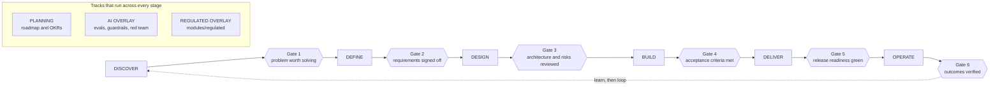

# Product Manager OS

**Run a product from discovery to sunset: gated templates, PM canon cards, and AI skills that work without AI.**

Six stages, six gates, a knowledge layer with named attribution, runnable framework worksheets, fill-in templates for every artifact a product needs, and optional AI layers stacked on top. It is a document system first and an AI system second. Every template works with a text editor and a pencil. The AI layers, boot prompts, skills, agents, and model routing, are accelerants on a format that stands without them. Stated precisely, because the strong version of that sentence does not survive contact: you can run this tree with no model at all, and you cannot delete a content layer and keep a green quality gate. The exact limit is in the quality gate section below.

Every prompt here is a file you can read. The document path has no account, hosted prompt, or hidden wrapper; the optional local runtime is equally inspectable Python under `pmos/`. This remains a versioned system in a git repository: you can fork it, diff it, and see what changed. The manual document path and the local runtime need no model. And one more thing you can inspect: the document system through 0.7.1 was built with Claude Code by a working payments CPO; the 0.8.0 runtime hardening was implemented and red-teamed with OpenAI Codex agents. AI-assisted non-merge commits identify the tool in their trailers, and the prompts and policies remain files you can read and argue with. [docs/FAQ.md](docs/FAQ.md) answers what that means for what you should audit hardest here, since the label matters less than which parts of a tree a model is good at producing and bad at grounding.

## Say "start"

The fastest way in is a conversation:

```bash
git clone https://github.com/RizwanZafaris/product-manager-OS.git
cd product-manager-OS
claude        # or any agent CLI that reads AGENTS.md
> start
```

That word wakes the Conductor, the interviewer defined in [os/CONDUCTOR.md](os/CONDUCTOR.md). It asks before it writes. One question at a time, each with a recommended default and lettered options, so most answers cost you one word. A vague answer gets cross-examined, at most twice, then parked visibly instead of accepted quietly. Every accepted answer lands immediately in your product workspace: in the template field it belongs to, and in `products/<name>/STATE.md`, the file that lets any later session, in any runtime, pick up exactly where you stopped. Say "resume" or "where are we" and it does.

The Conductor never advances a stage on its own judgment: it renders the stage's gate checklist, marks each line pass, fail, or unknown against the evidence, and stops. It never signs; a named human does. If you insist on going past a gate that did not pass, it does not refuse, because it has standing to record and not to veto. It asks the stage's two forced questions first, then writes a waiver naming who insisted, on what date, which checklist line is still unmet, what that risks, and who objected, and it opens the next stage saying out loud that it was waived. No agent CLI at hand? The boot prompt in [system/BOOT-PROMPT.md](system/BOOT-PROMPT.md) runs the same interview in any chat model: you paste STATE.md at session start and save the updated sections it dictates back. And nothing below requires the Conductor at all; everything under it is the same template system, fillable with a pencil.

## The problem, first

A PM's tools are scattered. Discovery lives in one product, specs in another, delivery in a tracker, and judgment nowhere. The strongest open systems each own one segment: [spec-kit](https://github.com/github/spec-kit) owns spec-to-code, [product-os](https://github.com/topics/product-os) owns discovery, [BMAD](https://github.com/bmad-code-org/BMAD-METHOD) owns agentic build. None that I found (as of September 2026) chains discovery through requirements, architecture, delivery, and post-launch verification in one system. None carries a regulated overlay, a canon knowledge layer with named attribution, tiered model routing, or a whole-tree consistency gate.

Those four claims are written as falsifiable statements, each with what would disprove it, in [docs/COMPARISON.md](docs/COMPARISON.md), alongside a dated side-by-side of the alternatives and the rows where each of them beats this one. Read that file before adopting this one; it also names the binding constraint that should send you elsewhere, and the common configuration is running two of these systems together rather than picking one.

This repository is the whole loop in one place, and it works without any AI at all. If the model is free-tier, offline, or wrong, the artifacts and gates still function. That is a design rule here, not a hope: graceful degradation is structural.

## The operating loop

One product runs through six stages. Each stage ends at a gate: a named checklist to be worked before the next stage opens. Gates are documents, not ceremonies. A gate passes when its checklist is filled in and signed, and a stage opened without that leaves a waiver on the record saying so.

What a gate is worth is worth stating plainly, because the overclaim is easy to write and easy to break. A gate is prose plus a human signature. Nothing binds a signature to the bytes of the artifact it approved, so editing an approved PRD does not stale its approval; nothing checks a typed name; nothing stops an author from signing their own document. What you get is that an unreviewed document is visibly unreviewed and a skipped gate carries a named waiver instead of silence. That is a discipline, not a control, and it will not stop a person willing to lie to it.



Two tracks run across the loop rather than inside one stage. PLANNING (roadmap, OKRs) feeds every stage. The AI OVERLAY (eval specs, guardrails, red-team review) activates whenever the product itself contains a model. A third overlay, the regulated module, activates when the product contains an AI or machine-learning feature and a financial or data regulator applies to it, which is the scope the module's two cited instruments actually cover.

The loop is defined in [os/OPERATING-LOOP.md](os/OPERATING-LOOP.md), the gate checklists in [os/STAGE-GATES.md](os/STAGE-GATES.md), and a narrative walkthrough of a full pass in [os/HOW-TO-RUN-A-PRODUCT.md](os/HOW-TO-RUN-A-PRODUCT.md). Two shorter files answer the questions that come first in practice: [os/WHICH-DOCUMENT.md](os/WHICH-DOCUMENT.md) decides how much document a given decision deserves, and [os/PRODUCT-WORKSPACE.md](os/PRODUCT-WORKSPACE.md) says where the filled artifacts live once you have them.

## Five ways to run it

**Method 1: bare templates, no model.** Clone the repository, copy the template for the artifact you need, fill it in with any editor. The gates are checklists a human works through. No document in `knowledge/`, `frameworks/`, `templates/`, or `os/` needs an AI layer to be readable or fillable: where a template names a skill, that is a pointer to a procedure, not a dependency you have to satisfy. What those pointers do cost you is the gate, and that is said plainly in the quality gate section below.

**Method 2: any chat model.** Paste [system/BOOT-PROMPT.md](system/BOOT-PROMPT.md) into ChatGPT, Gemini, Claude, or a free model. It installs the operating loop, the gate discipline, the evidence-first rules, the team of roles, and the Conductor mode, with no file access assumed. When the session needs a specific template or role, paste the contents of the file it names, or a role block from [system/ROLE-PROMPTS.md](system/ROLE-PROMPTS.md). Whenever a prompt needs a file, it asks for it by exact repo path; the role blocks in [system/ROLE-PROMPTS.md](system/ROLE-PROMPTS.md) name every file they drive.

**Method 3: agent CLIs.** Claude Code reads [CLAUDE.md](CLAUDE.md), Codex and other agent runtimes read [AGENTS.md](AGENTS.md), and both pick up the procedures in `skills/` and the instruction files in `agents/`. Say "start" for the conducted interview above, or ask for the artifact you need directly; the router maps the request to the right skill and template.

**Method 4: local PMOS runtime.** Install the dependency-free `pmos` package and use its local SQLite store, transactional commits, leased queue, scoped memory, deterministic Conductor, migrations, provenance, policy hooks, and typed integration seams. The runtime has no model or network requirement. Its golden path and recovery path are in [docs/RUNTIME-QUICKSTART.md](docs/RUNTIME-QUICKSTART.md).

**Method 5: API-driven model routing.** The runtime can route through the standard-library OpenRouter adapter, or you can keep the existing [routing/omniroute.config.json](routing/omniroute.config.json) setup with OmniRoute. Both are optional provider boundaries. Setup, tier doctrine, dynamic discovery, and the free-model limits are in [routing/README.md](routing/README.md); what crosses either boundary and what local controls do not prove is in [SECURITY.md](SECURITY.md).

## Quickstart

Standard library Python, nothing to install.

```bash
git clone https://github.com/RizwanZafaris/product-manager-OS.git
cd product-manager-OS

cat os/OPERATING-LOOP.md            # the six stages and what each gate demands
cat os/WHICH-DOCUMENT.md            # how much document this decision deserves

python3 tools/init_product.py my-product
python3 tools/init_product.py my-product --add templates/discovery/discovery-document.md
# Fill every field with any editor. Square-bracket fields are the blanks.
# Delete any section you do not need; an empty section is worse than no section.

python3 tools/init_product.py my-product --check   # every link still resolves
cat os/STAGE-GATES.md                              # take the filled document to Gate 1
```

The first command builds the workspace [os/PRODUCT-WORKSPACE.md](os/PRODUCT-WORKSPACE.md) defines, one folder per stage, and seeds `STATE.md` from its blank. The second copies one template into the stage folder it belongs in, which for a discovery document is `products/my-product/discovery/`, not the workspace root.

Use the tool rather than `cp`, for one reason worth knowing. A template's links are written from where the blank lives: the discovery document reaches its knowledge card as `../../knowledge/torres-continuous-discovery.md`, which is correct from `templates/discovery/` and wrong from anywhere else. Copy that file by hand into a workspace and all four of its links point at directories that have never existed; the PRD carries thirty-five links with the same property. `--add` recomputes each link from the real depth of the destination, then re-resolves every one of them from the destination and refuses the copy if a single link fails, because a copy tool that produces broken links is the defect rather than the fix. `--check` runs that same verification over a workspace you already have. Copying by hand still works, and you then own the links.

A filled example is one file away: [examples/expense-copilot-discovery.md](examples/expense-copilot-discovery.md) is that same template answered end to end, and [examples/checkout-modernization-brownfield.md](examples/checkout-modernization-brownfield.md) shows the templates attached to a product that was already live and already messy.

## Local runtime quick path

The document workspace above is the portable record. Use the optional local runtime when you need durable local transactions, queue and memory semantics, policy checks, migration, or offline provenance:

```bash
python3 -m venv .venv
. .venv/bin/activate
python -m pip install --no-build-isolation .
pmos init --path ./my-product --product-id my-product
pmos status --path ./my-product
pmos verify --path ./my-product
```

`pmos` creates only local state under `./my-product/.pmos/`; it does not contact a provider by default. Read [docs/RUNTIME-QUICKSTART.md](docs/RUNTIME-QUICKSTART.md) before migrating an existing workspace or producing a provenance manifest.

**Local evidence is not external evidence.** A local green run proves only the executable local contract. Hosted CI, live provider behavior, vendor sandboxes, non-maintainer use, independent human review, organization-specific regulatory approval, and release publication remain separate required attestations in [docs/readiness/external-gates.json](docs/readiness/external-gates.json).

## Module map

| Directory | Layer | Answers |
|---|---|---|
| [knowledge/](knowledge/README.md) | Knowledge | WHY a method exists and when it misleads |
| [knowledge/roles/](knowledge/roles/README.md) | Roles | WHO each product title is: what it owns, decides, and how it fails |
| [knowledge/domains/](knowledge/domains/README.md) | Domains | WHERE the product plays: what a specific market changes about the loop |
| [frameworks/](frameworks/README.md) | Frameworks | HOW to actually run a method: the sheet, the scales, the arithmetic |
| [templates/](templates/README.md) | Templates | WHAT to produce at each stage, all 98 blanks cataloged by stage |
| [learn/](learn/README.md) | Learning | HOW to study the OS on fictional products before running a real one |
| [skills/](skills/README.md), [agents/](agents/README.md) | Skills and agents | HOW to produce it with an AI runtime: procedures, and the roles that run them |
| [system/](system/README.md) | System prompts | WHO the model becomes |
| [routing/](routing/README.md) | Routing | WITH WHICH model each task runs |
| [docs/RUNTIME-QUICKSTART.md](docs/RUNTIME-QUICKSTART.md), `pmos/` | Local runtime | HOW local state is made durable: transactional snapshots, leased work, two scoped memory planes, lifecycle and portfolio policy, approvals, adapters, migration, hooks, provenance, and a deterministic CLI. It is local engineering evidence, not a hosted service or external attestation |
| `harness/` | Legacy route harness | HOW the document-route manifest stays aligned with the router table and legacy adapters. It remains optional and deletable; its own state-free limitations do not describe the `pmos/` runtime. Named in plain text rather than linked, because the directory is deletable and a link from here would break on the deletion |
| [os/](os/README.md) | Operating loop | The six stages, the six gates, which document to write, and where filled artifacts live |
| [os/maps/](os/maps/README.md), [docs/GRAPH.md](docs/GRAPH.md) | Graph | WHERE a file sits: one hub note per stage, and the link graph generated from the declarations every layer file carries |
| [examples/](examples/README.md) | Worked examples | What a filled artifact looks like, greenfield and brownfield |
| [modules/regulated/](modules/regulated/README.md) | Regulated overlay | What a regulated AI feature must answer before it ships |
| [docs/](docs/ARCHITECTURE.md) | Reference | WHY the mechanisms are shaped this way, what else you could run instead, and the questions a skeptic asks first |
| [GLOSSARY.md](GLOSSARY.md) | Vocabulary | Every term of art defined once, each pointing at the file that governs it |

Dependencies point downward only. Templates cite knowledge cards, skills cite templates, system prompts cite skills and templates by repo path, routing serves all of them. Cross-references are a second thing and they run both ways: each template's `Skill:` header points up at the procedure that drives it, which is what makes the tree navigable and is also why the link gate expects the whole tree to be present.

The last two rows are reference rather than layers, and nothing in the loop depends on them. [docs/PHILOSOPHY.md](docs/PHILOSOPHY.md) states the nine beliefs the templates are shaped by, each with the strongest counter-argument I could build against it and the mechanism in the tree that makes the belief operational, on the rule that a belief with no mechanism behind it is a mood. [docs/COMPARISON.md](docs/COMPARISON.md) is the dated comparison against the alternatives, with a column for where each of them beats this one and every one of this repository's own losses collected in a single list, each marked fixable or structural. [docs/FAQ.md](docs/FAQ.md) answers the sixteen questions a skeptic asks first, including whether this is AI-generated, why anyone should trust a solo maintainer, and what happens when maintenance stops. [GLOSSARY.md](GLOSSARY.md) defines the vocabulary, which earns its place wherever a word has a general industry meaning and a narrower one here: weight, evidence class, reach unit, escape hatch, tell, trap.

## Who you are and where you play

Two knowledge sub-layers answer the questions that arrive before any template does. [knowledge/roles/](knowledge/roles/README.md) is the PM role map: an eight-rung ladder from Associate PM to CPO with the IC and management fork after Senior PM, the specializations, the PM and PMM boundary as a decision table, the triad's decision rights with a written dispute path, the hiring loop and growth rituals, and what the same title means at a startup versus an enterprise. Rung names are marked directional, because titles are the least standardized vocabulary in software. [knowledge/domains/](knowledge/domains/README.md) is ten market cards, ecommerce through AI products, each naming the gatekeepers who can stop a launch and the metrics practitioners are judged on, plus how each metric lies. Fintech is deliberately a pointer card: its domain pack is the regulated module below. Record your product's domain, or "none", in STATE.md at DISCOVER; the Gate 1 checklist asks for it.

## Running a method, not reading about one

A knowledge card tells you why RICE exists and how its false precision misleads. It does not give you the sheet. That gap is where methods get performed from memory: reach counted in whatever unit came to mind, confidence never written down, and an argument three weeks later that nobody can audit because the arithmetic lived in one person's head.

[frameworks/](frameworks/README.md) is 58 worksheets in eight groups (strategy, discovery, prioritization, metrics and growth, pricing, execution, systems, assessment) that you fill in. Six of those groups plan; the last two diagnose, which is the split the layer was missing. A planning sheet takes the problem as given, so a planning sheet aimed at a symptom buys a confident quarter of work on the wrong thing. Systems establishes what kind of problem you are holding and what structure keeps producing it; assessment scores whether the organization can carry the plan at all. Each one carries its scales, its formula or decision rule written out, the inputs it needs and where they come from, an invented worked example, the trap it falls into, and a line beginning **Skip it when** that names the situation where running it costs a week and returns nothing. Attribution is named in every file, including the honest cases: TAM/SAM/SOM, RACI, and the risk matrix have no single originator, and their files say so rather than inventing a founder.

The layer sits between knowledge and templates and produces inputs, not artifacts. The RICE sheet ranks the backlog that fills [the roadmap](templates/planning/roadmap.md); the market sizing sheet, reconciled top-down against bottom-up, produces the number [the business case](templates/planning/business-case.md) argues from; the Kano survey classifies the attributes that decide what the PRD's functional scope covers first. Where a card and a worksheet cover the same method, the card holds the reasoning and the worksheet holds the form, and each links the other.

## Learn mode

[learn/](learn/README.md) teaches the OS the only way a document system can be taught: by making you fill it in. Three paths (foundations, transitioning into PM, senior sharpening), each a stepped sequence over fictional products with a capstone at a real gate checklist, a [library](learn/library.md) of attributed one-line book and podcast pointers, and a [tutor skill](learn/skills/tutor/SKILL.md) that quizzes and scores your filled artifacts the way the Conductor cross-examines answers. Practice work lives in `learn/products/<name>/`, never in `products/`, and is labeled as invented evidence throughout. Say "learn" or "quiz me" to enter. The layer depends downward only; delete the folder and the OS loses nothing but the curriculum.

## The regulated module

This repository does not assume a US software company. Discovery and compliance templates ask for markets, jurisdictions, and locales as first-class fields, the planning and roadmap material treats a regulator's calendar as something that outranks a RICE score, and the module below exists because a large share of the world's product work ships into a market with a supervisor in it.

`modules/regulated/` is a verbatim import of the regulated AI PRD system: a section-0 regulatory overlay, eval-set acceptance criteria, guardrails with owners, and its own review gate. Its canonical source is the standalone regulated-ai-prd repository, which opens publicly at its v0.1 tag; until then the copies in this tree are the full readable reference. Five files are imported and all five are pinned by sha256 in the quality gate, so drift fails the build: the regulated PRD template, the worked dispute-summary example, and the three runnable files (`SKILL.md`, `lint.py`, `test_lint.py`) that let the module's own gate run from its directory. The sixth file in that directory, its `README.md`, is not pinned and is not a copy: it documents this repository's own import policy and is written here. Nothing imported is edited here; fixes happen in the source repo and are re-copied. The overlay activates at Gate 2 and Gate 5 when the product contains an AI or machine-learning feature and a financial or data regulator applies to it; see [modules/regulated/README.md](modules/regulated/README.md). It is scoped to two instruments, both about AI and machine learning, so a regulated product with no model in it gets no coverage here and should not tick those two gate lines. That gap is named, with what to do instead, in [os/STAGE-GATES.md](os/STAGE-GATES.md).

## Quality gate

```bash
python3 lint.py --os
```

Standard library only. It enforces, across the whole tree: no banned characters, no banned metric literals, no unowned placeholders outside sanctioned fill-in fields, every relative link resolves inside the repository and lands on a tracked file, every template carries its Stage/Knowledge/Skill header, every skill has exactly the two required frontmatter fields, all five imported regulated files match their pinned hashes, every path named in a system prompt exists, no credential-shaped string anywhere (no file is exempt, including the file that defines the patterns), every file in the six declaring layers carries a graph declaration whose layer matches its directory and whose stage, gate, and feeds paths hold, and every wikilink lands on a tracked file or on a uniquely declared alias. Green means the tree is consistent, not that any document in it is true.

The local-runtime gates are separate and executable: `python3 tools/ci_gate.py` runs the checked runtime suites, while `python3 tools/readiness.py --local` evaluates the fixed local engineering rubric on a clean commit. Neither command makes an external gate pass; the required external evidence is deliberately listed separately.

**What the gate expects, and what that costs a fork.** It expects the whole tree. Delete `harness/` and every gate still passes, which is proved in `harness/README.md` and is the one deletion the gate is built to support. Delete a content layer such as `skills/`, `agents/`, `system/`, or `routing/` and two different things happen: the remaining documents keep working, because a template's link to a skill is a pointer and the guidance is readable prose, and the link gate fails in the hundreds because those pointers no longer resolve. Deleting `modules/regulated/` costs a few dozen findings the same way. So the honest version of the claim is that the document layers are usable with no model and no AI layers present, and that a fork which deletes a layer has chosen to give up the gate or to fix the links it broke. An honest limit stated once beats a guarantee that fails on first contact.

## Versioning and stability

Within a major version, template field names and file paths do not change under you. A copy you filled in last quarter keeps matching the template it came from, and a link you wrote into your own documents keeps resolving. Renaming a field, moving or deleting a linked file, or changing what a gate demands is a breaking change; those happen only on a major version, and each one is named in [CHANGELOG.md](CHANGELOG.md) with the migration beside it.

**What a minor version does and does not promise, corrected 2026-09-03.** Additions are minor versions, and the promise they carry is narrower than this section used to claim. A document you filled keeps its fields, keeps its paths, and keeps rendering: nothing renames or moves under it. It does not stay current with the template it came from, and it may no longer clear the current gate. The 0.5.1 release added sections to the PRD (a one-read summary, kill criteria, counter-evidence per risk, a sign-off block), and the validation agent and the PRD's own exit gate now expect the current headings, in order. So a PRD filled against 0.5.0 still opens, still reads, and still means what it meant, and running today's checks over it will report the newer sections as missing. That is a real change to the bar and calling it non-breaking was too generous. If you hold an older filled document: keep it as the record of what was decided, and if it has to pass a gate again, diff it against the current template and add the new sections rather than refilling the document.

This is all stated because the failure is common enough to plan for: systems in this category ship a redesign, existing users find their filled artifacts no longer match, and the advice on the forum becomes "roll back and stay there". The changelog also carries a known-gaps list, because a release note that only lists wins is marketing.

## What this is not

- **Not a replacement for talking to customers.** The discovery templates demand interview evidence; they do not generate it.
- **Not an autopilot.** Gates are signed by people with the standing to stop a stage. A gate nobody can fail is a ceremony.
- **Not a claim that a model's output is evidence.** Evidence-thin input produces confident-sounding, thin output. The gates exist to catch exactly that.
- **Not legal or regulatory advice.** The regulated module tells you which questions to answer and where the primary text sits, never what the answer is in your entity or license class.
- **Not an external-readiness certificate.** This repository cannot self-attest a hosted run, a live provider, a vendor sandbox, a non-maintainer journey, an independent team review, a regulated deployment, or a published release.

Each of those four refusals comes from a belief, and the beliefs are argued rather than asserted in [docs/PHILOSOPHY.md](docs/PHILOSOPHY.md): nine of them, each carrying the best counter-argument against it, the mechanism that enforces it, and the failure mode that shows up when the mechanism is present but hollow.

## Scope and sunset

The knowledge layer covers eleven canonical methods with named attribution and an index of eighteen more; it grows slowly and only with attribution. The frameworks layer holds a worksheet only where a template, a skill, or a gate needs its output: a method that nothing in the tree depends on stays a one-line entry in the knowledge index until something does. The roles and domains sub-layers follow the same rule, and a domain card graduates to a template pack only when the card proves insufficient in real use. The learn layer covers exactly three paths and one tutor; it is curriculum over the existing tree, adds no infrastructure, and is deleted before it is allowed to rot. The regulated overlay covers exactly what its source repository covers, no more, and inherits that repository's currency policy: citations carry verification dates, and staleness fails the gate rather than looking maintained. If maintenance of this repository stops, an ARCHIVED notice will go at the top of this README with the date, instead of the repository quietly rotting.

## License

MIT. See [LICENSE](LICENSE).
