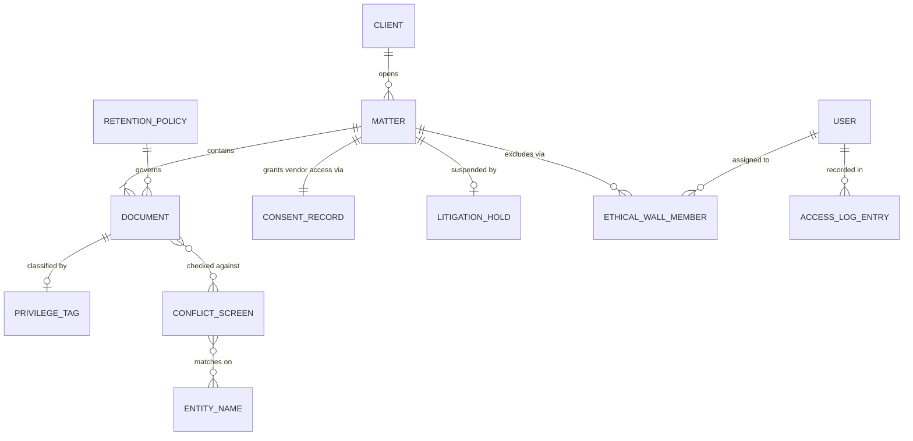

# Data Model: Statute & Sage Contract Review

Fills [templates/architecture/data-model.md](../templates/architecture/data-model.md). Everything here is invented for this standalone example: Statute & Sage is a fictional AI-assisted contract-review platform sold to law firms, the people named are roles filled by invented names, and every count, date and identifier is ILLUSTRATIVE, not drawn from any real firm or product. There is no external Statute & Sage journey or data sheet. See the [examples index](README.md).

**Domain:** Legaltech (contract review) · **Data owner:** Ilse Janssen, principal engineer · **Reviewed by:** Elena Vasquez, DBA
**Status:** Approved at Gate 3, 2026-09-11 · **Date:** 2026-09-11

## 1. Entities and relationships

The many-to-many between `DOCUMENT` and `CONFLICT_SCREEN`, mediated by `ENTITY_NAME`, exists because a single document may reference multiple parties whose names trigger separate conflict checks, and a single conflict screen may scan across many documents within a matter. The join entity `ENTITY_NAME` carries the normalized party name and the source document ID that surfaced it, so a false clear can be traced back to which extraction produced which match.

## 2. Entity definitions

| Entity | Definition (one sentence, business language) | Source of truth | Natural key | Surrogate key | Estimated volume at 12 months |
|---|---|---|---|---|---|
| CLIENT | A law-firm client whose matters are reviewed in Statute & Sage; privilege belongs to this entity, not the firm or the vendor | Firm's DMS sync (read-only mirror); S&S holds copy only | Firm-assigned client code + jurisdiction | UUID | 4,200 (ILLUSTRATIVE) |
| MATTER | A discrete legal engagement under which documents are reviewed, consents granted, and holds applied | Firm's billing system (primary); S&S holds operational copy | Matter number + client code | UUID | 18,500 (ILLUSTRATIVE) |
| DOCUMENT | A contract, memo, email, or attachment ingested for review; its privilege status determines whether it may reach the inference endpoint | S&S ingestion pipeline (first write); DMS remains authoritative for content integrity | SHA-256 hash + matter ID | UUID | 2,100,000 (ILLUSTRATIVE) |
| PRIVILEGE_TAG | A classification marking a document as attorney-client privileged, work product, or non-privileged; set by assigned reviewer, never inferred automatically | S&S reviewer UI (sole writer); no other system may create or correct | Document ID + tag type + reviewer ID | Composite PK | 2,100,000 (one per document, ILLUSTRATIVE) |
| CONSENT_RECORD | A partner-signed authorization permitting documents in a specific matter to be routed to the model vendor's inference endpoint; absence means block | S&S consent workflow (sole writer); logged immutably | Matter ID + signing partner ID + timestamp | UUID | 3,100 (subset of matters with active review, ILLUSTRATIVE) |
| LITIGATION_HOLD | A flag suspending automatic deletion of all documents tied to a matter, regardless of retention policy default | Firm's litigation-support system (primary); S&S mirrors status read-only | Matter ID + hold issuer + effective date | UUID | 840 (active holds at 12 months, ILLUSTRATIVE) |
| RETENTION_POLICY | A rule defining when documents in a given class expire if no hold applies; versioned, never overwritten | S&S policy engine (sole writer); changes require compliance sign-off | Policy ID + version | UUID | 14 (distinct policies, ILLUSTRATIVE) |
| ETHICAL_WALL_MEMBER | An assignment excluding a user from accessing documents in a matter where a conflict or wall applies | S&S access-control module (sole writer); synced from firm HR directory for identity only | User ID + matter ID + exclusion reason | Composite PK | 27,400 (assignment rows, ILLUSTRATIVE) |
| ACCESS_LOG_ENTRY | An immutable record of every read attempt against a privileged-class document, including requester, matter, timestamp, and outcome | S&S audit log (append-only); no update or delete path | Requester ID + document ID + timestamp | Bigserial | 94,000,000 (ILLUSTRATIVE, ~45 reads per doc avg) |
| CONFLICT_SCREEN | A check run at intake comparing new-matter parties against existing client/matter records; result is pass/fail/flagged | S&S intake module (sole writer); firm may override with documented reason | Matter ID + screen timestamp | UUID | 19,800 (includes re-runs, ILLUSTRATIVE) |
| ENTITY_NAME | A normalized party name extracted from a document or entered at intake, used as the matching unit for conflict screens | S&S NLP extraction pipeline (auto-writes); reviewer may correct | Normalized string + source type | UUID | 63,000 (ILLUSTRATIVE) |

## 3. Data dictionary

| Entity.attribute | Type | Meaning | Allowed values or range | PII class | Retention |
|---|---|---|---|---|---|
| MATTER.consent_flag | boolean | Whether the responsible partner has authorized model-vendor access for this matter's documents | true / false (default false) | none | life of matter plus 7 years post-closure |
| DOCUMENT.privilege_class | enum | Privilege status of the document, independent of personal-data sensitivity | attorney_client / work_product / non_privileged / unreviewed | sensitive (privilege is its own axis; see section 5) | governed by matter hold status, not fixed duration |
| DOCUMENT.content_hash | string | SHA-256 digest of the document body at ingestion, used as natural key component | 64 hex chars | none | same as document |
| CONSENT_RECORD.signing_partner_id | uuid | The licensed attorney who granted vendor access; their bar number is held in the firm directory, not duplicated here | valid user ID with role=partner | indirect (quasi-identifier: links to bar registration) | 7 years after consent revocation |
| LITIGATION_HOLD.effective_date | date | When the hold began suppressing deletion | ISO 8601 date | none | until hold released, then 90 days grace before deletion eligibility resumes |
| ETHICAL_WALL_MEMBER.exclusion_reason | enum | Why the user is walled off from the matter | conflict_of_interest / ethical_wall_order / regulatory_bar | none | life of matter plus 7 years |
| ACCESS_LOG_ENTRY.requester_role | string | Role of the person attempting access, captured at request time, not current role | partner / associate / paralegal / admin / support_agent / service_account | indirect | 10 years (audit trail requirement) |
| PRIVILEGE_TAG.reviewer_id | uuid | The licensed attorney who made the privilege determination | valid user ID with role in (partner, associate) | indirect | life of document |
| CLIENT.firm_code | string | The law firm's internal identifier for this client; never exposed to end users outside the firm | alphanumeric, max 12 chars | none | life of relationship plus 7 years |
| MATTER.jurisdiction | string | Bar or court jurisdiction governing the matter, determining which ethics rules apply | ISO country + state/province code | none | permanent (needed for historical compliance audits) |
| DOCUMENT.matter_id | uuid | Foreign key linking document to its parent matter; determines which consent and hold rules apply | valid matter UUID | none | same as document |
| CONFLICT_SCREEN.result | enum | Outcome of the conflict check at intake | clear / flagged / overridden_with_note | none | 7 years (malpractice defense window) |

## 4. Keys, uniqueness, and integrity rules

| Rule | Enforced by (database / application / pipeline) | Owner | What breaks if violated |
|---|---|---|---|
| A document cannot reach the model-vendor inference endpoint unless the parent matter's `consent_flag` is true | Application (routing middleware checks flag before dispatch; database constraint prevents setting `endpoint_dispatched=true` when `consent_flag=false`) | Ilse Janssen | Privilege waiver exposure: routing privileged material through a third-party processor without informed client consent may strip protection retroactively, per ABA Model Rule 1.6 and ABA Formal Opinion 512 (July 2024, verify current status with counsel; this is not legal advice) |
| A litigation hold overrides any retention-policy deletion schedule for every document tied to the matter | Pipeline (deletion job queries hold table first; if `LITIGATION_HOLD` row exists and is active, skip deletion unconditionally) | Elena Vasquez | Spoliation sanctions under Federal Rules of Civil Procedure Rule 37(e) (as of 2026-09-11, confirm with counsel); malpractice carrier claim against both firm and vendor |
| Conflict screens are access rules, not advisory flags: a `flagged` result blocks document visibility until cleared or formally overridden with a partner note | Application (access-control layer rejects reads where an unresolved conflict screen exists for the requesting user's assigned matters) | Marcus Chen, head of compliance | Unauthorized-practice complaint risk if a conflicted lawyer accesses matter materials; disqualification motion in litigation; Rule 1.7 ABA Model Rules violation |
| Every `PRIVILEGE_TAG` must be set by a licensed attorney (role in partner, associate); no automated inference writes this field | Database (foreign-key constraint to `USER.role`; application-level guard also present) | Ilse Janssen | Misclassification leading to inadvertent disclosure; privilege-log accuracy metric collapses; defensibility challenge in discovery fails |
| `CONSENT_RECORD` cannot be created or modified by anyone other than a partner on the matter's team | Application (RBAC check at write time; no API endpoint accepts consent creation from non-partner tokens) | Marcus Chen, head of compliance | Invalid consent: model-vendor access without proper authority; potential Rule 1.6 breach |
| `ACCESS_LOG_ENTRY` is append-only; no UPDATE or DELETE grant exists on the table for any application role | Database (GRANT statement omits UPDATE/DELETE; trigger raises exception on attempted modification) | Elena Vasquez | Audit-trail integrity failure; inability to demonstrate defensible process under Sedona Conference principles |

## 5. PII and classification summary

- Entities carrying direct or sensitive PII: `CLIENT` (firm-assigned identifiers, indirect), `MATTER` (jurisdiction-linked party names, indirect), `DOCUMENT` (content may contain direct PII of opposing parties, witnesses, employees; classified separately from privilege), `PRIVILEGE_TAG` (attorney identity, indirect), `CONSENT_RECORD` (partner identity and bar linkage, indirect), `ETHICAL_WALL_MEMBER` (user identity, indirect), `ACCESS_LOG_ENTRY` (requester identity, indirect)
- Where that data is stored and processed, per market: US matters processed in AWS us-east-1 (Virginia) and us-west-2 (Oregon); England and Wales matters processed in AWS eu-west-2 (London); EU GDPR matters processed in AWS eu-central-1 (Frankfurt). No cross-border transfer occurs without a Standard Contractual Clause addendum executed with the firm (as of 2026-09-11, confirm with counsel; this is not legal advice)
- Deletion path when a subject requests erasure: GDPR Article 17 requests received by the firm are forwarded to S&S privacy desk (privacy@statuteandsage.example, fictional address); S&S verifies the matter's hold status first, since a litigation hold suspends erasure obligations pending resolution; if no hold applies, hard-delete executes within 30 days across primary store and backups (backup expiry follows standard 35-day rotation). Owner: Amara Osei, privacy lead
- Access model: production PII readable only by assigned matter-team members whose role passes RBAC check AND whose user does not appear in `ETHICAL_WALL_MEMBER` for that matter AND whose conflict screen is clear; firm IT admins excluded from default list but logged separately on emergency-access grants; every read produces an `ACCESS_LOG_ENTRY`. Sampling audit run quarterly per the domain card's access-log-completeness metric
- Classification signed off by: Amara Osei, privacy lead, 2026-09-08; reviewed against ABA Model Rule 1.6 and ABA Formal Opinion 512 (July 2024, verify current status with counsel; this is not legal advice). Privilege is classified on its own axis, separate from PII: a document may be non-privileged yet carry direct PII, or privileged yet contain no personal data. The `PRIVILEGE_TAG` row below is carried unchanged from the domain card's worked example, because the card's privileged-communication data-class definition is the source of truth for how this repo treats privilege as a data class.

| Field | Value |
|---|---|
| Data class | Privileged client communication (attorney work product) |
| Where it lives | Document store, tagged at ingestion by matter ID; never routed through the drafting model's third-party inference endpoint without the per-matter consent flag set |
| Who can reach it | Assigned matter team only, role-checked per request, not per session; the firm's own IT admins are logged separately and excluded from the default access list |
| Subprocessor exposure | Model vendor: none by default. A matter-level consent flag, set by the responsible partner, is required before any document in this class reaches the vendor, and the flag is itself logged as a decision |
| Retention | Governed by the matter's litigation-hold status, not a product-wide default; a hold flag on the matter suspends the class's normal deletion schedule automatically |
| Access-log requirement | Every read logged with requester, matter ID and timestamp; sampling audit run quarterly per the card's own metric on log completeness |
| Business rule | BR-LT-02: WHEN a matter's litigation-hold flag is set THEN block automatic deletion for every document in this class tied to that matter, with no override short of partner sign-off |

## 6. Migration and versioning notes

- Migration strategy for existing data, if any: Expand-and-contract. Phase 1 adds nullable columns (`privilege_class`, `consent_flag`, `hold_status_cached`) to existing tables without breaking current readers. Phase 2 backfills `PRIVILEGE_TAG` rows for all documents already in the system, using reviewer-supplied classifications from the firm's legacy DMS metadata where available; documents with no prior classification receive `unreviewed` and are blocked from inference dispatch until a licensed attorney tags them. Phase 3 enforces NOT NULL constraints and drops legacy free-text privilege fields. Backfill estimated at 2,100,000 rows (ILLUSTRATIVE), batched at 50,000 per job to avoid lock contention.
- Rollback plan if a migration fails midway: Each phase runs inside a transactional wrapper with a savepoint. If phase 2 backfill fails, the partial `PRIVILEGE_TAG` inserts are rolled back, the legacy fields remain populated, and the system reverts to pre-migration behavior (all documents treated as `unreviewed`, blocking inference dispatch conservatively). No data loss; availability degrades to safe-by-default mode until rerun.
- Schema change approval: All schema changes reviewed by Elena Vasquez (DBA) and Ilse Janssen (principal engineer) in the architecture RFC channel (#arch-rfc), with a minimum 48-hour comment window. Changes touching privilege, consent, or hold logic additionally require sign-off from Amara Osei (privacy) and Marcus Chen (compliance) before merge, because those columns carry regulatory consequence beyond engineering correctness.

## Exit gate

- [x] Diagram, entity table, and dictionary agree: same entities, same names. All eleven entities appear in sections 1, 2, and 3 with consistent naming
- [x] Every many-to-many relationship has a named join entity. `DOCUMENT` ↔ `CONFLICT_SCREEN` joins through `ENTITY_NAME`; `MATTER` ↔ `USER` joins through `ETHICAL_WALL_MEMBER`
- [x] Every entity names one source of truth. Section 2 column 3 identifies the authoritative system for each entity; S&S copies are marked as such
- [x] Every attribute in the dictionary has a PII class and a retention value. All twelve rows in section 3 carry both
- [x] Application-enforced integrity rules have named owners. Section 4 assigns Ilse Janssen, Elena Vasquez, Marcus Chen, or Amara Osei to every application-enforced rule
- [x] PII summary signed off by privacy or compliance, by name. Amara Osei, privacy lead, 2026-09-08
- [x] The example dictionary row has been deleted. No template example row remains

Signed at Gate 3, 2026-09-11: Ilse Janssen, principal engineer and data owner; Elena Vasquez, DBA and reviewer; Amara Osei, privacy lead (PII classification sign-off); Marcus Chen, head of compliance (integrity-rule ownership confirmation).
