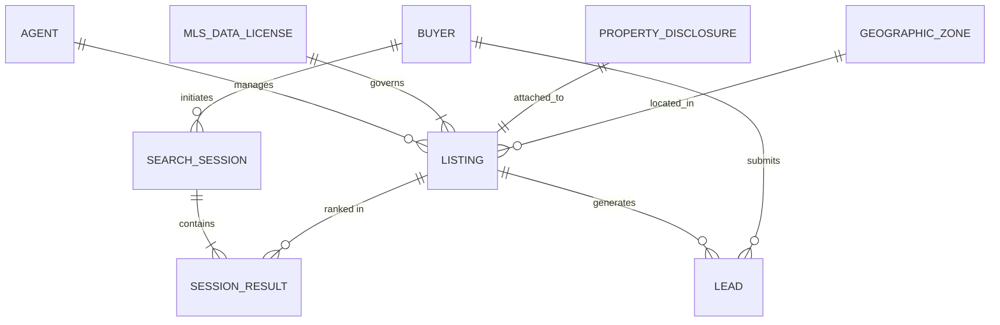

# Data Model: Cobblestone Listings Home-Search Ranking

Fills [templates/architecture/data-model.md](../templates/architecture/data-model.md). Everything here is invented: Cobblestone Listings is a fictional brokerage-tech company, its home-search ranking feature is the fictional system documented below, and every number, name and date is ILLUSTRATIVE. See the [examples index](README.md).

**Domain:** `Home Search & Listing Discovery` · **Data owner:** Odile Marchand, Head of Product Data · **Reviewed by:** Marcus Thorne, Principal Data Engineer
**Status:** Approved · **Date:** 2026-09-11

## Context (ILLUSTRATIVE)

Cobblestone Listings serves independent brokers in three US metros. The product surfaces listings to buyers based on relevance scores generated by a machine-learning model (`search_ranking_model_v1`). The primary users are buyers (shoppers) and agents (listing providers). The critical constraint for this data model is not just PII protection, but Fair Housing compliance: ensuring that features used for ranking or targeting do not act as proxies for protected classes (race, national origin, familial status, disability, religion, sex, color). This document defines the entities, attributes, and strict usage rules required to maintain that boundary.

## 1. Entities and relationships

*Note: `SESSION_RESULT` acts as the join entity between `SEARCH_SESSION` and `LISTING`, capturing the specific rank score and visibility state for a given query.*

## 2. Entity definitions

| Entity | Definition (one sentence, business language) | Source of truth | Natural key | Surrogate key | Estimated volume at 12 months |
|---|---|---|---|---|---|
| BUYER | A registered user searching for properties | Cobblestone User Service | email_address | buyer_id | 45,000 |
| LISTING | A property available for sale or rent | MLS Feed Ingestion Pipeline | mls_listing_id + mls_board_code | listing_id | 12,500 active |
| SEARCH_SESSION | A discrete interaction where a buyer queries the database | Search Analytics Service | session_uuid | session_id | 380,000 |
| SESSION_RESULT | The ordered list of listings returned for a session | Search Ranking Engine | session_id + listing_id | result_id | 19,000,000 |
| LEAD | An inquiry submitted by a buyer regarding a listing | CRM Service | lead_uuid | lead_id | 28,000 |
| PROPERTY_DISCLOSURE | Mandatory legal disclosures attached to a property | Listing Submission Form | disclosure_type + listing_id | disclosure_id | 12,500 |
| GEOGRAPHIC_ZONE | A defined area (census tract, school district, flood zone) | External GIS Provider / HUD | zone_code + zone_type | zone_id | 8,200 |
| AGENT | A licensed professional managing listings | Brokerage Directory | license_number | agent_id | 1,800 |
| MLS_DATA_LICENSE | The contractual agreement governing data reuse | Legal Contract Repository | contract_id | license_id | 12 |

## 3. Data dictionary

*PII Class Key:*
*   `none`: Public or synthetic data.
*   `indirect`: Quasi-identifier; can be linked to an individual with additional info.
*   `direct`: Directly identifies an individual.
*   `sensitive`: Protected class information or high-risk personal data.
*   `proxy_risk`: Flagged specifically for fair-housing disparate impact review under *Inclusive Communities (2015)*. Note: `proxy_risk` fields may also carry PII classes.

| Entity.attribute | Type | Meaning | Allowed values or range | PII class | Retention |
|---|---|---|---|---|---|
| BUYER.email | string | Login and contact address | valid RFC 5322 address, unique | direct | life of account + 90 days |
| BUYER.first_name | string | Given name | UTF-8 string | indirect | life of account + 90 days |
| BUYER.last_name | string | Surname | UTF-8 string | indirect | life of account + 90 days |
| BUYER.language_pref | enum | Preferred UI language | en, es, zh, vi, other | proxy_risk | life of account + 90 days |
| LISTING.mls_listing_id | string | Unique ID from MLS board | alphanumeric, max 32 chars | none | permanent (archived after close) |
| LISTING.price | decimal | Asking price | > 0, USD | none | permanent (archived after close) |
| LISTING.zip_code | string | Postal code of property | 5-digit US ZIP | proxy_risk | permanent (archived after close) |
| LISTING.school_rating_join | float | Aggregated rating from external source | 0.0 to 10.0 | proxy_risk | refreshed quarterly |
| LISTING.flood_zone_flag | boolean | Whether property is in FEMA Special Flood Hazard Area | true, false | none | permanent (archived after close) |
| LISTING.lead_paint_disclosure | enum | Pre-1978 lead paint status | disclosed, waived, unknown | none | permanent (archived after close) |
| LISTING.photo_url | string | URL to main property image | valid HTTPS URL | none | permanent (archived after close) |
| SESSION_RESULT.rank_score | float | Relevance score calculated by model | 0.0 to 1.0 | none | 18 months |
| SESSION_RESULT.is_ad | boolean | Whether result is sponsored placement | true, false | none | 18 months |
| GEOGRAPHIC_ZONE.census_tract | string | Census tract identifier | 11-digit numeric | proxy_risk | permanent |
| GEOGRAPHIC_ZONE.race_pct_minority | float | % population identifying as minority | 0.0 to 100.0 | sensitive | permanent |

## 4. Keys, uniqueness, and integrity rules

| Rule | Enforced by (database / application / pipeline) | Owner | What breaks if violated |
|---|---|---|---|
| `zip_code` and `school_rating_join` must never be passed as features to `search_ranking_model_v1` | Application (Feature Store Guardrail) | Odile Marchand (Product), Marcus Thorne (Eng) | Violation creates disparate-impact liability under Fair Housing Act; risks DOJ enforcement similar to the 2022 Meta housing ad settlement |
| `language_pref` cannot be used for ad targeting segmentation | Application (Ad Server Filter) | Marketing Compliance Lead | Violation constitutes discriminatory advertising practice under HUD guidelines |
| `last_name` is excluded from ranking features; retained only for identity verification | Application (Feature Selection Layer) | Data Science Lead | Using surname as a proxy for national origin in ranking violates *Inclusive Communities (2015)* principles |
| MLS data reuse restrictions: No display of `mls_listing_id` or raw feed data outside licensed platforms without attribution | Pipeline (Output Validator) | Legal Counsel | Breach of MLS Clear Cooperation Policy and data license; potential delisting from MLS boards |
| `flood_zone_flag` and `lead_paint_disclosure` must be present before a listing is marked "Active" | Database (NOT NULL constraint on Active status) | Listing Operations Manager | Non-compliance with RESPA/TRID adjacent disclosure requirements and local habitability laws |
| `email` must be unique across all BUYER records | Database (UNIQUE constraint) | User Service Team | Duplicate accounts corrupt lead attribution and violate GDPR/CCPA erasure requests |

## 5. PII and classification summary

*   **Entities carrying direct or sensitive PII:** `BUYER` (email, names), `LEAD` (contact details), `GEOGRAPHIC_ZONE` (demographic aggregates flagged as sensitive/proxy risk).
*   **Fair-Housing Proxy Risk Flags (Separate from PII):**
    *   `LISTING.zip_code`: Correlates strongly with race and national origin in US metros. Excluded from ranking.
    *   `LISTING.school_rating_join`: Often correlates with racial demographics of neighborhood. Excluded from ranking.
    *   `BUYER.language_pref`: Proxy for national origin. Excluded from ad targeting.
    *   `BUYER.last_name`: Proxy for national origin. Excluded from ranking.
    *   `GEOGRAPHIC_ZONE.census_tract`: Used for geographic filtering only, never as a direct ranking feature.
*   **Where that data is stored and processed, per market:** All US data resides in AWS us-east-1 and us-west-2 regions. No cross-border transfer.
*   **Deletion path when a subject requests erasure:** Automated deletion job triggered via Privacy Portal; removes `BUYER` record and anonymizes associated `SEARCH_SESSION` history within 30 days. Owner: Odile Marchand.
*   **Access model:** Production PII access restricted to Engineering and Support staff with MFA and Just-In-Time elevation. Access logs reviewed monthly by Security.
*   **Classification signed off by:** Elena Ross, Chief Privacy Officer, 2026-09-05.

## 6. Migration and versioning notes

*   **Migration strategy for existing data:** Expand and contract. New columns added to `LISTING` for `flood_zone_flag` and `lead_paint_disclosure` were backfilled from MLS feeds over 4 weeks. Feature store tables were rebuilt to exclude `zip_code` and `school_rating_join` from the training set schema.
*   **Rollback plan if a migration fails midway:** Restore snapshot of Feature Store table taken immediately prior to migration. Rollback script re-enables previous feature set configuration but triggers alert to Data Science Lead for immediate review of model performance drop.
*   **Schema change approval:** Any change to attributes flagged as `proxy_risk` requires sign-off from Legal Counsel and Chief Privacy Officer before implementation. Regular schema changes approved by Data Architecture Review Board (Marcus Thorne, Chair).

## Exit gate

- [x] Diagram, entity table, and dictionary agree: same entities, same names
- [x] Every many-to-many relationship has a named join entity (`SESSION_RESULT`)
- [x] Every entity names one source of truth (e.g., MLS Feed for Listings, User Service for Buyers)
- [x] Every attribute in the dictionary has a PII class and a retention value
- [x] Application-enforced integrity rules have named owners (e.g., Feature Store Guardrail owned by Odile/Marcus)
- [x] PII summary signed off by privacy or compliance, by name (Elena Ross, 2026-09-05)
- [x] The example dictionary row has been deleted

Signed: Odile Marchand, Head of Product Data, 2026-09-11
