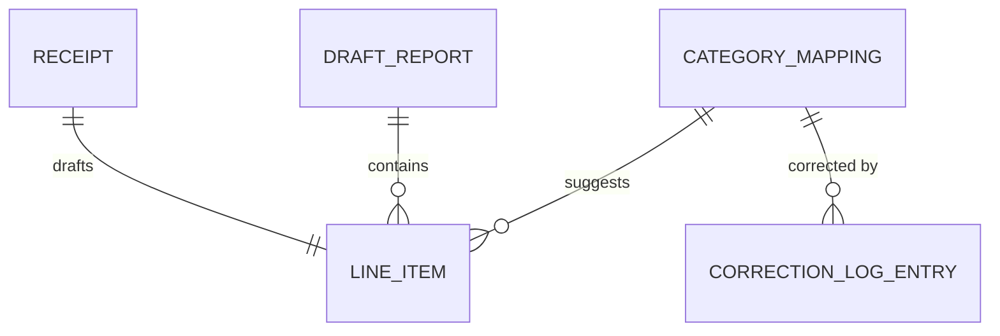

# Data Model: Expense Copilot

Fills [templates/architecture/data-model.md](../templates/architecture/data-model.md). Everything here is invented: Ledgerline is the fictional mid-market software company of [ledgerline-journey.md](ledgerline-journey.md) and [expense-copilot-journey.md](expense-copilot-journey.md), the Expense Copilot is its fictional internal expense tool, every person named below is fictional, and every number, date and identifier is ILLUSTRATIVE, carried from those two data sheets rather than from any real receipt-processing system. See the [examples index](README.md).

Stage: DESIGN, feeds [Gate 3: architecture and risks reviewed](../os/STAGE-GATES.md)
Knowledge: [knowledge index](../knowledge/INDEX.md)
Skill: [architect agent](../agents/architect-agent.md)

**Domain:** Expense Copilot, receipt capture and draft report assembly · **Data owner:** Maya Chen, Product Manager · **Reviewed by:** Priya Nair, Engineering Lead
**Status:** Approved at Gate 3, 2026-09-11, with one item left open (see section 5) · **Date:** 2026-09-05

Five entities carry the copilot's v1 scope (V10): Receipt, LineItem, DraftReport, CategoryMapping and CorrectionLogEntry, between them covering REQ-1 to REQ-6. Receipt and LineItem are flagged provisionally as carrying personal data, per the PRD's own [Launch criteria](expense-copilot-prd.md#8-launch-criteria) line that receipts carry personal data (V10); formal PII classification and sign-off wait for the compliance impact assessment at Gate 5, not this document, and section 5 below states that rather than leaving a blank.

## 1. Entities and relationships

No many-to-many relationship exists in this v1 scope. RECEIPT to LINE_ITEM is one to one rather than one to many: ADR-0001 extracts fields from one receipt per model call, and AC-10 rejects a photo carrying more than one receipt back to the filer rather than drafting more than one line item from it, so each receipt drafts exactly one line item, per the one-receipt-per-item v1 scope.

## 2. Entity definitions

| Entity | Definition (one sentence, business language) | Source of truth | Natural key | Surrogate key | Estimated volume at 12 months |
|---|---|---|---|---|---|
| RECEIPT | One uploaded photo or forwarded-email attachment ingested for extraction (REQ-1) | the copilot's own ingestion pipeline | none; each upload is its own record | receipt_id | about 40,000 a year, the quoted rate N9 draws on |
| LINE_ITEM | The drafted merchant, date, amount, currency and category for one receipt (REQ-2, REQ-3) | the copilot's extraction pipeline, until the filer edits a field | none; one per receipt | line_item_id | about 40,000 a year, one per RECEIPT |
| DRAFT_REPORT | The filer's editable assembly of line items before submit (REQ-4) | the copilot, until submitted; finance's system of record after | none; one per filing | report_id | up to N2's 9,600 reports a year |
| CATEGORY_MAPPING | One finance policy line a suggestion can match (REQ-3, REQ-6) | finance policy, entered and corrected by a finance admin | policy_line_reference | mapping_id | not sized on either data sheet |
| CORRECTION_LOG_ENTRY | One admin correction to a category mapping, logged and versioned (REQ-6, AC-8) | the admin correction loop | none; one per correction | correction_id | not sized on either data sheet |

## 3. Data dictionary

| Entity.attribute | Type | Meaning | Allowed values or range | PII class | Retention |
|---|---|---|---|---|---|
| RECEIPT.receipt_id | string | Surrogate key | unique per receipt | none | not set on either data sheet; DEPV-2 (receipt image retention and deletion schedule) is the open dependency |
| RECEIPT.source_channel | enum | How the receipt arrived (REQ-1) | photo_upload, forwarded_email | none | not set on either data sheet; DEPV-2 open |
| RECEIPT.image_or_message | reference | The stored photo or forwarded-email attachment itself | pointer to stored content | direct, provisional (V10) | not set on either data sheet; DEPV-2 open |
| RECEIPT.filer | reference | The employee who submitted the receipt | pointer to the filer's record | indirect, provisional (V10) | not set on either data sheet; DEPV-2 open |
| LINE_ITEM.line_item_id | string | Surrogate key | unique per line item | none | follows its DRAFT_REPORT |
| LINE_ITEM.receipt_id | reference | The one RECEIPT this line item was drafted from | pointer to RECEIPT | direct, provisional (V10) | follows its DRAFT_REPORT |
| LINE_ITEM.report_id | reference | The DRAFT_REPORT this line item belongs to | pointer to DRAFT_REPORT | none | follows its DRAFT_REPORT |
| LINE_ITEM.merchant | string | Extracted merchant name (REQ-2) | blank and flagged when the model cannot read it, never guessed (AC-3) | none | follows its DRAFT_REPORT |
| LINE_ITEM.date | date | Extracted receipt date (REQ-2) | blank and flagged when unreadable (AC-3) | none | follows its DRAFT_REPORT |
| LINE_ITEM.amount | decimal | Extracted amount (REQ-2) | blank and flagged when unreadable (AC-3) | none | follows its DRAFT_REPORT |
| LINE_ITEM.currency | string | Extracted currency (REQ-2) | ISO 4217 code; blank and flagged when unreadable (AC-3) | none | follows its DRAFT_REPORT |
| LINE_ITEM.confidence | enum | Whether a field is low confidence, shown distinct in the reviewer's view (REQ-5, AC-7) | high, low | none | follows its DRAFT_REPORT |
| LINE_ITEM.suggested_mapping | reference | The matched policy line shown with the suggestion (REQ-3, AC-4) | pointer to CATEGORY_MAPPING | none | follows its DRAFT_REPORT |
| LINE_ITEM.filer_edited | boolean | Whether the filer changed a drafted field (REQ-4, AC-5) | true, false | none | follows its DRAFT_REPORT |
| DRAFT_REPORT.report_id | string | Surrogate key | unique per report | none | not set on either data sheet; DEPV-2 open |
| DRAFT_REPORT.status | enum | Whether the report has been submitted (REQ-4, AC-6, AC-9) | draft, submitted | none | not set on either data sheet; DEPV-2 open |
| CATEGORY_MAPPING.mapping_id | string | Surrogate key | unique per mapping | none | not sized on either data sheet |
| CATEGORY_MAPPING.policy_line_reference | string | The finance policy line this mapping matches (REQ-3) | natural key | none | not sized on either data sheet |
| CATEGORY_MAPPING.version | integer | Increments each time a correction is logged against this mapping (REQ-6) | an incrementing marker; the starting value and increment are not set on either data sheet | none | not sized on either data sheet |
| CORRECTION_LOG_ENTRY.correction_id | string | Surrogate key | unique per correction | none | not sized on either data sheet |
| CORRECTION_LOG_ENTRY.mapping_id | reference | The CATEGORY_MAPPING this correction changed | pointer to CATEGORY_MAPPING | none | not sized on either data sheet |
| CORRECTION_LOG_ENTRY.corrected_by | reference | The admin who made the correction (AC-8) | pointer to the admin's record | indirect | not sized on either data sheet |
| CORRECTION_LOG_ENTRY.corrected_at | timestamp | When the correction was made (AC-8) | ISO 8601 timestamp | none | not sized on either data sheet |

## 4. Keys, uniqueness, and integrity rules

| Rule | Enforced by (database / application / pipeline) | Owner | What breaks if violated |
|---|---|---|---|
| Every LINE_ITEM field the model cannot read stays blank and flagged, never populated with a guess | Application (extraction pipeline) | Priya Nair, Engineering Lead | Violates the PRD's never-invent rule (AC-3); a filer sees a confident-looking field for data the model never read |
| A photo containing more than one receipt is rejected back to the filer rather than drafting a merged or first-match LINE_ITEM | Application (ingestion pipeline) | Priya Nair, Engineering Lead | The one-receipt-per-item v1 scope (ADR-0001, AC-10) is silently broken, and the extraction eval set's own threshold, which cannot hold across overlapping receipts, is asked to answer for a case it was never scored against |
| A DRAFT_REPORT's status moves to submitted only by the filer's own action; no automatic path sets it | Application (report assembly) | Priya Nair, Engineering Lead | Violates AC-6 and the PRD's Out of scope line naming auto-submission a load-bearing guardrail, not a v2 candidate |
| A correction to a CATEGORY_MAPPING is written as a new CORRECTION_LOG_ENTRY and never rewrites a LINE_ITEM already inside a submitted DRAFT_REPORT | Application (admin correction loop) | Priya Nair, Engineering Lead | Violates AC-8's log-who-and-when requirement and AC-9's guarantee that a correction does not silently rewrite a submitted report |

## 5. PII and classification summary

- Entities carrying direct or sensitive PII: RECEIPT and LINE_ITEM, both flagged provisionally rather than formally classified, per V10.
- Where that data is stored and processed, per market: not set on either data sheet.
- Deletion path when a subject requests erasure: not yet defined; DEPV-2, the receipt image retention and deletion schedule (expense-copilot-dependency-register.md, not yet written), is open, owner the legal lead, needed before Gate 5.
- Access model: not set on either data sheet.
- Classification signed off by: not yet. Per V10, formal PII classification and sign-off wait for the compliance impact assessment at Gate 5, which the PRD's own [Launch criteria](expense-copilot-prd.md#8-launch-criteria) already names as a Gate 5 item, not this document.

## 6. Migration and versioning notes

- Migration strategy for existing data, if any: none needed; this is the copilot's first data model, with no existing production data to migrate.
- Rollback plan if a migration fails midway: not applicable at Gate 3; no migration is proposed by this document.
- Schema change approval: reviewed by Priya Nair, Engineering Lead, the same engineer who signs Gate 3's architecture and security lines for this build, this build carrying no separate security lead (V16).

## Exit gate

- [x] Diagram, entity table, and dictionary agree: same entities, same names (RECEIPT, LINE_ITEM, DRAFT_REPORT, CATEGORY_MAPPING, CORRECTION_LOG_ENTRY)
- [x] Every many-to-many relationship has a named join entity: none exists in this v1 scope, per section 1
- [x] Every entity names one source of truth: section 2
- [x] Every attribute in the dictionary has a PII class and a retention value: section 3, including the entries this document leaves open rather than blank
- [x] Application-enforced integrity rules have named owners: section 4, all Priya Nair, Engineering Lead, this build's sole engineering signer
- [ ] PII summary signed off by privacy or compliance, by name: not yet. Per V10, sign-off waits for the compliance impact assessment at Gate 5; Gate 3 accepted this data model with that gap named rather than papered over
- [x] The example dictionary row has been deleted

Approved at Gate 3, 2026-09-11 (document dated 2026-09-05), with the PII sign-off item above left open by design: Maya Chen, Product Owner, and Priya Nair, Engineering Lead. Full journey: [expense-copilot-journey.md](expense-copilot-journey.md); shared figures: [ledgerline-journey.md](ledgerline-journey.md).
