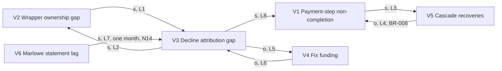

# Harbourgate Causal Loop Diagram: the completion plateau

Fills [frameworks/systems/causal-loop-diagram.md](../frameworks/systems/causal-loop-diagram.md). Everything here is invented: Harbourgate, Quay, Kestrel, Marlowe and Tidewater are fictional, every person is fictional, and every number, date, rate and identifier is ILLUSTRATIVE, taken from the [Harbourgate journey](harbourgate-journey.md) and the [Harbourgate coverage sheet](harbourgate-coverage-sheet.md). This diagram is not a forecast or a benchmark.

**Owner:** Ife Adeyemi, Product Manager · **Date:** 2026-03-19 · **Drawn with:** Tomasz Wierzbicki · **Status:** Reconstruction window

## What it is for

This diagram explains HC50's twelve flat months of payment-step non-completion around 11%. The visible curve is not treated as a demand problem. The structure contains an unowned wrapper, the BR-008 cascade that saves some declines, and unattributed declines that keep the fix unfunded.

The two loops with dominance 6, B1 and R2, tie. The worksheet reads that tie as the plateau: the cascade balances some failures while unattributed declines reinforce the absence of a funded fix.

The diagram feeds the competitive analysis framing: rebuild the payment layer in place, or route through a single provider and retire two integrations. The structural option is reflected in ADR-0003.

## Run it when

- A payment-step metric has remained flat across the twelve months in HC50.
- The team can see provider volume in N12 but cannot attribute every decline because Marlowe carries no decline attribution at entry in N20.
- A proposed fix is limited to logging, while the system contains a wrapper and a cascade rule.
- The team needs to decide whether to tune the current path or change its structure before ADR-0003.

**Skip it when:** the variable has one cause and no path back to itself. This Harbourgate case has three closed paths, so a causal loop diagram is appropriate.

## Inputs you need first

- HC50, the measured monthly payment-step non-completion series from March 2025 to February 2026.
- HC51, the estimate that 73% of payment attempts are attributable to a provider at entry.
- HC52, the measured wrapper state: no commit to the wrapper since 2021 and 0 engineers able to change it safely until 2026-04-24.
- N12, the measured provider share at entry: Kestrel 58%, Marlowe 27%, Tidewater kiosks 15%.
- N14, the estimate based on Marlowe's monthly statements, used for the one-month delay.
- N20, the measured decline attribution state: 0% of Marlowe declines at entry and 100% of all declines at Gate 6.
- BR-008, the retired 2019 cascade rule, which retried Kestrel declines through Marlowe.
- HC54, the measured loop scores and the one-month delay recorded on 2026-03-19.

## The worksheet

### Step 1: name the variables

| ID | Variable (neutral noun phrase) | Measure and source | Current level | Shape over the last 12 periods |
|---|---|---|---|---|
| V1 | Payment-step non-completion | Percentage of orders reaching the payment step, order data, HC50 and N5 | HC50: 11.3%, 10.9%, 11.0%, 11.4%, 11.2%, 10.8%, 11.1%, 11.5%, 11.6%, 11.2%, 10.9% and 11.1%; February is N5 at 11.1% | flat |
| V2 | Wrapper ownership gap | Wrapper repository history, HC52; R2 records the related delivery risk | No commit since 2021; 0 engineers able to change it safely until 2026-04-24 | flat |
| V3 | Decline attribution gap | N20, with HC51 showing the attributable share at entry | 0% of Marlowe declines at entry; 73% of payment attempts attributable to a provider at entry, HC51 | flat |
| V4 | Fix funding | Reconstructed problem framing, linked to the decline attribution gap; no independent level is recorded in HC50 to HC54 | Not quantified in the data sheets | flat |
| V5 | Cascade recoveries | BR-008 and provider shares in N12; the loop score and interpretation are in HC54 | BR-008 saves some declines by retrying Kestrel declines through Marlowe; no count of recovered declines is recorded | flat |
| V6 | Marlowe statement lag | Marlowe monthly statements, N14, and HC54 | One month | flat |

### Step 2: draw the links and set polarity

Polarity legend: **s** means same direction, and **o** means opposite direction. Each explanation uses the counterfactual meaning, "than it otherwise would have been."

| Link | From | To | Polarity (s / o) | Why, in one line | Delay (none / short / long) |
|---|---|---|---|---|---|
| L1 | V2, Wrapper ownership gap | V3, Decline attribution gap | s | A larger ownership gap leaves more decline behaviour without a safe owner or change path. | none |
| L2 | V3, Decline attribution gap | V2, Wrapper ownership gap | s | Unattributed failures provide less evidence that creates ownership, so the ownership gap remains larger. | none |
| L3 | V1, Payment-step non-completion | V5, Cascade recoveries | s | More visible non-completion creates pressure to rely on the existing BR-008 recovery path. | none |
| L4 | V5, Cascade recoveries | V1, Payment-step non-completion | o | More recovered declines reduce non-completion below what it otherwise would have been. | none |
| L5 | V3, Decline attribution gap | V4, Fix funding | o | More unattributed declines weaken the case for funding a targeted fix. | none |
| L6 | V4, Fix funding | V3, Decline attribution gap | o | More funding reduces the attribution gap below what it otherwise would have been. | none |
| L7 | V6, Marlowe statement lag | V3, Decline attribution gap | s | A longer statement lag leaves the missing Marlowe decline information unresolved for longer. | long |
| L8 | V3, Decline attribution gap | V1, Payment-step non-completion | s | More unattributed declines leave the underlying failure path unresolved, increasing non-completion. | none |

### Step 3: close the loops and label them

Loop arithmetic counts the o links:

- R1 has L1 and L2: 0 o links. Zero is even, so R1 is reinforcing.
- B1 has L3 and L4: 1 o link. One is odd, so B1 is balancing.
- R2 has L5 and L6: 2 o links. Two is even, so R2 is reinforcing.

| Loop | Name (a sentence a stakeholder would repeat) | Variables in order | Count of o links | Type (R / B) | Implicit goal (B loops only) | Behavior if it dominates |
|---|---|---|---|---|---|---|
| R1 | Nobody touches the wrapper, so nobody can safely change it | V2 Wrapper ownership gap → V3 Decline attribution gap → V2 Wrapper ownership gap | 0, even | R | not applicable | The ownership and attribution gaps compound in the direction they are already running. HC52 is the evidence for the unowned wrapper. |
| B1 | The cascade saves some declines | V1 Payment-step non-completion → V5 Cascade recoveries → V1 Payment-step non-completion | 1, odd | B | The number of non-completions the BR-008 cascade can recover before its capacity and operational limits reassert | Non-completion approaches the recovery limit and holds. BR-008 is the cascade rule active at entry, later retired on 2026-07-20. |
| R2 | Unattributed declines keep the fix unfunded | V3 Decline attribution gap → V4 Fix funding → V3 Decline attribution gap | 2, even | R | not applicable | The attribution gap and the lack of funding reinforce each other. N20 records 0% Marlowe attribution at entry. |

### Step 4: mark the delays

| Delay | On which link | Length | How you know the length | What it does to the behavior |
|---|---|---|---|---|
| D1 | L7, V6 Marlowe statement lag → V3 Decline attribution gap | One month | HC54 records the one-month Marlowe monthly statement lag, using N14, whose baseline is derived from monthly statements because Marlowe logs no declines. | The reinforcing attribution loop is fed late. A funding or ownership decision made before the statement arrives is based on incomplete evidence, so the plateau can persist while the room waits for the next monthly statement. |

The delay is long relative to the monthly statement cycle because the source itself is monthly. It does not create a new oscillating series in HC50, which is flat, but it makes the reinforcing R2 loop slower to see and easier to dismiss.

### Step 5: score the loops for dominance

The source score is HC54. Each product is shown as arithmetic:

- R1: gain g = 2, speed s = 1, dominance = 2 x 1 = 2.
- B1: gain g = 2, speed s = 3, dominance = 2 x 3 = 6.
- R2: gain g = 3, speed s = 2, dominance = 3 x 2 = 6.

| Loop | Gain g (1 to 3) | Basis for g | Speed s (1 to 3) | Basis for s | Dominance = g x s |
|---|---:|---|---:|---|---:|
| R1 | 2 | HC54 records the wrapper ownership loop as visible but not the strongest driver. HC52 shows the wrapper had no commit since 2021. | 1 | HC54 records the loop as slow, because ownership does not change within the operating cycle. | 2 x 1 = 2 |
| B1 | 2 | HC54 records the cascade as saving some declines, with BR-008 and N12 establishing the provider path it used. | 3 | HC54 records the cascade as fast, because BR-008 acts during the authorisation path rather than waiting for the monthly statement. | 2 x 3 = 6 |
| R2 | 3 | HC54 records unattributed declines as the strong driver. N20 records 0% of Marlowe declines attributed at entry. | 2 | HC54 records the loop as moderate in speed. The one-month delay in D1 slows the evidence, while the funding response remains within the planning cycle. | 3 x 2 = 6 |

**Dominance reading:** B1 = 6 and R2 = 6. Since the balancing and reinforcing loops tie at 6, the diagram reads HC50's flat twelve-month shape as a plateau. The cascade is pushing non-completion down, while unattributed declines keep the structural fix unfunded.

### Step 6: the intervention table

The options are ordered by what they touch. "Retire two rails" changes the structure. "Fix the logging only" changes a link in the reinforcing attribution loop but leaves the wrapper, cascade and three-provider structure in place.

This diagram's two dominant loops are B1 (balancing) and R2 (reinforcing); R1 is real but not dominant. The generic four-category scale names a "B loop's goal" rank, but R2 is reinforcing and, per Step 3, has no implicit goal of its own. Funding a shared decline stream is the closest thing this diagram has to that rank: it does not touch a B1 goal (B1's goal is the cascade's recovery capacity, unrelated to funding), so the category is stretched to cover a lever that moves the condition keeping R2 active rather than a true balancing-loop goal. That stretch is kept here, rather than folded into the R-link rank, because funding changes the level of V4 directly instead of changing the evidence on a single link the way the logging fix does.

| Rank | What the option touches | What it buys | What it costs |
|---:|---|---|---|
| 1 | The B loop's structure, by removing two rails, as framed in the competitive analysis and decided in ADR-0003 | Removes the current three-rail and wrapper structure, so the ceiling is set by a different payment path | A single-provider dependency and the accepted R4 risk; the data sheet does not quantify a cost amount |
| 4 | A link inside the dominant R loop, by fixing logging only | Improves decline attribution and may make the gap visible after the statement delay | It leaves the wrapper and provider structure in place, so the structural ceiling does not change; no effort amount is recorded |
| 3 | A link inside the balancing loop, by continuing to tune BR-008 | More short-term recovery from the existing cascade | It buys only the delay or cycle's worth of relief before the same structure reasserts itself; BR-008 already produced the double-authorisation problem recorded in the journey |
| 2 | The stretched "B loop's goal" rank, by funding a shared decline stream and its owner, since R2 has no implicit goal of its own | Moves the funding condition that currently prevents the fix | It still leaves the existing wrapper and cascade structure unless paired with the structural option |

| Option | Touches (R link / B link / B goal / structure) | Expected ceiling after the change | Cost | Weeks before the result is readable | Owner |
|---|---|---|---|---|---|
| Retire two rails through one provider | structure | The current numerical ceiling cannot be calculated from HC50 to HC54. The structure changes, so the old plateau is not treated as the expected ceiling. | Not quantified in the data sheets; ADR-0003 records the single-provider risk | Not quantified in the data sheets; the intervention is evaluated against the reconstruction and later Gate 6 evidence | Rohan Iyer, sponsor and budget owner |
| Fix the logging only | R link | Unchanged structural ceiling; no numerical ceiling is available in the data sheets | Not quantified in the data sheets | At least the one-month Marlowe statement lag before the attribution evidence is complete; the data sheets do not provide a further cycle length | Ife Adeyemi, with the payment-path owner to be named |
| Continue tuning the cascade | B link | Unchanged structural ceiling; BR-008 remains the balancing mechanism | Not quantified in the data sheets | The loop is fast in HC54, but no additional duration is recorded | Tomasz Wierzbicki |
| Fund one decline stream for fraud, finance and support | B goal (stretched; R2 has no implicit goal of its own) | A numerical ceiling cannot be calculated from the available data; it moves the condition that keeps R2 active | Not quantified in the data sheets | At least the one-month statement lag for Marlowe evidence; no further duration is recorded | Ife Adeyemi |

## Reading the result

HC50 is flat across twelve measured months, from March 2025 to February 2026, with values from 10.8% to 11.6% and February at 11.1%. The flat shape is not evidence that demand stopped. It is the observed result of two dominant loops tied at 6:

- B1, the cascade that saves some declines, pushes non-completion down.
- R2, unattributed declines keeping the fix unfunded, pushes the unresolved failure path back into non-completion.

R1 is real but weaker, at 2. The wrapper's lack of ownership helps the problem persist, but it does not explain the plateau's immediate shape as strongly as the balancing cascade and the unattributed-decline loop.

The one-month Marlowe statement delay means the evidence needed to fund a fix arrives after the decision cycle has already moved. N14 is an estimate from monthly statements because Marlowe logs no declines. N20 records the result at entry: 0% of Marlowe declines carry attribution.

The intervention reading is structural. "Fix the logging only" touches the reinforcing loop, but it does not remove the wrapper or the cascade. "Retire two rails" changes the loop structure, which is why it ranks above the logging-only option and feeds the competitive analysis framing and ADR-0003.

## ILLUSTRATIVE example

Harbourgate's reconstruction shows a payment-step non-completion plateau rather than a demand plateau. HC50 records twelve monthly readings around 11%. N12 shows Kestrel at 58%, Marlowe at 27% and Tidewater kiosks at 15% of payment-step volume. N20 shows that 0% of Marlowe declines carried provider and reason attribution at entry, while HC51 estimates that 73% of payment attempts were attributable to a provider.

The causal reading is:

1. The wrapper ownership gap remains high because no commit touched the wrapper since 2021, and 0 engineers could change it safely until 2026-04-24, HC52.
2. The cascade in BR-008 recovers some Kestrel declines through Marlowe, producing the balancing loop B1.
3. The missing Marlowe decline attribution weakens the case for a funded fix, producing reinforcing loop R2.
4. The Marlowe monthly statement lag is one month, so evidence arrives late.
5. B1 and R2 both score 6, which explains the flat HC50 curve.

The decision is therefore not another demand push. The structural option, route through one provider and retire two integrations, is ranked above fixing the logging only. That framing is carried into ADR-0003.

## The decision it feeds

Whether Harbourgate should preserve the three-provider structure and fix logging, or route every card payment through Kestrel from Quay and retire the Marlowe and Tidewater integrations.

The diagram supports the structural option because the plateau is not caused only by missing data. Missing attribution is one reinforcing loop, but it is connected to the unowned wrapper and the balancing cascade. Fixing logging alone would improve visibility without removing the structure that keeps the failure path active.

The decision record is ADR-0003. The rejected option is a new wrapper over all three providers. The selected direction retires two integrations rather than adding another wrapper around them.

## Where the output lands

- The competitive analysis framing in the Harbourgate reconstruction, where the choice is "rebuild the payment layer in place, or route through a single provider and retire two integrations", with "fix the logging only" as the non-product alternative.
- ADR-0003, which records the decision to route every card payment through Kestrel from Quay and retire the Marlowe and Tidewater integrations.
- The next product strategy and growth planning discussion, where the named loops, the one-month delay and the plateau reading should replace a demand-only explanation.
- The [Harbourgate journey](harbourgate-journey.md), which is the canonical data sheet for N5, N12, N14, N20, BR-008 and ADR-0003.
- The [Harbourgate coverage sheet](harbourgate-coverage-sheet.md), which is the supplement for HC50 to HC54.

## Re-run trigger

Re-run when the shape changes or the constraint moves:

- HC50 stops being flat or moves outside the recorded 10.8% to 11.6% range.
- N20 changes from 0% Marlowe attribution at entry or from 100% attribution at Gate 6.
- BR-008 changes or is retired.
- The wrapper ownership gap changes after a named owner or a structural retirement.
- The one-month Marlowe statement lag changes.
- The single-provider structure in ADR-0003 is revisited.
- A new provider, routing rule or logging path creates a new closed loop.

## The trap: when this method misleads you

This diagram would produce confident nonsense if HC50 were replaced by a single 11.1% reading, or if the arrows were drawn from preference rather than from the reconstruction evidence.

The main risks are:

- Treating HC51's 73% as a measured recovery rate. It is an estimate derived from N12 and N20.
- Treating N14 as a direct decline count. It is an estimate from Marlowe's monthly statements because Marlowe logs no declines.
- Calling the wrapper "bad" rather than using the neutral variables wrapper ownership gap and decline attribution gap.
- Treating loop existence as dominance. R1 exists, but HC54 gives it dominance 2, below B1 and R2 at 6.
- Treating the cascade as a complete fix. B1 is balancing, but its tie with R2 explains why the metric remains flat.
- Ranking logging above structure because logging is easier to name. The intervention table ranks by what the option touches, not by apparent implementation ease.

The discipline that saves the analysis is to start with HC50, show the polarity arithmetic, show the dominance arithmetic, mark the one-month delay, and then test the result against the competitive analysis framing and ADR-0003.

## Feeds

- Competitive analysis framing in the Harbourgate reconstruction: the structural choice between rebuilding the payment layer and routing through one provider while retiring two integrations.
- ADR-0003: the selected structure, routing every card payment through Kestrel from Quay and retiring Marlowe and Tidewater.
- [Harbourgate journey](harbourgate-journey.md): canonical rows N5, N12, N14, N20, BR-008 and ADR-0003.
- [Harbourgate coverage sheet](harbourgate-coverage-sheet.md): HC50 to HC54, including the measured twelve-month curve, the wrapper state, the one-month delay and the dominance scores.
- Gate 1 reconstruction and the subsequent product definition, where the plateau is recorded as a systems diagnosis rather than a demand diagnosis.

Exit-gate walk: Ife Adeyemi confirms that HC50's twelve-month shape is explained by the tied dominance of B1 and R2, that R1 is scored separately, that the one-month N14 delay is marked, and that the intervention ranking places "retire two rails" above "fix the logging only". Signed by Ife Adeyemi, 2026-03-19.
