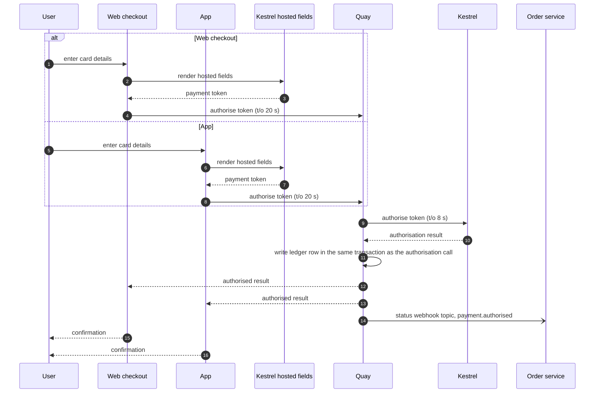
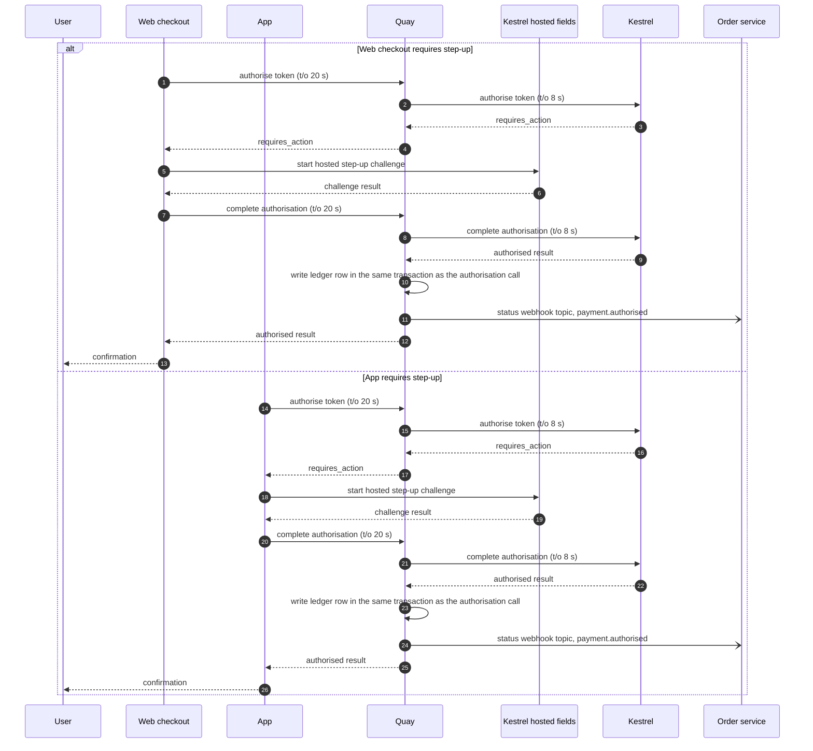
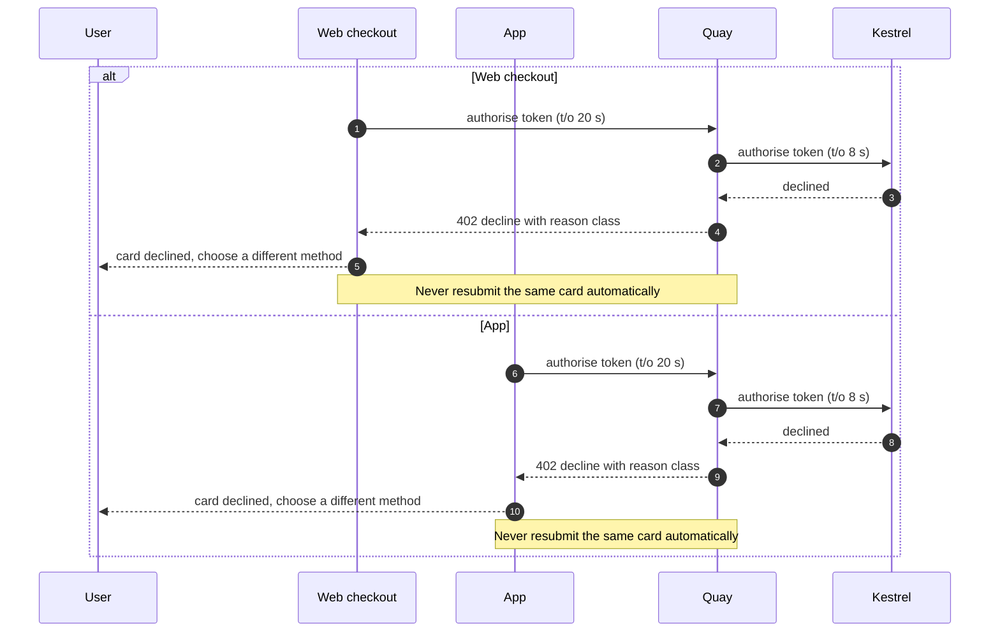
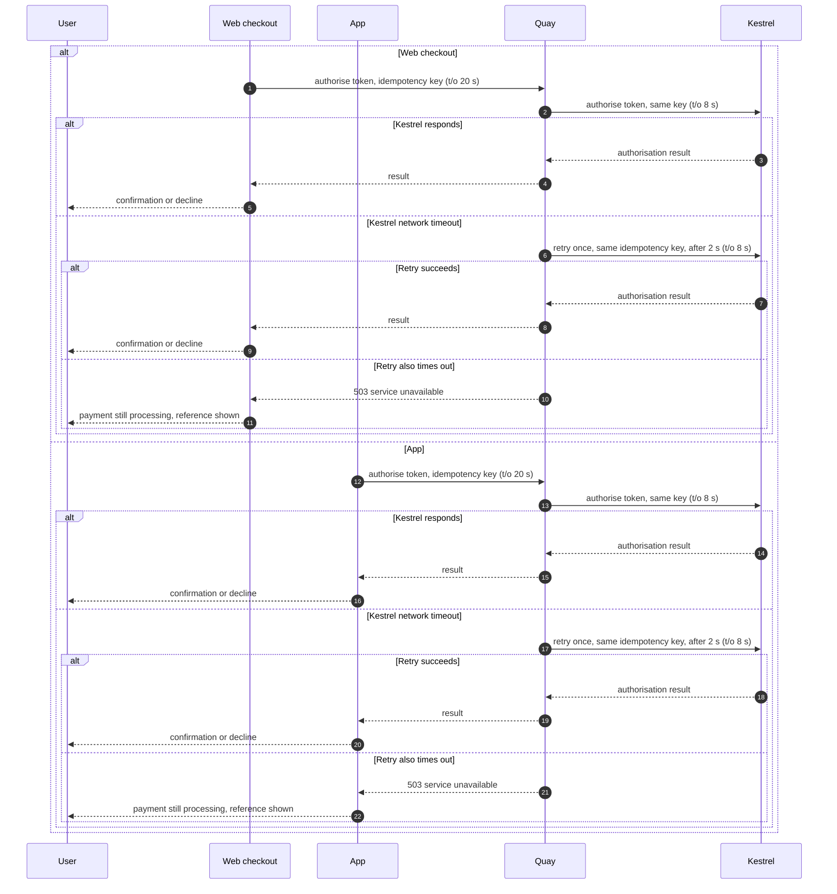
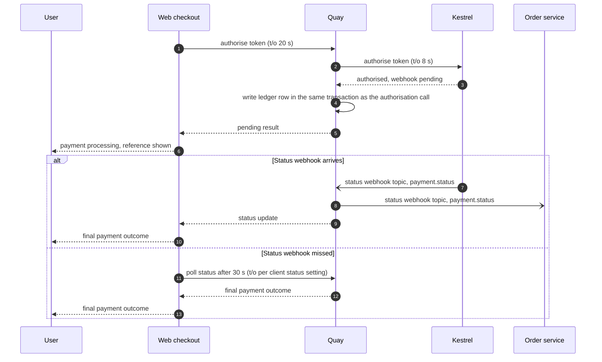

# Sequence Diagram: Harbourgate web and app card authorisation

Fills [templates/architecture/sequence-diagram.md](../templates/architecture/sequence-diagram.md). Everything here is invented: Harbourgate, Quay and Kestrel are fictional, Bea Lindqvist is fictional, and every number, date, amount, rate and identifier is ILLUSTRATIVE, drawn from the [Harbourgate journey](harbourgate-journey.md) and [coverage sheet](harbourgate-coverage-sheet.md), never to be quoted as a benchmark or copied as a target.

**Owner:** Bea Lindqvist, Senior Engineer, payments · **Date:** 2026-04-09 · **Status:** Gate 3 architecture review · **Story:** [HARBOURGATE-S1](harbourgate-journey.md) · **Supplement:** [HC5](harbourgate-coverage-sheet.md)

## Conventions

1. Synchronous calls carry their timeout: `authorise (t/o 20 s)`.
2. Asynchronous messages name the queue or topic in the label.
3. In the failure and timeout diagrams (Section 2 onward), every `alt` block has at least one failure branch. An `alt`/`else` used only to split Web from App channels, with both arms on the happy path, carries no failure branch by itself (Section 1).
4. Participants use the system names from the solution architecture one-pager: Web checkout, App, Quay, Kestrel hosted fields, Kestrel, and Order service.
5. The web and app clients wait 20 s for Quay. Quay's Kestrel call policy is an 8 s timeout, followed by one retry after 2 s on a network error, for a worst case of 18 s, from N61 and HC5.
6. Card data is entered into Kestrel hosted fields. The card number does not reach a Harbourgate server, satisfying AC-1.

## 1. Happy path

The web and app clients submit a token from Kestrel hosted fields to Quay. Quay authorises through Kestrel, writes its ledger row in the same transaction as the call outcome, and preserves the legacy table shape for the order service.

For a card-not-present order above £250, or any order flagged by a fraud rule, Quay returns `requires_action` and the client presents Kestrel's hosted step-up challenge. This is BR-005 and HARBOURGATE-S10.

## 2. Failure and timeout paths

A decline is a business response, not a transport failure. Quay returns `402`, the client does not resubmit the same card automatically, and the user sees an actionable decline with an offer to use a different method. This implements BR-001 and AC-5.

A Kestrel timeout is retried once after 2 s, with the same idempotency key, only for the network-error case. The Kestrel call policy is 8 s, so the worst case is `8 s + 2 s + 8 s = 18 s`. The client timeout is 20 s, leaving time for Quay to return `503` if the same-key retry also times out.

Kestrel sends the status webhook asynchronously. If the webhook is missed, the client resolves the pending state with a status poll after 30 s. The poll's client timeout is governed by the client status-call setting, which is not specified in the supplied data.

## 3. Open questions from drawing the flow

| Question surfaced | Owner | Moved to (decision log / risk register row) |
|---|---|---|
| What happens if a web or app client retries the authorisation with a new idempotency key after receiving `503` or remaining in a pending state? | Bea Lindqvist | Risk register R1, the duplicate-authorisation risk; dispositioned for the R1 control and review |

## Exit gate

- [x] Every synchronous call shows a timeout, or explicitly identifies the supplied client setting where the value is not specified
- [x] Every flow has at least one failure or timeout diagram, not just the happy path
- [x] Each failure branch shows what the user or caller sees
- [x] Retries state their idempotency mechanism
- [x] Participant names match the solution architecture one-pager
- [x] Section 3 questions are all dispositioned to a log or register

Signed at Gate 3, 2026-04-09: Bea Lindqvist, Senior Engineer, payments.
