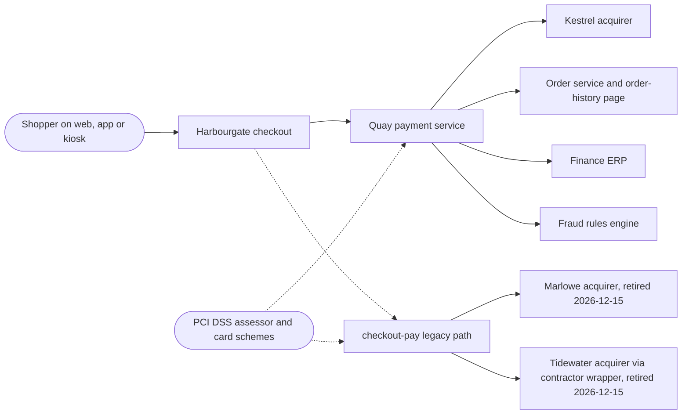

# Solution Architecture One-Pager: Checkout modernisation (Quay)

Fills [templates/architecture/solution-architecture.md](../templates/architecture/solution-architecture.md). Everything here is invented: Harbourgate is a fictional mid-market retailer, Quay, Kestrel, Marlowe and Tidewater are fictional systems and providers, every person is the journey's fictional cast, and every number, date, rate and pound is ILLUSTRATIVE, taken from the data sheet in [harbourgate-journey.md](harbourgate-journey.md) or its supplement [harbourgate-coverage-sheet.md](harbourgate-coverage-sheet.md), never to be quoted as a benchmark. See the [examples index](README.md).

**Initiative:** Checkout modernisation, code-named Quay · **Architect:** Tomasz Wierzbicki, Engineering Lead · **Product owner:** Ife Adeyemi, Product Manager
**Status:** Approved at Gate 3 attempt 1, 2026-04-10, with the wrapper-owner miss recorded · **Date:** 2026-04-10

## 1. Context diagram

The boundary that matters: no card number reaches a Harbourgate server through Quay (AC-1, HARBOURGATE-S1); the Marlowe path still carries it through Harbourgate servers today, which is why seven systems sit in PCI assessment scope at entry (N55, measured at entry). The assessor and the schemes reach Harbourgate through its acquiring contracts, not directly.

## 2. Capability map

| Capability | Delivered by (system) | Build / buy / reuse | Status today |
|---|---|---|---|
| Authorise a card payment on web and app | Quay | build over bought: bought half is Kestrel hosted fields (see section 4) | Legacy checkout-pay; 58% of total card volume already on Kestrel (N12, measured) |
| Authorise a card payment at a kiosk PIN pad | Quay | build over bought: bought half is the Kestrel terminal SDK, DEP-1 (see section 4) | Legacy Tidewater through an unowned wrapper (R2) |
| Show a decline with a reason class and offer one retry | Quay decline event stream | build | Marlowe logs no declines at all (N20, measured) |
| Route refunds to the authorising provider | Quay refund routing + legacy drain | build | No single rail exists; BR-002 governs the tail |
| Reconcile settlement daily across both paths | Quay reconciliation service | build | Three file formats, three vocabularies (ADR-0003 rationale) |
| Acquiring, hosting and terminal hardware | Kestrel | buy | Live since 2017 (web); SDK certification pending (DEP-1) |
| Order history and reporting reads the payment tables | checkout-pay table shape | reuse (constraint, ADR-0002) | Coupled; removal 2027-03-31 (N65, target) |

Every capability maps to exactly one delivering system. The two "build over bought" rows share a boundary because the bought half is the acquirer, not a system inside Harbourgate.

## 3. Integration points

| From | To | Purpose (one clause) | Detail |
|---|---|---|---|
| Quay | Kestrel | Outbound authorisation API, OAuth 2.0 client credentials, SLA N26 | [harbourgate-integrations.md](harbourgate-integrations.md) row I-1 |
| Kestrel | Quay | Inbound status webhooks, HMAC-signed | I-2 |
| Quay | Kestrel | Terminal SDK on kiosks, terminal keys, DEP-1 | I-3 |
| Kestrel | Quay | Daily settlement file over SFTP at 06:30 (N33) | I-4 |
| checkout-pay | Marlowe | Legacy outbound authorisation, card number in transit, SLA N27, retired 2026-12-15 | I-5 |
| Marlowe | checkout-pay | Legacy daily settlement file, weekend on Monday, no sandbox (R3) | I-6 |
| checkout-pay | Tidewater | Legacy XML over HTTPS through the contractor wrapper, certificate expires 2027-02-03 (N66), no SLA clause (N28) | I-7 |
| Tidewater | checkout-pay | Weekly settlement file, Mondays 06:30 | I-8 |
| Quay | Fraud rules engine | Outbound decline event stream to the fraud rules engine (I-9, re-pointed under DEP-6) | I-9 |
| Quay (legacy table shape) | Order service and order-history page | Read of the legacy table shape, unchanged (AC-9, ADR-0002) | I-10 |
| Quay | Finance ERP | Nightly export from the reconciliation service | I-11 |

## 4. Build vs buy rationale

| Capability | Decision | Rationale | Switching cost if we are wrong |
|---|---|---|---|
| Payment orchestration layer (Quay itself) | Build | Customers do not choose Harbourgate for its payment plumbing, but they cannot transact without one that attributes declines, enforces idempotency and survives a brownfield migration. No vendor sells a layer that keeps writing the legacy table shape to 2027-03-31 while draining three providers behind per-provider flags. | Low: Quay is one service with one interface (API v1, [harbourgate-api-contract.md](harbourgate-api-contract.md)); replacing it means re-pointing clients, not re-acquiring cards. |
| Acquiring, tokenisation and terminal SDK | Buy (Kestrel) | Kestrel already carried 58% of volume at entry (N12), its terminal SDK covers the kiosk PIN pads (DEP-1), and consolidation drops blended processing cost from 1.38% to 1.29% (N56). Building an acquirer is not on the table. | Moderate: MSA schedule 4 makes card tokens exportable to a successor processor on exit; rolling 12-month term with 180 days' notice (HC27, coverage sheet). |
| Routing flexibility across three acquirers | Do not build | A new wrapper over all three providers lost in ADR-0003: three settlement formats, three decline vocabularies, three on-call surfaces and three contracts forever, for a routing ability that the shadow-comparison retries (D-011) had shown produces double authorisations rather than approvals (R1 occurred 2026-05-19); the 2019 cascade rule (BR-008) is retired. | High if reversed later: re-onboarding Marlowe and Tidewater after contract termination on 2026-12-15 (D-023) means fresh contracts, certificates and integration work. Accepted as R4 (single point of failure), signed off by Rohan Iyer under D-022 on 2026-08-24. |

## 5. What this commits us to

- **A single-provider dependency.** Every card payment on every surface runs through Kestrel from 2026-09-07 onward. An outage stops all payments; the mitigation is the kiosk "pay at the till" fallback within 10 s (BR-004, N31, target), which applies only to kiosks (web and app have no equivalent fallback), and a region failover RTO of 60 minutes post-sunset (N29, target; never rehearsed). This risk (R4) was accepted by name by the CFO, not absorbed silently.
- **A living coupling.** Quay must keep writing the legacy payment table shape until 2027-03-31 (ADR-0002, N65) so that reporting, finance reconciliation and the order-history page read unchanged (I-10, AC-9). That is a recurring engineering interest of 3 engineer-days per quarter (TD-1, coverage sheet) until DEP-4 lands.
- **A drain that outlasts the cutover.** Marlowe and Tidewater integrations retire on 2026-12-15, but their settlement files, straddle lines and refund tails run to 2027-06-15 (N52, BR-009). Finance operations owns manual portal refunds from 2026-11-16 (TD-5, 6 finance-analyst days in Q4). Wrapper log files must be deleted by 2027-01-15 (N58); the old table shape must not be removed before 2027-03-31 (N65, ADR-0002).
- **An owned caretaker role.** The contractor's wrapper has a named caretaker (Bea Lindqvist, 2026-04-24, closing R2) whose successor is unfunded (HC45 dimension 9). The sunset plan must fund or eliminate that seat before 2026-12-15, or the knowledge leaves with the next departure.

## Exit gate

- [x] The context diagram shows every external party, including auditors where relevant. Kestrel, Marlowe, Tidewater, the order service, finance ERP, the fraud engine, and the PCI DSS assessor and card schemes all appear.
- [x] Every capability maps to exactly one delivering system. Section 2 holds seven rows, each naming one delivering system; the bought acquirer halves of the two "build over bought" rows sit in the build/buy column and in section 4, not in the delivered-by column.
- [x] Every boundary-crossing line has a row in section 3 with a link to integration detail. Eleven rows, I-1 to I-11, each pointing to [harbourgate-integrations.md](harbourgate-integrations.md).
- [x] Every build or buy decision records a rationale and a switching cost. Section 4 carries three decisions, each with two-to-three sentences of reasoning and a named switching cost.
- [x] The commitments in section 5 have been read by someone with budget authority. Rohan Iyer, Chief Financial Officer, accepted R4 by name in D-022 on 2026-08-24. Rohan Iyer, sponsor, signed the Gate 6 PERSIST alongside Ife Adeyemi (D-024, 2026-10-14).

Signed at Gate 3 attempt 1, 2026-04-10: Tomasz Wierzbicki, architect and design owner; Ife Adeyemi, product owner; Hamid Qureshi, Information Security Lead and PCI DSS owner (security reviewer per STAGE-GATES); Rohan Iyer, sponsor and budget owner. The wrapper-owner miss was recorded at this gate as an action on Tomasz Wierzbicki to name an owner by 2026-04-24; the action closed when Bea Lindqvist was named caretaker on that date.
