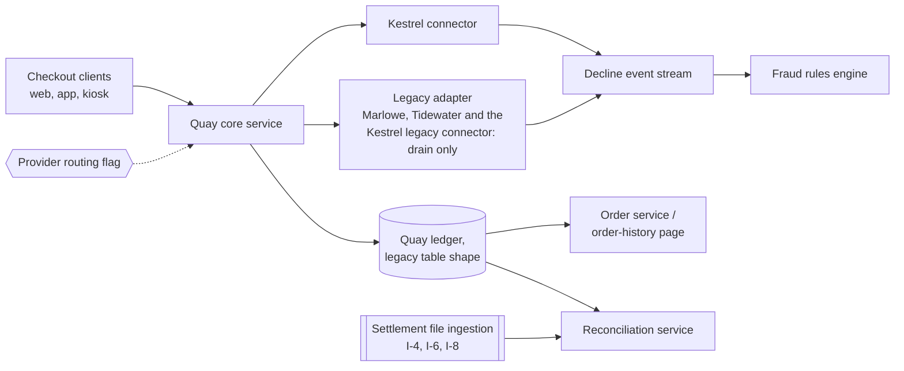

# System Design: Quay

Fills [templates/architecture/system-design.md](../templates/architecture/system-design.md). Everything here is invented: Harbourgate is a fictional mid-market retailer, Kestrel, Marlowe and Tidewater are fictional payment providers, Quay is the fictional payment service this design fixes the shape of, every person is fictional, and every number, date and identifier is ILLUSTRATIVE, carried from the shared data sheet in the [Harbourgate journey](harbourgate-journey.md) rather than from any real payments stack. See the [examples index](README.md).

**System:** Quay, the payment service replacing checkout-pay's payment layer · **Design owner:** Tomasz Wierzbicki, Engineering Lead · **Reviewers:** Bea Lindqvist, Hamid Qureshi, Noor Haddad
**Status:** Approved, reviewed at Gate 3, 2026-04-10; revised 2026-06-19 under ADR-0004 (new reconciliation service) and D-021 (cohort migration with legacy drain, reversing D-019); later additions dated below include the settlement-file-absent alert (A3, live 2026-07-09) and the Kestrel legacy connector cohorts (N71) · **Date:** 2026-04-09
**Feeds from:** the signed PRD and NFR document behind this journey ([harbourgate-nfr.md](harbourgate-nfr.md), this journey's DEFINE-stage sibling); background reconstructed in [checkout-modernization-brownfield.md](checkout-modernization-brownfield.md), the Gate 4 seed

## 1. Goals

- Authorise latency end to end, p95, target under 2,000 ms (N23); measured 1,350 ms in the Kestrel sandbox on 2026-06-05, after this design's Gate 3 review
- Sustain the payment path's ordinary load without a redesign: average 6 requests per second, peak minute 24 req/s on 2025-11-28 (both pre-existing order data), with 50 req/s as the design ceiling set by Kestrel's per-account rate limit (Kestrel master services agreement, schedule 2) and 80 req/s as the point the payment table's write path breaks, confirmed by the load test of 2026-06-05, after Gate 3 (N24)
- Payment-step availability target of 99.9% of minutes, monthly (N25)
- Recovery time objective (target) of 30 minutes during the drain, by a flag flip to legacy, rehearsed at 3 min 50 s on 2026-07-04, after Gate 3, and 60 minutes after sunset, by a Kestrel region failover under its master services agreement schedule 3 (N29)
- Recovery point objective (target) of zero minutes for authorisations: Kestrel is the record. Quay persists the authorisation intent and its idempotency key before calling Kestrel, records the outcome after the call returns, and closes any gap between the two writes with status polling on the Kestrel webhook (I-2) and the daily reconciliation service, since an outbound call to Kestrel cannot share a local database transaction (N30)
- Serve 6,400 orders/day on an average day and hold through 31,000 orders/day on a peak day without degrading the goals above (N3, N4)

## 2. Non-goals

- The guest checkout redesign is out. Design has wanted it for two years, it is unrelated to the decline problem this system exists to fix, and it stays with Ines Castellanos as a Gate 5 design line, not a Quay deliverable.
- Reworking the order-history page is out. It reads the legacy payment table shape today and keeps doing so; Quay's obligation is to keep writing that shape (ADR-0002), not to rebuild the reader.
- Modifying the contractor's Tidewater wrapper is out, except the 2026-05-08 log-scrubbing patch (G2). ADR-0003 retires it rather than repairing or re-owning it permanently. At Gate 3 the wrapper had no named owner; Tomasz Wierzbicki was asked to name one by 2026-04-24 (R2), and Bea Lindqvist filled that caretaker role on that date, for the length of the drain.
- Migrating reporting off the legacy table shape is out of this design's scope; it is DEP-4, owned by Grace Mbeki, due 2027-02-27, and its completion is what lets ADR-0002's removal date (2027-03-31, N65) hold.

## 3. Context and constraints

| Constraint | Type | Source |
|---|---|---|
| Quay must keep writing the legacy payment table shape until at least 2027-03-31; reporting, finance reconciliation and the order-history page all read it today | technical | ADR-0002; N65 |
| A routing flag change needs two named approvers, logged with both names, while any legacy flag remains live (per-provider since D-017, 2026-05-21) | organizational | BR-007; HARBOURGATE-S4, AC-6 |
| Kestrel's per-account authorisation rate is capped at 50 req/s under the Kestrel master services agreement, schedule 2; the payment table's write path breaks at 80 req/s, per the load test of 2026-06-05 | technical | Kestrel MSA schedule 2; load test 2026-06-05 (N24) |
| Kestrel carries a 99.9% monthly availability commitment; Marlowe carried 99.5%; Tidewater's 2021 contract carries no SLA clause at all | technical (contractual) | N26 to N28 |
| Seven systems sit inside PCI DSS assessment scope while the Marlowe path still carries a card number through Harbourgate's own servers; the target is 3 after sunset, not yet assessor-evidenced | regulatory | N55; DEP-7 |
| A declined card is never re-submitted automatically, on any rail; one retry with a different method is offered instead (BR-001, AC-5). The 2019 cascade rule that re-tried a Kestrel decline through Marlowe (BR-008) was retired 2026-07-20, when the Marlowe cohort reached 100% | organizational | BR-001, BR-008; R1 |
| The build team is 5 engineers, 1 QA lead and 1 PM, for the length of the migration and the drain that follows it | organizational | N63 |

The routing decision itself (route every card payment through Kestrel, retire Marlowe and Tidewater) is not a constraint this design lives with; it is this design's own choice, recorded in ADR-0003 and reasoned through in section 7. Likewise the shape of the migration (no freeze-move-switch weekend) is a decision, walked in section 4 and section 7, not a fact this design found already in place. On a brownfield product the constraints table still runs longer than the goals list, which is normal: most of what a legacy system imposes is fact, not preference.

## 4. Design overview and diagram

Quay sits in front of checkout-pay as a separate service, not a module inside it (ADR-0001), and owns one outbound rail: the Kestrel connector, used by the web checkout and app, where hosted fields keep the card number off Harbourgate's own servers (HARBOURGATE-S1, AC-1), and by the kiosk terminal SDK (HARBOURGATE-S2). The migration approach the premortem of 2026-04-09 assumed, and D-011 formalised on 2026-04-14, four days after Gate 3, was a traffic-percentage ramp with shadow comparison. The fraud team's double-authorisation finding of 2026-05-19 (R1) led to D-017 (2026-05-21), moving to one provider at a time behind a per-provider routing flag. D-019 (2026-06-02) planned a one-weekend cutover per provider; rehearsal 1's failure (2026-06-13) led to D-021 (2026-06-18), which reversed D-019 and kept D-017's per-provider flag, shifting each provider in cohorts with a legacy drain, described below; ADR-0004 (2026-06-19) added the dual-path reconciliation that the drain requires. These are recorded here as the sequence of revisions since Gate 3, not as the shape approved on 2026-04-10.

During the migration and the drain that follows it, a legacy adapter keeps the Marlowe and Tidewater calls alive, and later the Kestrel legacy connector's own cohorts (2026-08-31 to 2026-09-07, N71), behind the provider routing flag, so that traffic can move by cohort rather than by a single cutover weekend. A provider's flag is removed 14 days after its cohort reaches 100% (N49). Refunds on orders authorised before a provider's cutover keep routing back to that provider through the legacy path until 2026-11-15 (BR-002, HARBOURGATE-S5, AC-7), after which BR-009 takes over; the legacy adapter itself is kept warm through the drain and is retired at shutdown, 2026-12-15 (D-024, Gate 6, 2026-10-14), not when any one straddle set reaches zero. Every authorisation, decline and status event, from Kestrel or from a still-live legacy rail, lands in one decline event stream carrying provider, reason class and trace id (AC-4), which is what lets the fraud team and finance read one picture instead of three. A reconciliation service, owned by Bea Lindqvist, matches settlement files from whichever rails are still live against Quay's own ledger on either reference, the mechanism ADR-0004 built after HG-INC-14 (2026-06-15) proved a straddle set is unavoidable mid-drain. Quay keeps writing the legacy payment table shape on every order so the order-history page and reporting continue to read unchanged rows (ADR-0002, AC-9), a coupling this design states rather than hides. At the kiosk, a call with no outcome within 10 seconds falls back to "pay at the till", holding the basket for 30 minutes (HARBOURGATE-S9, BR-004, N31).

## 5. Components

| Component | Responsibility | Owner | New or existing | Depends on |
|---|---|---|---|---|
| Quay core service | Accepts authorise, capture, void and refund calls; enforces BR-001, BR-005, BR-006; persists the authorisation intent and its idempotency key before calling Kestrel and records the outcome after (see goal 5) | Tomasz Wierzbicki | New | Kestrel connector, legacy adapter, provider routing flag |
| Kestrel connector | Outbound authorisation API, status webhooks, terminal SDK for the kiosks | Tomasz Wierzbicki (design owner); Bea Lindqvist (operational owner, per I-1 to I-4) | New | I-1 to I-4 |
| Legacy adapter | Keeps Marlowe, Tidewater and the Kestrel legacy connector calls live behind the provider routing flag during the drain; each provider's flag is removed 14 days after its cohort reaches 100% (N49); legacy refunds run through it until 2026-11-15 (BR-002); the adapter is retired at shutdown, 2026-12-15 (D-024) | Bea Lindqvist (caretaker named 2026-04-24, R2; unowned at Gate 3) | New, temporary | I-5 to I-8; provider routing flag |
| Provider routing flag (control plane) | Per-provider flag gating Kestrel versus legacy traffic; any change while a legacy flag is live needs two named approvers, logged with both names | Tomasz Wierzbicki | New | BR-007; HARBOURGATE-S4, AC-6 |
| Settlement file ingestion | Pulls the daily or weekly settlement files from each live rail: Kestrel, Marlowe, Tidewater | Bea Lindqvist | New | I-4, I-6, I-8 |
| Decline event stream | Carries every decline from every live rail with provider, reason class and trace id | Bea Lindqvist | New | Kestrel connector, legacy adapter |
| Reconciliation service | Matches settlement files against the ledger across both paths, classifying the straddle set until it drains, and exports nightly to the finance ERP (I-11) | Bea Lindqvist | New (ADR-0004, 2026-06-19, after Gate 3) | Settlement file ingestion, Quay ledger; finance close |
| Fraud rules engine | Consumes the decline event stream to score risk and flag orders for step-up; the £250 threshold itself is fixed by Fraud policy v6 (BR-005, N57), not by the engine | Saoirse Whelan's team | Existing, re-pointed | Decline event stream (DEP-6) |
| Quay ledger | Legacy table shape written on every order, so the order-history page and reporting continue to read unchanged rows (ADR-0002, AC-9); removal date 2027-03-31 (N65) | Tomasz Wierzbicki | New | Quay core service |
| Order service / order-history page | Reads the legacy table shape Quay continues to write | Grace Mbeki | Existing, unchanged | Quay ledger (ADR-0002) |

Story trace: S1 (hosted fields, AC-1) and S2 (kiosk SDK) map to the Kestrel connector; S3 (decline plus retry, AC-5) and S4 (routing flag, AC-6) map to Quay core service and the provider routing flag; S5 (refund to the original rail, AC-7) maps to the legacy adapter; S6 (daily reconciliation, AC-8) maps to settlement file ingestion and the reconciliation service; S7 (legacy table shape, AC-9) maps to the Quay ledger; S8 (decline event stream, AC-4) maps to the decline event stream; S9 (kiosk fallback, AC-10) maps to the Kestrel connector's terminal SDK; S10 (step-up authentication, AC-11) maps to Quay core service and the fraud rules engine; S11 (capture on dispatch, void on failure, AC-12) maps to Quay core service; S12 (settlement-file-absent alert, AC-13) is an observability item, not a component, and is filled in [harbourgate-observability.md](harbourgate-observability.md).

## 6. Alternatives considered

| Alternative | Summary | Why not chosen | What would change the answer |
|---|---|---|---|
| Wrapper over all three providers | Replace the contractor's Tidewater-only wrapper with a supported one covering Kestrel, Marlowe and Tidewater, keeping the ability to route any order to any acquirer | Three settlement formats, three decline vocabularies, three on-call surfaces and three contracts forever, in exchange for a flexibility the 2019 cascade rule already showed produces double authorisations (R1) rather than saved declines; full reasoning in ADR-0003 | If Kestrel's 99.9% availability commitment (N26) is breached often enough that R4's accepted single-point-of-failure risk stops being acceptable at the 2027-01-31 review (D-022) |
| Fix the logging only, keep all three rails as they are | The non-product alternative the seed's competitive analysis carried: instrument Marlowe's missing decline logs and leave the routing untouched | Solves visibility, not the 1-in-9 non-completion rate; keeps the contractor's unowned wrapper and the cascade rule that produced R1; scored better on every axis except the one that mattered, recovering non-completing orders (N5), in the reconstructed competitive analysis | If the migration's cost or risk ever outran the value of consolidation, this becomes the fallback; it was not chosen because the decline baseline Gate 2 was signed against (N13 to N15) needed the routing fixed, not just observed |
| Do nothing: leave checkout-pay as is | No engineering cost, no migration risk | An estimated £5.8M a year in recoverable non-completing orders (N10), resting on the 35% recoverable-share assumption (N7), and leaves seven systems in PCI DSS scope (N55) with a wrapper nobody owns | Never; this was the baseline the reconstruction measured against, not a live contender |

## 7. Tradeoffs accepted

- We chose one provider, one contract, one on-call surface over redundancy across acquirers, because R4 (a Kestrel outage stops every card payment) is cheaper to operate against, with a named fallback and a review on 2027-01-31, then quarterly, than three integrations forever; Rohan Iyer accepted R4 by name in D-022 (2026-08-24, after Gate 3).
- We chose, in the revisions since Gate 3, a phased cohort migration (D-021, 2026-06-18) with no freeze over both the percentage ramp of D-011 (2026-04-14) and the cleaner freeze-move-switch weekend of D-019 (2026-06-02), because rehearsal 1 (2026-06-13) proved a payment provider has no instant with nothing settling or refunding in flight; the price is six weeks on the completion date (N43) and the reconciliation service this design carries for the length of the drain (ADR-0004).
- We chose to keep writing the legacy table shape from Quay over a clean data model, because the order-history page and finance reporting read it today and rebuilding both inside this migration would have added scope Gate 2 never scoped; the price is a coupling that outlives the migration itself, with a stated removal date (2027-03-31, N65) rather than an open-ended one.
- We chose to retire the wrapper rather than find it a permanent owner, because Kestrel's terminal SDK was expected to cover the kiosk PIN pad model, pending certification (DEP-1, delivered 2026-07-09) and the firmware update it required across the 61 shops (DEP-5, delivered 2026-07-30); the price is that the caretaker role Tomasz Wierzbicki was asked to find an owner for by 2026-04-24 (R2), taken up by Bea Lindqvist that date, is a bridge, not a role Quay's design gives a long-term home to.

## 8. Cross-cutting concerns

- Data model: the legacy table shape Quay keeps writing is fixed by ADR-0002 and carries its removal date, 2027-03-31 (N65); this points to the product's data model, section 6 (N65), which is not reproduced among this journey's sixteen filled artifacts.
- API contracts: authorise, capture, void, refund and status event, with the idempotency and 402/409/503 error rules that make BR-001 and BR-002 enforceable, are filled in [harbourgate-api-contract.md](harbourgate-api-contract.md).
- Integrations: I-1 to I-11, the boundary rows behind the connector, adapter and ingestion components above, are filled in [harbourgate-integrations.md](harbourgate-integrations.md).
- Security: the STRIDE walk of 2026-04-08 that produced F1 to F4 is filled in [harbourgate-security-architecture.md](harbourgate-security-architecture.md); F2, scored 4 and not acted on, is why HG-INC-14 (2026-06-15) happened.
- Observability: the SLOs behind N25 and N32 and the settlement-file-absent alert (A3) are filled in [harbourgate-observability.md](harbourgate-observability.md).
- Risks raised by this design: R4 (Kestrel single point of failure, accepted by name in D-022), R5 (a legacy table shape change breaks reporting or finance close), R8 (the wrapper's log files hold the masked PAN and cardholder name in plain text until deletion), R13 (unsigned Marlowe callbacks could mark an order paid, closed 2026-08-03 when the Marlowe flag was removed).

## Exit gate

- [x] Every goal in section 1 has a number or names the document that holds the number: all six cite N3, N4, N23, N24, N25, N29 or N30
- [x] Non-goals are stated and at least one scope request has been pointed at them: the guest checkout redesign, raised at every gate since Gate 2, is named and pointed at Ines Castellanos and Gate 5
- [x] The diagram matches the component table: same ten boxes, same names, plus the checkout-clients entry node feeding in, Quay core service shown as the quay node the other components attach to
- [x] At least two real alternatives are recorded with reasons and reversal conditions: the wrapper-over-three (reopens if Kestrel's SLA is breached often enough) and fix-the-logging-only (reopens if migration cost ever outran consolidation's value), plus do-nothing as the measured baseline
- [ ] Every component has an owner who knows they own it: Tomasz Wierzbicki, Saoirse Whelan's team and Grace Mbeki are named at Gate 3; the wrapper-facing legacy adapter had no named owner at Gate 3 (R2); Tomasz Wierzbicki was asked to name one by 2026-04-24, and Bea Lindqvist was named that date
- [x] The cross-cutting links in section 8 resolve to filled documents, not blank templates: api-contract, integrations, security-architecture and observability are this journey's own filled siblings; a stand-alone data-model.md is outside this journey's sixteen artifacts, and that gap is named, pointing instead to the product's data model, section 6, rather than hidden behind an invented link
- [x] New risks from this design are rows in the risk register with owners: R5, R8 and R13 carry owners as register rows from the 2026-04-09 premortem; R4 was a register row with no named acceptor until D-022 (Rohan Iyer, 2026-08-24)

Reviewed at [Gate 3: architecture and risks reviewed](../os/STAGE-GATES.md), accepted 2026-04-10 alongside ADR-0003, with one miss recorded against this document: the contractor's wrapper had no named owner; Tomasz Wierzbicki was asked to name one by 2026-04-24, and it closed that date when Bea Lindqvist was named caretaker (R2). Signed off by Tomasz Wierzbicki, Engineering Lead and design owner. See the [Harbourgate journey](harbourgate-journey.md) for how this design reached Gate 3 and for the revisions recorded above since that date, and [harbourgate-adr.md](harbourgate-adr.md) for the routing decision this design fixes the shape around.
