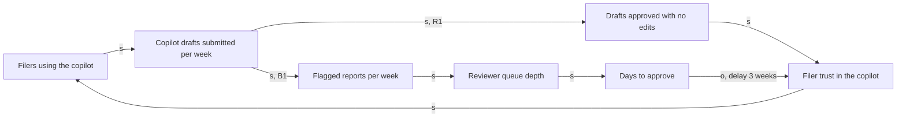

# Causal Loop Diagram

Based on the system dynamics of Jay Forrester, from Industrial Dynamics (1961); the loop notation used here was popularized by Peter Senge (1990). Explained in this repository's own words.

## What it is for

The meeting where a number has gone flat and the room splits: half say the fix is more demand, half say the system is at its limit, and both sides have a chart. A causal loop diagram settles it structurally. You name the variables, draw the arrows, mark each arrow as same-direction or opposite-direction, close the arrows into loops, and label each loop reinforcing or balancing. The question it answers is whether the metric is flat because nothing is pushing it or because something is pushing back, and where the pushback lives. The output is a named loop with a marked delay and a ceiling you can compute, which is what turns "adoption stalled" into "the review queue caps adoption near 520 filers, and every push shows up three weeks late". It is a qualitative instrument: it explains a shape and locates a constraint. It does not forecast.

## Run it when

- A metric grew, then went flat, and the work that produced the first curve has stopped producing
- The same fix keeps needing to be reapplied: the same incident, the same escalation, the same quarter-end scramble
- Two teams propose opposite interventions and each can point at real data
- Before a growth bet whose entire mechanism is "do more of what worked"

**Skip it when:** the variable has one cause and no path back to itself. A linear chain of causes is a fishbone, not a loop, and drawing it as a circle adds an arrow the world does not have; use [five whys and fishbone](../execution/five-whys-fishbone.md).

## Inputs you need first

- Behavior over time: the variable plotted across at least 8 to 12 periods, not a single reading. This method explains a shape, and without the shape you are drawing opinions in a circle.
- Definitions and sources for each variable, from the [metrics dictionary](../../templates/operate/metrics-dictionary.md), so two people mean the same thing by "queue depth"
- The step rates from [growth loops](../metrics/growth-loops.md), if a loop has already been measured; this sheet draws the structure that worksheet quantifies
- Fifteen minutes with whoever operates the suspected constraint: the reviewer, the approver, the on-call. They know the delay's real length, and nobody else does.

## The worksheet

### Step 1: name the variables

<!-- Each variable is a quantity that can rise or fall, written as a neutral noun
     phrase. "Days to approve", never "slow approvals" and never "fix approvals".
     A name that carries a direction inside it (falling trust, poor quality)
     breaks the polarity arithmetic in step 2, because you can no longer say what
     an increase in that variable means. Keep the list to 10 or fewer. -->

| ID | Variable (neutral noun phrase) | Measure and source | Current level | Shape over the last [n] periods (rising / flat / falling / oscillating) |
|---|---|---|---|---|
| V1 | [ ] | [ ] | [ ] | [ ] |
| V2 | [ ] | [ ] | [ ] | [ ] |
| V3 | [ ] | [ ] | [ ] | [ ] |

### Step 2: draw the links and set polarity

Polarity, stated exactly. **s (same)** means that if the cause rises, the effect rises above what it otherwise would have been, and if the cause falls, the effect falls below it. **o (opposite)** means that if the cause rises, the effect falls below what it otherwise would have been. The clause "than it otherwise would have been" is the whole definition. Drop it and every arrow pointing into a growing variable looks like an s, which is how a team ends up with a diagram of nothing but reinforcing loops.

<!-- Some teams write plus and minus instead of s and o. Same meaning, and one
     legend on the diagram settles which you used. Do not mix them in one file. -->

| Link | From | To | Polarity (s / o) | Why, in one line | Delay (none / short / long) |
|---|---|---|---|---|---|
| L1 | [V1] | [V2] | [s] | [ ] | [none] |
| L2 | [V2] | [V3] | [o] | [ ] | [long] |

### Step 3: close the loops and label them

A loop's sign is the product of its link signs, so the only arithmetic is a parity count: **count the o links in the loop. An even count, and zero counts as even, is reinforcing, labelled R. An odd count is balancing, labelled B.** Do it on your fingers, once per loop, out loud. This is the single step where teams guess, and a guessed label inverts the diagram's entire recommendation.

Reinforcing loops compound in whichever direction they are already running, which means the same R loop that grows a product also unwinds it. Balancing loops seek a goal, and every balancing loop has one whether or not anybody wrote it down: a capacity, a budget, a tolerance, a service level someone defends. Write the goal in the table. An unnamed goal is where a plateau hides, because the team argues about effort while the goal is the thing setting the ceiling.

| Loop | Name (a sentence a stakeholder would repeat) | Variables in order | Count of o links | Type (R / B) | Implicit goal (B loops only) | Behavior if it dominates |
|---|---|---|---|---|---|---|
| R1 | [ ] | [ ] | [0] | R | not applicable | [compounds, in the direction it is already running] |
| B1 | [ ] | [ ] | [1] | B | [the capacity or tolerance that sets the ceiling] | [approaches the goal and holds] |

### Step 4: mark the delays

| Delay | On which link | Length | How you know the length | What it does to the behavior |
|---|---|---|---|---|
| D1 | [L2] | [3 weeks] | [interview with the operator, or the lag between the two series] | [ ] |

A delay changes what the loop feels like from inside the team. Reinforcing plus delay is a slow start and then a surprise, in both directions: the growth arrives late and the collapse does too, so the last quiet quarter is not evidence of safety. Balancing plus delay is overshoot and oscillation, and it is the honest explanation for a team that seems to overcorrect every month. They are not making a new mistake each time; they are steering a system whose response arrives after the next decision has already been made.

### Step 5: score the loops for dominance

Existence is not dominance. Every product has half a dozen real loops, and one or two of them explain this quarter's shape. Score each loop:

- **Gain g:** 1 = weak, the effect is visible only across a quarter of data. 2 = moderate, visible within one cycle, but larger drivers exist. 3 = strong, it dominates the variable's movement within one cycle.
- **Speed s:** 1 = slow, the loop comes around in more than one planning period. 2 = moderate, about one planning period. 3 = fast, within a sprint.
- **Dominance = g x s, from 1 to 9.**

The scale is 3 points and not 5 on purpose. A causal loop diagram carries no measurement of its own, so a finer scale would invent precision the instrument cannot supply, and a five-way argument about gain is time spent on the map instead of the territory. If you can defend a 4 out of 5, you have measured the loop, and it belongs in [growth loops](../metrics/growth-loops.md) as arithmetic rather than here as a score.

| Loop | Gain g (1 to 3) | Basis for g | Speed s (1 to 3) | Basis for s | Dominance = g x s |
|---|---|---|---|---|---|
| R1 | [ ] | [ ] | [ ] | [ ] | [ ] |
| B1 | [ ] | [ ] | [ ] | [ ] | [ ] |

### Step 6: the intervention table

The ordering below is not a separate method; it falls out of the parity rule. While a balancing loop dominates, pushing harder on a link inside the reinforcing loop buys exactly the delay's length in good weeks and then hands them back, because the B loop's goal has not moved. So options are ranked by what they touch, not by what they cost.

| Rank | What the option touches | What it buys | What it costs |
|---|---|---|---|
| 4 | A link inside the dominant R loop | The delay's length in good weeks, then the ceiling reasserts | Real money, no ceiling change |
| 3 | A link inside the dominant B loop | Moves the ceiling, in proportion to the link | Usually engineering work |
| 2 | The B loop's goal | Moves the ceiling furthest per unit of effort | Someone owns that goal and must agree |
| 1 | The B loop's structure, by removing the link | Ceiling is set by something else entirely | A different product, and a new risk row |

| Option | Touches (R link / B link / B goal / structure) | Expected ceiling after the change | Cost | Weeks before the result is readable | Owner |
|---|---|---|---|---|---|
| [ ] | [ ] | [ ] | [ ] | [delay length plus one cycle] | [role] |

## Reading the result

A flat variable with an R and a B loop scoring equal dominance is a plateau, and that is a finding rather than a shortage of demand; the growth work is being spent against a ceiling. No B loop on the page means you have not looked hard enough, because every real reinforcing loop meets a limit, and the missing one is almost always a person's capacity, an approval, or a budget line. Nothing but B loops with an oscillating variable means the delay is the story, and the fix is to shorten it or to stop steering between readings. A diagram nobody can read aloud in a meeting, which is roughly more than ten variables, has become a model rather than a diagram; cut it back to the loops that carry the behavior and keep the rest in a note. The test that the whole thing is right is simple and unforgiving: it must predict the shape you already have on the chart. A diagram that explains a curve which did not happen is a story with arrows on it.

## ILLUSTRATIVE example

Invented figures for Ledgerline's expense-report copilot. Adoption climbed from 40 filers in week 1 to about 520 by week 9, then sat between 505 and 530 for six weeks. An onboarding campaign in week 11 added 60 filers over three weeks, after which the count fell back to 515 by week 16. The growth team read this as message fatigue and asked for a second campaign.

| Loop | Name | Count of o links | Type | Implicit goal | Gain | Speed | Dominance |
|---|---|---|---|---|---|---|---|
| R1 | Clean drafts earn trust, trust brings filers | 0, even | R | not applicable | 3 | 2 | 6 (ILLUSTRATIVE) |
| B1 | The review queue is the ceiling | 1, odd | B | The flagged volume two reviewers can clear, about 260 reports per week | 3 | 2 | 6 (ILLUSTRATIVE) |

Ceiling arithmetic, all inputs ILLUSTRATIVE: each filer submits 1.6 drafts per week, a share of 0.31 of drafts is flagged for manual review, and two reviewers clear 130 flagged reports each per week, so capacity is 260 per week. Flagged inflow per filer per week is 1.6 x 0.31 = 0.496. The ceiling is 260 / 0.496 = 524 filers. Observed adoption sits at about 520. The plateau is not fatigue; it is arithmetic, and the delay on the trust link is why the week-11 campaign looked like it worked for three weeks before giving the filers back.

| Option | Touches | Expected ceiling (ILLUSTRATIVE) | Weeks to read |
|---|---|---|---|
| Second onboarding campaign | R1 link | 524, unchanged | 4 |
| Add a third reviewer | B1 goal, capacity to 390 per week | 390 / 0.496 = 786 filers | 5 |
| Cut the flag share from 0.31 to 0.18 by fixing category matching | B1 link | 260 / 0.288 = 903 filers | 6 |
| Replace per-report review with a sampled audit | B1 structure | Set by something else; opens an audit-evidence risk row | 8 |

The team took the flag-share work. Cutting the share buys more headroom than the extra reviewer and does not add permanent cost, and the sampled-audit option was parked as a structural change that needs a row on the [risk matrix](../execution/risk-matrix.md) before anyone builds it.

## The decision it feeds

Whether the next bet pushes the driver or relieves the constraint. That is the choice this diagram changes: it moves a quarter's spend off another adoption campaign and onto the review path, and it turns a headcount request into a comparison against an engineering fix with a number attached to each. Where a plateau was previously argued as a demand problem, the diagram names the ceiling, its owner, and what moving it is worth.

## Where the output lands

[Growth plan](../../templates/planning/growth-plan.md), section 3 (the loop or channel behind the metric): the named loops with their R and B labels, the marked delay, and the ceiling arithmetic. The option chosen from step 6 becomes section 4's cheapest experiment, and the delay length sets that experiment's minimum duration, because a result read before the loop comes around is noise.

## Re-run trigger

Re-run when the shape changes or the constraint moves: a flat variable starts moving, a push produces a few good weeks and then reverses, or the ceiling named in a B loop is relieved (capacity added, a link fixed, a goal renegotiated). Relieving a constraint does not remove the ceiling, it hands dominance to the next loop, and that loop is usually not on the current page. Re-run also at the start of each planning period, since the diagram is an input to where the period's effort goes.

## The trap: when this method misleads you

This instrument produces confident nonsense whenever the arrows come from the room rather than from data. The parity arithmetic is mechanical and always returns a clean R or B label, so a diagram assembled out of shared belief hands that belief the appearance of proof, complete with a named loop a stakeholder will repeat in a review. Three conditions make it worse. Variables named with a direction inside them ("declining trust") corrupt every polarity that touches them, because an increase in a falling thing is undefined. Existence gets read as dominance, and a real but weak loop, once it has a memorable name, becomes the reason for a bet nobody sized. And a diagram drawn without behavior-over-time data cannot be falsified by anything, which is exactly why it will survive its first two reviews. The discipline that saves it: draw the chart first, then require the diagram to explain that chart, then check the ceiling with arithmetic. If the numbers refuse, the diagram is wrong, not the numbers.

## Feeds

- [Growth plan](../../templates/planning/growth-plan.md), sections 3 and 4, the primary landing place
- [Growth loops](../metrics/growth-loops.md), which quantifies the reinforcing loop this sheet locates, and [north star input tree](../metrics/north-star-input-tree.md), whose tree assumes a hierarchy this diagram can show is actually a circle
- [Product strategy](../../templates/planning/product-strategy.md), section 1 (the diagnosis), when the dominant balancing loop is the strategic problem
- [Metrics review](../../templates/operate/metrics-review.md), section 4 (what we predicted versus what happened), where a delay explains a miss that looked like a wrong bet
- [Risk matrix](../execution/risk-matrix.md) and the [risk register](../../templates/execution/risk-register.md), which take the row that a structural change opens
- [Five whys and fishbone](../execution/five-whys-fishbone.md) for the linear case, and the [premortem worksheet](../execution/premortem-worksheet.md), whose failure stories often name a loop nobody had drawn
- [Incident postmortem](../../templates/operate/incident-postmortem.md), section 3 (contributing causes), when the same incident keeps returning
- Run by the [growth agent](../../agents/growth-agent.md); reviewed at [Gate 6: outcomes verified](../../os/STAGE-GATES.md)
- Method background: the [knowledge index](../../knowledge/INDEX.md), and the [frameworks index](../README.md) for where this sits among the other worksheets
