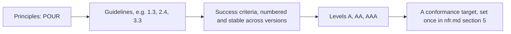

# Accessibility and Inclusive Design

Primary source: the W3C Web Accessibility Initiative, through Web Content Accessibility Guidelines (WCAG) 2.2, a W3C Recommendation republished with errata on 12 December 2024. Testing-evidence figures come from the UK Government Digital Service (2017), Vigo, Brown and Conway (W4A 2013), Deque Systems, Power, Freire, Petrie and Swallow (CHI 2012), and WebAIM.

## The essence

Accessibility is a property of the experience design, not a pass applied to it after the fact. WCAG organizes that property into four principles, POUR: content and controls must be Perceivable (available to more than one sense), Operable (usable by keyboard, switch, or voice, not only a mouse), Understandable (predictable, with input errors explained), and Robust (interpretable by the assistive technology a person already has). Under each principle sit guidelines, and under each guideline sit testable success criteria, numbered so the numbering stays stable release to release, for example guideline family 1.3 (adaptable structure), 2.4 (navigable), or 3.3 (input assistance). Each success criterion is rated Level A (the floor), AA (the common target), or AAA (rarely adopted wholesale). A team names its target level once, in the non-functional requirements, and every other artifact in this repository inherits it rather than re-deciding it.

WCAG 2.2 added nine success criteria over 2.1. Six sit at A or AA, the levels most products target: 2.4.11 Focus Not Obscured (Minimum), AA; 2.5.7 Dragging Movements, AA; 2.5.8 Target Size (Minimum), AA, which sets a 24 by 24 CSS pixel floor for pointer targets, with listed exceptions such as inline text links; 3.2.6 Consistent Help, A; 3.3.7 Redundant Entry, A; and 3.3.8 Accessible Authentication (Minimum), AA, which bars a cognitive function test, remembering a password, solving a puzzle, at any authentication step, subject to listed exceptions. Three sit at AAA: 2.4.12 Focus Not Obscured (Enhanced), 2.4.13 Focus Appearance, and 3.3.9 Accessible Authentication (Enhanced). The same release removed 4.1.1 Parsing as obsolete, because assistive technology no longer parses HTML directly; a team still bound by a policy that names 2.0 or 2.1 by number may still be asked to test and report it. Content that conforms to 2.2 also conforms to 2.1 and 2.0: 2.2 does not deprecate the earlier numbers, and the W3C's own advice is to adopt 2.2 even where a policy still names an older version by name.

WCAG 3.0 is a Working Draft, most recently dated 10 September 2026. It contains only requirements at developing status, it says explicitly that it does not replace WCAG 2, and it has not settled its own conformance model, whether requirements split into core and supplemental, whether levels survive as Bronze, Silver, and Gold, or something else. Cite it only as a status marker of a document in progress; do not set a conformance target against it and do not repeat a delivery date for it, because none is stated as fact by the working group itself.

The WAI-ARIA Authoring Practices Guide opens its pattern library with a warning worth keeping ahead of any component spec: "No ARIA is better than bad ARIA." Incorrect ARIA misrepresents the interface to a screen reader user more than no ARIA at all would, and the guide is explicit that its own example code needs testing across real browser and assistive-technology pairs before it reaches production, not copied as a promise.

## Where it came from

The Web Accessibility Initiative has run WCAG's development since the 1990s, moving from WCAG 1.0's technology-specific checkpoints to a full restructure into 2.0's technology-agnostic success criteria in 2008, a rewrite that did not carry 1.0's checkpoints forward unchanged, then 2.1 in 2018 and 2.2 in 2023, each keeping the earlier numbering; 2.2 removed one criterion, 4.1.1 Parsing, as obsolete, as noted above. The testing-evidence base this card leans on is younger and comes from a different tradition entirely: government and academic groups measuring what their own tools and processes actually catch, rather than what a specification promises. The UK Government Digital Service ran a controlled experiment on a single page built with 142 known barriers; Vigo, Brown and Conway benchmarked tools against the WCAG 2.0 criteria set at the 2013 Web for All conference; Power, Freire, Petrie and Swallow observed real blind users on real sites at CHI 2012; WebAIM has scanned the same slice of the web every year since 2019. None of the four groups set out to write a standard. They set out to find out whether following one actually works, and the honest answer each produced is more useful to a PM than the standard's own text.

## When to use it

- Before any component or flow reaches Gate 3: accessibility is architecture, not polish, and the [accessibility checklist](../../templates/architecture/accessibility-checklist.md) is where the target level gets walked component by component.
- When planning a usability test that will actually catch what a checklist cannot: the [usability test plan](../../templates/discovery/usability-test-plan.md) needs disabled participants walking real tasks, not an engineer clicking one control in isolation.
- When a design review needs one place to record what was walked, what passed, what did not, and who owns each gap: the [design review record](../../templates/architecture/design-review-record.md) carries that evidence across Gate 3 and into delivery.
- When a claim of conformance is about to leave the design team's hands, toward a customer, a procurement form, or a regulator: stop, and read the last paragraph of [How it lies](#how-it-lies) below before writing another word.

**Skip it when:** the work never reaches a real person, for example an internal data migration script with no interface, or the accessibility target is already inherited unchanged from a signed nfr.md and nothing about this feature's components, flows, or content is new. Re-open this card the moment either of those stops being true.

## How much testing actually catches

Three groups measured automated and semi-automated testing against three different denominators, and each produced a different number because each asked a different question. Quoting one figure as "how much testing catches" without saying which of the three it is, is the single most common way this evidence gets misused.

- **Per deliberately placed barrier.** The UK Government Digital Service built one page with 142 known accessibility barriers and ran it through 13 automated checkers in 2017. The best tool fully detected 40 percent of them; the worst detected 13 percent. Counting items a tool flagged for a human to check, rather than fully detected on its own, raised some tools' scores; the best tool on that measure reached 50 percent. Either way, a checker's report is a worklist, not a verdict.
- **Per WCAG success criterion.** Vigo, Brown and Conway benchmarked six tools against the WCAG 2.0 criteria set at W4A 2013. No tool in the study covered more than half of all success criteria, so relying on tools alone leaves about half the standard unchecked; completeness within the criteria a tool claimed to cover ran 14 to 38 percent, and correctness fell to 66 to 71 percent in the tools with the highest completeness, because catching more violations brought more false positives.
- **Per logged issue, by volume.** Deque, the vendor of the axe-core engine, reports that its automated tests found 57.38 percent of all issues by volume across more than 13,000 first-audit pages and page states, about 300,000 issues in total, with the five most common criteria accounting for 78 percent of that volume. This is a vendor claim, and it measures something different again: a handful of frequent issue types, missing alt text and low contrast chief among them, dominate the count, so a high volume-share figure can coexist with entire guideline families a tool cannot see at all.

A "roughly 30 percent" figure circulates widely in accessibility discussion and has no traceable primary source behind it. Do not use it. Cite one of the three figures above instead, and name its method every time, because a bare percentage borrowed from this evidence and stripped of its method is a number doing work it was never built to do.

Automated coverage is also not the same question as usability. Power, Freire, Petrie and Swallow observed 32 blind users completing tasks across 16 websites at CHI 2012 and logged 1,383 real problems. Only 50.4 percent of those problems were covered by any WCAG 2.0 success criterion at all, and on 16.7 percent of the sites tested, the recommended WCAG technique was correctly in place and still did not solve the problem the user actually had. A document that lists only passing checklist rows can look complete while the people it was built for are still stuck.

WebAIM's Million report, run on the same method every year since 2019, gives the trend a team should actually be watching. The 2026 report found an average of 56.1 automatically detectable errors per home page, up 10.1 percent on 2025; low-contrast text on 83.9 percent of pages, missing alternative text on 53.1 percent, missing form labels on 51 percent, and empty links on 46.3 percent; six error types accounted for 96 percent of all detected errors; and ARIA attribute usage rose 27 percent in one year to roughly 133 attributes per page, in the same period the APG's own warning about bad ARIA has stood unchanged. Full WCAG 2 A and AA conformance was certainly held by well under 4.1 percent of the pages sampled, since that is the ceiling implied by pages with zero automatically detected errors. A single-year snapshot from this report proves little; the same method run year after year is what makes the trend line worth trusting.

## Sampling like an evaluator, not a spot check

The W3C names a sampling method for this, Website Accessibility Conformance Evaluation Methodology (WCAG-EM) 1.0, worth knowing by name and citing directly rather than reinventing badly: a structured sample chosen to represent the site's page and screen types, plus a random sample on top of it, covering states as well as pages, error states, timeouts, and third-party embedded content included, with a partial-conformance statement for the content a team does not control. The practical translation for a checklist run inside this repository:

- **Conformance is all-or-nothing per page state, never a percentage.** A checkout flow that conforms on its happy path and fails on its error state is not "90 percent accessible"; it has a failing state, and the checklist should list which success criteria fail there, not a blended score.
- **Set the automated ruleset to the target level explicitly.** Most checkers default to an older WCAG version, often 2.0 or 2.1, and will silently under-report against a 2.2 AA target unless the ruleset is configured to match it.
- **"Incomplete" or "needs review" results are mandatory manual rows, not passes.** An automated tool that cannot determine an answer is telling a team exactly where its own coverage ends; recording that result as a pass erases the honest half of the report in the second bullet above.
- **A per-component mode that silently skips a check stays silent in continuous integration.** A component accessibility test that can be marked as deferred, or left as a non-blocking warning, can carry a known, unfixed issue indefinitely, because nothing in the pipeline ever turns red over it.
- **Record who owns each row, and whether the pass was tested or only assessed.** A checklist row should say whether the component is the team's own code, a shared internal component, or a third-party library, and whether the pass was actually exercised with assistive technology or only assessed from source code and not yet tested. The two are different claims, and conflating them is how a library's documented behavior gets reported as a tested one.
- **A silenced check needs the rule named, a reason, and, in this repository, a second approver and an expiry date.** The svelte-ignore convention requires naming the silenced rule and giving a reason; this repository goes further and requires an approver who is not the row's author, plus a date to revisit it. A row marked "N/A because" or a suppressed warning that nobody but the person who wrote the code ever reviewed, and that carries no date to revisit it, tends to stay silenced forever.

## Research and evidence with real users

One GOV.UK Service Manual habit is worth adopting whole: ask participants with disabilities to bring their own assistive technology to a research session, because their personal configuration is hard to recreate in a lab and is usually part of what makes the difference between a task that succeeds and one that does not; visit the participant instead when they cannot bring their setup with them. GOV.UK's page covers session logistics only, not analysis or reporting.

This repository adds its own practitioner heuristic on top: report assistive-technology users' task success as its own line in the results, never folded into an aggregate, and note the specific configuration used, voice speed, verbosity settings, custom gestures included. An average that looks healthy can be hiding a subgroup that failed the task outright, and folding the two together is the same error as reporting a passing checklist in place of the observation that would have caught it. This second habit is this card's recommendation, not a claim from the GOV.UK source.

Choosing which assistive technology to test with needs the same care. WebAIM's Screen Reader User Survey #10 found JAWS at 40.5 percent, NVDA at 37.7 percent, and VoiceOver at 9.7 percent as the primary desktop screen reader, from an uncontrolled, self-selected sample of 1,539 respondents skewed heavily toward North America and Europe, with only 4.8 percent of respondents from Africa and the Middle East. That is a defensible starting matrix for a desktop screen reader test in a market the survey actually represents. It is not evidence for choosing an Arabic or Urdu assistive-technology matrix, and the honest position for a team shipping into those markets is that the data has not been collected yet, not that the global survey answers the question by default.

The clearest documented failure mode in this evidence base is the overlay, a script added to a site that claims to make it accessible without changing the underlying markup. In April 2025 the US Federal Trade Commission finalized a one million dollar order against accessiBe over deceptive compliance claims and paid reviews: the order bars accessiBe from claiming that its automated products can make any website WCAG-compliant, or keep it compliant over time, without competent and reliable evidence. The order concerns what accessiBe claimed, not a technical finding about what any overlay can or cannot do. This card's own practitioner assessment, not the FTC's, is that an overlay sitting on top of markup it did not author cannot reliably add a label a form never had, reliably repair a keyboard trap, or reliably make an error message get announced before a form silently submits, and it can interfere with a screen reader user who already has their own tool configured the way they need it; an overlay can and does inject things like ARIA labels or alt text at runtime, the problem is that doing so reliably, for every case a real audit would catch, is not established. Treat any product pitched as an instant compliance layer with the same skepticism the FTC's order demonstrates is warranted, never as a shortcut to reach for. As of 2026-09-10; review if the FTC modifies or further enforces this order; this is not legal advice, confirm with counsel before relying on it.

## The trap: a conformant library, a broken flow

A component library can pass every isolated accessibility test its own component catalogue runs, and the flow built from those components can still fail. Focus gets lost between steps of a wizard that assembles compliant form fields. A live region that would announce correctly in isolation never fires because the page that hosts it swaps content without triggering it. An error summary links to nothing because the flow that generates it was hand-built around components that were each tested one at a time. A modal traps focus correctly and simply never returns it to where the user was.

The unit that has to conform is the flow a real person walks end to end, not the catalogue of parts that flow happens to be built from. This is exactly why the accessibility checklist's component-by-component tables are a floor and not the whole test, and why the usability test plan needs to schedule sessions where a disabled participant completes the entire task, start to finish, rather than a session where an engineer exercises one control at a time.

## How it lies

The testing-evidence triad above looks like it converges on "roughly half," and that convergence is an illusion built from three different denominators answering three different questions: barriers on one synthetic page, success criteria a tool claims to cover, issues by volume across real audits. None of the three tells a team what fraction of its own users' real problems its own process would catch, which is the only number that actually matters, and it is not a number any of these studies produced. Cite the figure whose method matches the question being asked, never the smallest or the most reassuring one on offer.

A passing checklist is not evidence that a product is usable by disabled people. Power et al.'s finding that half of the real problems blind users hit in their study fell outside any WCAG success criterion means a document built entirely from checklist rows can report a clean pass while the people it exists for are still stuck. Nothing in this card, or in the checklist it feeds, substitutes for watching a disabled person use the product.

Sampling only the happy path lies by omission in the same way. A conformant landing page and a broken checkout error state are both part of "the site" under a sampling method built around states as well as page types; a review that never reaches the error state, the timeout, or the third-party embedded widget has not evaluated the product, only its best moment.

The largest lie this card exists to refuse is the certified one. **Never certify conformance.** No checklist, no automated scan result, and no overlay product grants a defensible claim that a product conforms to a named standard. That claim belongs to a formal audit, run against a named method with a named date, and to the legal and regulatory obligations that decide which standard and which level actually bind a given product in a given market, which is the sibling card's job, [accessibility-regulation.md](accessibility-regulation.md), not this one's. As of 2026-09-10; review if the cited regulator or standards body revises its position; this is not legal advice, confirm any conformance or certification claim with counsel.

## Where it sits in the loop

- Stage: DESIGN, on trial at [Gate 3: architecture and risks reviewed](../../os/STAGE-GATES.md). The conformance target itself is set once, in `templates/definition/nfr.md` section 5, and every artifact this card feeds inherits it rather than re-deciding it.
- Upstream: personas and journey maps that name disabled users as a real segment with real tasks, not as an edge case appended after the design is otherwise finished.
- Downstream: the [accessibility checklist](../../templates/architecture/accessibility-checklist.md) walks the product component by component against the guideline families named above; the [usability test plan](../../templates/discovery/usability-test-plan.md) schedules the sessions that test the composed flow with real assistive-technology users, per the research habits above; the [design review record](../../templates/architecture/design-review-record.md) is the one signed record of what was walked and what still needs an owner, carried across the design and delivery gates.
- Checked in delivery by [agents/acceptance-agent.md](../../agents/acceptance-agent.md), which reports missing evidence as missing rather than assuming a pass.
- Which law or regulator sets the floor for a given product and market, and what evidence a public accessibility statement or an audit trail needs to hold, is [accessibility-regulation.md](accessibility-regulation.md)'s job. Read both cards together for a regulated product; this one supplies the practice, that one supplies the obligation.

## Used by

- [Accessibility checklist](../../templates/architecture/accessibility-checklist.md)
- [Usability test plan](../../templates/discovery/usability-test-plan.md)
- [Design review record](../../templates/architecture/design-review-record.md)

## Reading

- [Web Content Accessibility Guidelines (WCAG) 2.2](https://www.w3.org/TR/WCAG22/), W3C Recommendation, republished with errata 12 December 2024. W3C Document License: paraphrase with attribution and a link; criterion numbers and names may be quoted with the W3C notice; normative text is not reproduced or modified here.
- [W3C Accessibility Guidelines (WCAG) 3.0](https://w3c.github.io/wcag3/guidelines/), W3C Working Draft, dated 10 September 2026. W3C Document License: cited only as a status marker; no checklist in this repository is built on it.
- [WAI-ARIA Authoring Practices Guide, Read Me First](https://www.w3.org/WAI/ARIA/apg/practices/read-me-first/). W3C Software and Document License: adapt with notice, per docs/REFERENCES-DESIGN.md; the "No ARIA is better than bad ARIA" line is quoted above. After the WAI-ARIA Authoring Practices Guide, W3C Software and Document License.
- [Accessibility tools audit, 142 barriers, 13 tools](https://alphagov.github.io/accessibility-tool-audit/), UK Government Digital Service, 2017 (MIT-licensed repository). Paraphrase with attribution, per docs/REFERENCES-DESIGN.md; figures date-stamped to 2017 tool versions. After the GDS accessibility tools audit, MIT.
- [Vigo, Brown and Conway, Benchmarking web accessibility evaluation tools](https://doi.org/10.1145/2461121.2461124), W4A 2013. ACM copyright: cited only, with figures attributed.
- [The Automated Accessibility Coverage Report](https://www.deque.com/automated-accessibility-coverage-report/), Deque Systems. Vendor copyright: cited only, labeled as a vendor claim throughout.
- [Power, Freire, Petrie and Swallow, Guidelines are only half of the story](https://doi.org/10.1145/2207676.2207736), CHI 2012. ACM copyright: cited only.
- [The WebAIM Million, 2026 report](https://webaim.org/projects/million/), WebAIM. Copyright WebAIM: cited only, with year-stamped figures.
- [WebAIM Screen Reader User Survey #10](https://webaim.org/projects/screenreadersurvey10/), WebAIM. Copyright WebAIM: cited only, with its sample composition stated alongside every figure drawn from it.
- [FTC final order, accessiBe](https://www.ftc.gov/news-events/news/press-releases/2025/04/ftc-approves-final-order-requiring-accessibe-pay-1-million), April 2025, US Federal Trade Commission. Public domain, US government work: adapted freely with citation.
- [Running research sessions with disabled people](https://www.gov.uk/service-manual/user-research/running-research-sessions-with-people-with-disabilities), GOV.UK Service Manual. Open Government Licence v3.0: adapt with notice, under the OGL attribution requirement, per docs/REFERENCES-DESIGN.md. Contains public sector information licensed under the Open Government Licence v3.0.
- [Website Accessibility Conformance Evaluation Methodology (WCAG-EM) 1.0](https://www.w3.org/TR/WCAG-EM/), W3C. W3C Document License: named and linked as the sampling method; no text was taken from it, so what appears above is this repository's own restatement of the method's shape, to verify against the source before citing further.
- storybookjs/storybook, commit 4431a2f (MIT license). Paraphrase with attribution, per docs/REFERENCES-DESIGN.md: the per-component test mode that can be marked as deferred, or set to warn-only, without failing a build.
- mui/material-ui, commit 5ce5a0f (MIT license). Paraphrase with attribution, per docs/REFERENCES-DESIGN.md: the per-component conformance-report model distinguishing a tested pass from one assessed from source code only and not yet tested.
- sveltejs/svelte, commit ce89035 (MIT license). Paraphrase with attribution, per docs/REFERENCES-DESIGN.md: the svelte-ignore convention of naming the silenced rule with a reason. The second-approver and expiry-date requirement above is this repository's own addition, not something svelte itself requires.
