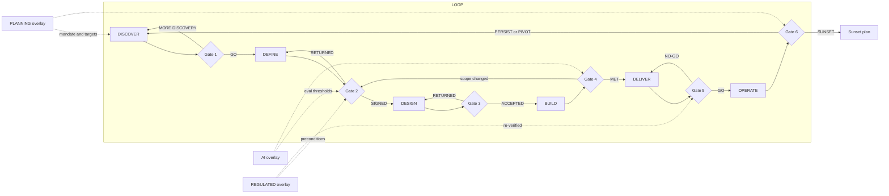

# The Operating Loop

One product, six stages, six gates. A stage opens when the previous gate is signed and closes when its own gate is signed. Gates are documents, not ceremonies: the checklists live in [STAGE-GATES.md](STAGE-GATES.md), and a full narrative pass is in [HOW-TO-RUN-A-PRODUCT.md](HOW-TO-RUN-A-PRODUCT.md).

Two decisions come before any template gets filled. How heavy should the artifact be: [WHICH-DOCUMENT.md](WHICH-DOCUMENT.md) answers that in three questions. Where does the filled copy live: [PRODUCT-WORKSPACE.md](PRODUCT-WORKSPACE.md) defines the folder convention that becomes the product's memory.

The loop is a loop. Gate 6 does not end the product; it decides whether the next pass through DISCOVER is a deepening, a pivot, or a sunset.

```
DISCOVER -> [Gate 1] -> DEFINE -> [Gate 2] -> DESIGN -> [Gate 3]
        -> BUILD    -> [Gate 4] -> DELIVER -> [Gate 5] -> OPERATE -> [Gate 6] -> loop
```



Read the dotted lines as the part teams forget. A product that enters DISCOVER without a planning mandate has no target for Gate 6 to score, and a product whose overlay attaches after Gate 2 pays for the overlay twice: once as design and once as rework.

## How to read a stage

Each stage below has an entry condition, the work, and an exit condition. The two conditions are not decoration. They answer the question that wastes the most time in product organizations: which stage are we actually in?

- **The entry condition is a test, not a feeling.** If you cannot point at the artifact the condition names, you are in the previous stage and calling it this one.
- **The exit condition is the gate, compressed.** Every exit line below expands into a checklist in [STAGE-GATES.md](STAGE-GATES.md). If the compressed version and the checklist disagree, the checklist wins, because that is the version a human signs.
- **Each stage has one characteristic failure with a visible tell.** The tell is on the page, not in the mood of the room. Teams argue about vibes and agree about pages, so name the page.

## The six stages

### 1. DISCOVER

Find a problem worth solving and prove someone has it.

- **Entry:** a trigger worth investigating: a metric moved, a customer pattern repeated, a strategic bet was named. Or Gate 6 from a previous pass sent you back here.
- **Work:** frame the problem, plan and run research, meet users, map their journey. Templates: `../templates/discovery/problem-framing.md`, `../templates/discovery/user-research-plan.md`, `../templates/discovery/personas.md`, `../templates/discovery/journey-map.md`, and `../templates/discovery/competitive-analysis.md` when a specific decision needs it, all rolled up into `../templates/discovery/discovery-document.md`. Raw feedback becomes weighted themes through `../skills/feedback-synthesis/SKILL.md` before it enters any of them.
- **Exit:** Gate 1, problem worth solving. Evidence from real users, a cost of inaction, and an explicit go or no-go. A no-go here is a success: it cost a week, not a quarter.

**Entry test.** One named trigger, written down, with a date and a source. If the trigger is "leadership wants us to look at onboarding", the trigger is not the metric that moved, it is a sentence in a meeting, and DISCOVER's first job is to find the metric or admit there is not one. If the entry is a Gate 6 PIVOT, the entry artifact is that gate attempt: the pivot inherits the previous pass's evidence and must say which parts it is discarding, because a pivot that keeps every prior belief is a rename.

**Exit test.** Five or more primary sources cited by name in the discovery document, one problem sentence that three people at the gate state identically, a cost of inaction with its arithmetic shown, and the Gate 6 success signal named before any solution exists. That last item is the one teams skip and the one that makes Gate 6 possible: a signal chosen after launch is chosen to be met.

**Characteristic failure: solution-shaped discovery.** The team researches whether people want the thing already decided on. The tell is in the research plan's script, section by section: if the questions contain the solution ("would a two-week forecast help you?") rather than the last occurrence of the pain ("tell me about the last time cash surprised you"), the answers are compliance, not evidence. The interview discipline that prevents it sits in `../frameworks/discovery/mom-test-interview-guide.md`; the reason it works is in `../knowledge/torres-continuous-discovery.md`.

**Worked micro-example.** Ledgerline, a fictional invoicing product for small businesses, enters DISCOVER because support tickets tagged "overdraft" ran 40 to 60 per week for two quarters while total ticket volume was flat. That is a trigger: a rate, a period, a source system. Cost of inaction: 11 of 34 churn interviews last quarter named a cash surprise, and at a monthly subscription of 29 currency units, the annualized value of that churn slice is the number the gate argues about. Nobody has to agree with the estimate. They have to be able to see how it was built.

### 2. DEFINE

Turn the validated problem into requirements someone can build, test, and sign.

- **Entry:** Gate 1 signed.
- **Work:** business case (`../templates/definition/brd.md`), product requirements (`../templates/definition/prd.md`, or `../templates/definition/one-pager.md` at the lighter weight), functional detail (`../templates/definition/frd.md`), non-functional targets (`../templates/definition/nfr.md`), business rules, the assumptions register, and acceptance criteria that can actually fail. Pick the weight first with `WHICH-DOCUMENT.md`; the gate asks the same questions either way.
- **Exit:** Gate 2, requirements signed off. Every requirement testable, every assumption registered, sponsor named. Regulated products answer the regulated overlay's precondition questions here, before design starts, because a license condition beats a sprint plan every time.

**Entry test.** A signed Gate 1 attempt in `products/<name>/gates/`, plus a weight decision logged per [WHICH-DOCUMENT.md](WHICH-DOCUMENT.md). Opening a PRD before the weight question is answered is how a two-week change acquires twelve sections nobody reads.

**Exit test.** Every acceptance criterion has a condition, an expected result, and a threshold that a test could report as failing. Every NFR target is a number or names an owner and a date that will produce the number. Every assumption in `../templates/definition/assumptions-register.md` carries a confidence, a validation method, and a validate-by date. The sponsor signed the BRD itself and not only the gate form, because a sponsor who signs the gate but not the business case has approved a process, not a commitment.

**Characteristic failure: prose that cannot fail.** "The forecast should feel trustworthy" survives review because nobody wants to be the person who objects to trustworthiness. The tell is grammatical: an acceptance criterion with an adjective in the expected-result field and no unit anywhere in the row. Read your criteria looking only for units. Rows without one are opinions with a checkbox. For model behavior the fix is not a better adjective, it is an eval row in `../templates/ai/eval-spec.md` with a dataset and a threshold.

**Worked micro-example.** Ledgerline's forecast has an NFR line for freshness. Attempt one reads "forecasts should be based on recent bank data". Attempt two reads: forecast recomputes within 90 minutes of a bank-feed sync; if the newest transaction is older than 36 hours, the forecast renders with a staleness banner and the explanation states the data age; owner, the platform lead; measured from the feed timestamp in the sync table. The second version can fail on a dashboard. The first can only be argued about in a launch review.

### 3. DESIGN

Decide how it will be built and what could go wrong, before anything is built.

- **Entry:** Gate 2 signed.
- **Work:** system and solution architecture, decision records, data model, API contracts, sequence diagrams, integrations, security architecture, observability plan (all under `../templates/architecture/`). In parallel, the execution set: stakeholder map, risk register, decision log, dependency register (`../templates/execution/`).
- **Exit:** Gate 3, architecture and risks reviewed. Alternatives were considered on paper, the premortem ran, and every high risk has an owner.

**Entry test.** Signed Gate 2, and the requirement set frozen enough that an architect can be wrong about it. Designing against requirements still in motion produces architecture that encodes the motion: optional fields everywhere, no decisions recorded, and an ADR log with one entry that says "flexible".

**Exit test.** At least one seriously considered alternative rejected in writing with its tradeoff, as a numbered record in `../templates/architecture/adr.md`. Every integration with an owner, a protocol, an SLA, and a stated failure behavior. PII classified in the data model with retention per class. A premortem that actually moved rows onto the risk register, run through `../skills/program-premortem/SKILL.md` onto the sheet at `../frameworks/execution/premortem-worksheet.md`. Observability thresholds set before code exists, because an alert threshold chosen after the first incident is chosen to exclude that incident.

**Characteristic failure: the register that was true in January.** The dependency register is filled at kickoff and never reviewed, so it describes a world that has moved. The tell is a date column where every needed-by date is in the past or every one is the same quarter-end. A live register has ragged dates and at least one row whose status changed in the last two weeks. `../frameworks/execution/risk-matrix.md` scores the rows; this stage's job is to make sure someone reads them again next week.

**Worked micro-example.** Ledgerline rejects a third-party forecasting API. The ADR records why in a form a successor can overturn: latency was acceptable and accuracy was comparable, but the vendor's terms did not allow the transaction-level detail to leave the primary region, and residency was a named constraint from the BRD. That is a reversible-if-terms-change decision, so the ADR names the condition that would reopen it. An ADR that says "we chose to build" without the condition is a preference, not a record.

### 4. BUILD

Build to the spec, and keep the spec honest as reality pushes back.

- **Entry:** Gate 3 signed.
- **Work:** the testing strategy, edge-case and failure-scenario tables (`../templates/delivery/`), acceptance criteria verified case by case, scope changes written into the decision log rather than absorbed silently.
- **Exit:** Gate 4, acceptance criteria met. Not "code complete": criteria demonstrated, edge cases covered by tests, known misses documented with owners.

**Entry test.** Signed Gate 3, plus the analytics instrumentation spec if the PRD names metrics: `../templates/delivery/analytics-instrumentation-spec.md` is written before build starts, because a metric whose events were added after launch has no baseline, and Gate 6 then compares a number to nothing.

**Exit test.** Every Gate 2 criterion demonstrated passing or listed as a miss with an owner and an explicit accept-or-fix decision. No row in `../templates/delivery/edge-cases.md` reading "to be decided". Failure scenarios exercised rather than described: detection fired, recovery ran, the data-loss result matched the write-up. Every scope change since Gate 2 in the decision log with a decider named.

**Characteristic failure: silent backward.** A requirement turns out to be wrong, the team quietly builds something else, and the spec stops describing the product. The tell is a diff: run the acceptance-criteria file against the demo and count rows that no longer parse. Two or more unparseable rows means Gate 2 was amended by nobody, and the launch review will find it. Rule 3 below is the remedy and it costs one decision-log entry.

**Worked micro-example.** Ledgerline's explanation model misses the latency budget: p95 measured at 4.8 seconds against a 1.5 second target. The team precomputes explanations nightly instead of generating on demand. That is a scope change and it touches an acceptance criterion, so it goes into `../templates/execution/decision-log.md` with the options considered, and the affected criterion is re-signed against Gate 2 explicitly. Cost of doing it properly: one meeting. Cost of doing it silently: a Gate 5 conversation in which nobody can say what was promised.

### 5. DELIVER

Ship it on purpose, with a way back.

- **Entry:** Gate 4 signed.
- **Work:** UAT with real users against entry and exit criteria (`../templates/delivery/uat-plan.md`), release readiness (`../templates/delivery/release-readiness.md`), rollback rehearsed, comms drafted.
- **Exit:** Gate 5, release readiness green. Go or no-go signed per function, rollback tested, known issues listed rather than hoped away. Regulated products re-check their overlay here: what was promised in section 0 at DEFINE must be true in the thing that ships.

**Entry test.** Signed Gate 4 and a release candidate that exists, deployed somewhere a non-engineer can open. UAT run against a branch that will be rebuilt before release tests a product that will never ship.

**Exit test.** UAT exit criteria met with real users or named proxies, every severity-1 defect closed. The rollback performed in a pre-production environment with the elapsed time recorded, because "we can roll back" is a belief and "rollback completed in 11 minutes, tested on the 14th" is a fact. Known issues listed with a workaround or an accepted-risk signature. Support and on-call briefed, with a runbook that exists. One signature per function, not one signature for the group.

**Characteristic failure: the untested rollback.** Every incident write-up in the field repeats the same line: the plan existed and had never been run. The tell is the readiness doc's rollback section containing verbs in the future tense and no timestamp. A rehearsed rollback section reads like a log entry.

**Worked micro-example.** Ledgerline's kill switch disables only the explanation component and leaves the numeric forecast live, which is the point of having two switches. The rehearsal flips it in staging, confirms the forecast still renders with the explanation slot collapsed rather than showing an empty box, and flips it back. Elapsed time recorded in the readiness doc. The bug the rehearsal found was the empty box, and it would have shipped.

### 6. OPERATE

Run it, measure it, and let the numbers decide what happens next.

- **Entry:** Gate 5 signed and the release is live.
- **Work:** operational readiness (`../templates/operate/operational-readiness-review.md`), compliance impact where applicable, and the metrics review (`../templates/operate/metrics-review.md`) against the targets set back in DEFINE.
- **Exit:** Gate 6, outcomes verified. The explicit decision: persist, pivot, or sunset. Each of the three loops back to DISCOVER with what was learned. Skipping this gate is how zombie products are born.

**Entry test.** Live in production, with the instrumentation emitting. A product live for a week with no events reaching the warehouse is not in OPERATE; it is in an outage of the measurement system, and that is a BUILD defect discovered late.

**Exit test.** The Gate 1 success signal measured, with the source system and calculation stated. Every planning key result scored number against number. Input metrics examined and not only the headline, because a headline can move for a reason your product did not cause. Operational load reviewed: incidents, on-call pain, support volume, cost to serve. One of exactly three decisions, with its consequence scheduled: the next DISCOVER pass, the pivot's Gate 1, or `../templates/operate/sunset-eol-plan.md` with dates and an owner.

**Characteristic failure: the review that rounds up.** The headline moved, the review says success, and nobody looks at whether the driver moved. The tell is a metrics review whose input-metric section is shorter than its headline section, or one where a flat number is described with an adverb. `../frameworks/metrics/north-star-input-tree.md` is the sheet that makes the drivers explicit; the reason a headline without drivers misleads is in `../knowledge/north-star-metric.md`.

**Worked micro-example.** Ledgerline's headline retention improves by 3 points at six weeks, and the input metric "owners who act on a warning within 48 hours" sits at 31 percent, flat since week two. The honest review names both, and Gate 6 returns PERSIST with the next DISCOVER pass aimed at the flat input rather than at a new feature. That is the loop doing its job: the second pass has a sharper question than the first because the first one measured something.

## The overlays

Three tracks run across the loop rather than inside one stage.

**PLANNING** feeds every stage. The roadmap (`../templates/planning/roadmap.md`) says which products enter the loop and when; OKRs (`../templates/planning/okrs.md`) supply the targets that Gate 6 verifies. A new owner taking over a product in flight starts at `../templates/planning/first-90-days.md`. Planning artifacts are reviewed on their own cadence, not at a gate.

The consequence worth internalizing: planning owns the portfolio's queue, the loop owns one product's sequence. Confusing them produces the roadmap that lists stages ("Q3: design phase") instead of outcomes, which tells a reader when work happens and never whether it should. If a roadmap row cannot name the problem statement it will produce at Gate 1, it is a schedule, not a plan.

**AI OVERLAY** activates whenever the product itself contains a model. The `../templates/ai/` set (eval spec, guardrails, hallucination controls, human approval gates, prompt structure, context management, agent architecture, multi-agent workflow, red-team review) attaches to DEFINE and DESIGN, and its eval thresholds become blocking checks at Gate 4 and Gate 5. A model feature with prose acceptance criteria cannot pass Gate 2: a requirement that cannot fail is not a requirement.

Two tests decide whether it activates, and both are about the artifact rather than the technology. Does model output reach a user or a decision without a human reading it first? Does the product's behavior change when the model version changes? Either yes means the overlay attaches. A model used once by the team to draft copy that a human then edits is a tool, not a product component, and does not activate anything. Domain background: `../knowledge/domains/ai-products.md`.

**REGULATED OVERLAY** activates when the product operates under a financial or data regulator. It lives in `../modules/regulated/` as a byte-exact import, is routed through `../skills/reg-gap-check/SKILL.md`, and hooks into the loop at Gate 2 (preconditions answered before requirements freeze) and Gate 5 (overlay re-verified before release). Files under the module are never edited in this repository.

The reason the hook is at Gate 2 and not later: a precondition is a constraint on the solution space. Discovered at DESIGN it costs a re-architecture; discovered at DELIVER it costs the launch date; discovered after launch it can cost the license, and no sprint plan outranks a license condition. The determination is recorded even when the answer is no, because "we decided the regulator does not apply" is a decision with a date and an owner, while an unexamined no is an assumption wearing a fact's clothes.

## Stage transitions that are not forward

Four of the six transitions people actually make are not the arrow on the diagram. Name them so they get recorded.

| Move | When it is correct | What it costs | The record it must leave |
|---|---|---|---|
| MORE DISCOVERY at Gate 1 | The problem is real but the evidence class is too weak to fund a quarter | Days | The gate attempt, filed, naming which two questions the next round answers |
| Return to Gate 2 from BUILD | A requirement was wrong, not merely hard | One meeting plus a re-signature | Decision-log entry with options and decider, plus the re-signed criterion |
| Return to DESIGN from BUILD | The architecture cannot carry the requirement, and the requirement stands | Weeks | A superseding ADR, never an edit to the original |
| Sunset at Gate 6 | The outcome was measured and does not justify the running cost | The migration and comms work in `../templates/operate/sunset-eol-plan.md` | A signed Gate 6 naming the number that decided it |

The move that is never correct is sideways: keeping the stage name and changing the work. "We are still in BUILD, we are just re-scoping" is DEFINE with a build team on the payroll.

## What good looks like

| Signal | What good looks like | The anti-pattern, and its tell |
|---|---|---|
| Gate outcomes | A gate history with failures in it | Six gates, six first-attempt passes. Tell: attempt numbers are all 1 |
| Evidence | Claims cite a source a reader could open | "Customers have been asking for this." Tell: no source column anywhere in the discovery document |
| Unknowns | Every unknown carries an owner and a date | Blanks and TBDs. Tell: the assumptions register has fewer rows than the PRD has objectives |
| Overlay decisions | Recorded, including the ones that did not apply | Silence. Tell: no decision-log row mentions the regulator or the model at all |
| Backward moves | Explicit, logged, re-signed | Absorbed. Tell: the decision log's last entry predates the last three scope changes |
| Artifact weight | Chosen in three questions and logged | One PRD template for everything. Tell: a two-day change with twelve filled sections |

## Cadence

The loop is not a calendar, but it does have a rhythm, and stating it prevents the two failure modes at either end: the gate that becomes a monthly ceremony, and the gate that gets scheduled the day someone wants to ship.

- **Gates are events, scheduled when the exit test can plausibly pass**, with the pre-read circulated 48 hours ahead. A gate booked before the artifacts exist trains everyone that the form is theater.
- **Four files are written continuously, not at stages**: decision log, risk register, assumptions register, and STATE.md where a Conductor run exists. Per [PRODUCT-WORKSPACE.md](PRODUCT-WORKSPACE.md), these are the four a new owner reads first.
- **The dependency register is reviewed weekly** from Gate 3 onward, because its whole content is other people's dates and other people's dates move.
- **Gate 6 has a review window, not a review date**: launch plus enough weeks for the behavior to appear. Choosing that window at Gate 5, before the numbers exist, is what stops the window from being chosen to flatter the result.

## Rules of the loop

1. **No stage without its gate.** Work that skips a gate is inventory, not progress. Inventory is the right word because it has a carrying cost: unsigned work accrues decisions nobody can point at, and the interest is paid in the launch review.
2. **Gates fail.** A gate that cannot fail is a ceremony. Expect some no-gos; they are the system working. A product whose entire gate history is first-attempt passes is not a well-run product, it is an unread checklist, and the tell is in the attempt numbers.
3. **Backward is allowed, silent backward is not.** Discovering at BUILD that a requirement was wrong sends you to Gate 2 explicitly, with the decision log updated. The asymmetry is deliberate: going backward costs a meeting, and hiding it costs the ability to answer "what did we promise?" for the rest of the product's life.
4. **Evidence over confidence.** Every gate asks where a claim came from. "The model said so" is not a source. Nor is a slide, a recollection, or a number with no unit and no period attached. The evidence ladder that operationalizes this is in [CONDUCTOR.md](CONDUCTOR.md), and it applies whether or not anyone is running the Conductor.
5. **The loop ends on purpose.** Sunset is a Gate 6 outcome with its own checklist, not an abandonment. A product nobody decided to stop is more expensive than a product someone decided to stop, because the first one keeps consuming on-call attention that no plan accounts for.
6. **Filled artifacts accumulate in one place.** One folder per product, one subfolder per stage, per [PRODUCT-WORKSPACE.md](PRODUCT-WORKSPACE.md). A decision recorded where nobody will find it was recorded for nobody.
7. **The gate does not change with the artifact weight.** A one-pager faces the same Gate 2 questions as a full PRD stack and answers them in fewer words, not in fewer answers. [WHICH-DOCUMENT.md](WHICH-DOCUMENT.md) sizes the document; it never discounts the gate.
