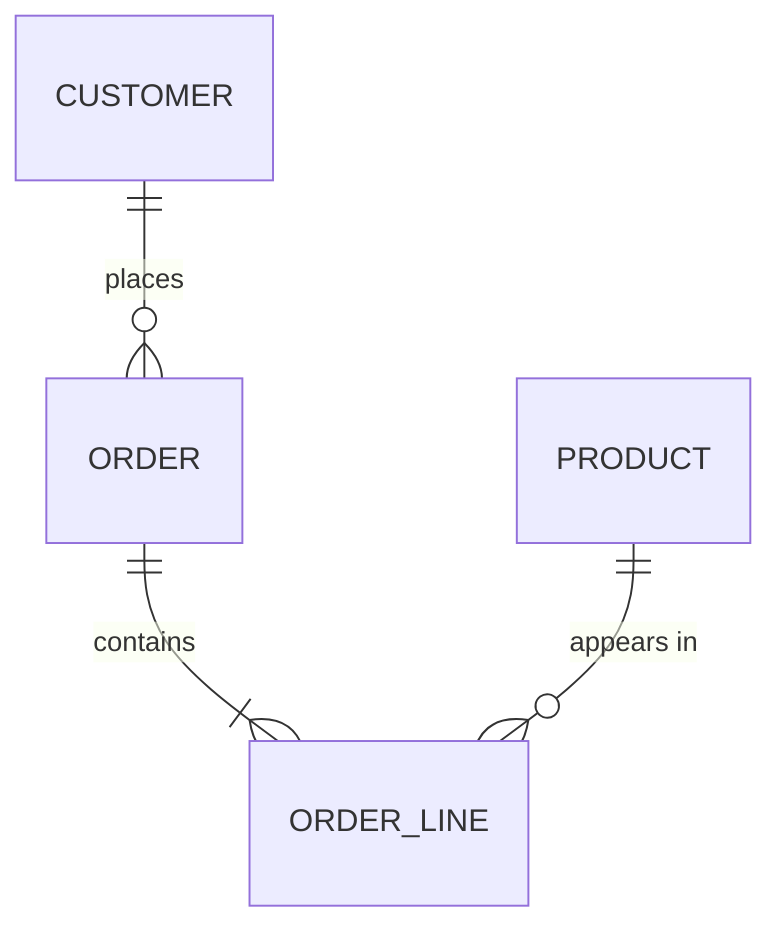

# Data Model: `<system or domain name>`

Stage: DESIGN, feeds [Gate 3: architecture and risks reviewed](../../os/STAGE-GATES.md)
Knowledge: [knowledge index](../../knowledge/INDEX.md)
Skill: [architect agent](../../agents/architect-agent.md)

<!-- The data model outlives the code that uses it. Migrations are the most expensive
     class of change a team ships, so this document gets reviewed harder than the
     service design. Fill it per bounded domain, not per table dump: if the entity
     list passes fifteen, split the document. -->

**Domain:** `<name>` · **Data owner:** `<name>` · **Reviewed by:** `<DBA or data engineer name>`
**Status:** Draft / In review / Approved · **Date:** `<YYYY-MM-DD>`

## 1. Entities and relationships

<!-- Mermaid ER syntax: ||--o{ reads "one to many", ||--|| "one to one",
     }o--o{ "many to many". Every many-to-many needs a named join entity before this
     document passes review. Replace the skeleton. -->

## 2. Entity definitions

<!-- One row per entity. "Source of truth" names the system that may create or
     correct this entity; every other system holds a copy and must say so. -->

| Entity | Definition (one sentence, business language) | Source of truth | Natural key | Surrogate key | Estimated volume at 12 months |
|---|---|---|---|---|---|
| | | | | | |

## 3. Data dictionary

<!-- One row per attribute that carries business meaning. Skip pure housekeeping
     columns (created_at and the like) unless retention rules apply to them.
     PII class: none / indirect (quasi-identifier) / direct / sensitive.
     The example row shows the expected precision; keep it as a guide and delete it
     before sign-off. -->

| Entity.attribute | Type | Meaning | Allowed values or range | PII class | Retention |
|---|---|---|---|---|---|
| CUSTOMER.email | string | Login and contact address | valid address, unique per customer | direct | life of account plus 90 days |
| | | | | | |

## 4. Keys, uniqueness, and integrity rules

<!-- Constraints the database enforces versus rules the application enforces. Every
     application-enforced rule is a standing bet that every future writer of this
     data knows the rule; record who owns that bet. -->

| Rule | Enforced by (database / application / pipeline) | Owner | What breaks if violated |
|---|---|---|---|
| | | | |

## 5. PII and classification summary

<!-- Roll up section 3: which entities carry personal data, under which lawful basis
     or policy, and who signed off. If the answer to any question below is unknown,
     it becomes a row in the risk register, not a blank. -->

- Entities carrying direct or sensitive PII: `<list>`
- Where that data is stored and processed, per market: `<list>`
- Deletion path when a subject requests erasure: `<mechanism and owner>`
- Access model: `<who can read production PII, and how access is logged>`
- Classification signed off by: `<privacy or compliance name, date>`

## 6. Migration and versioning notes

- Migration strategy for existing data, if any: `<expand and contract / backfill / none needed>`
- Rollback plan if a migration fails midway: `<plan>`
- Schema change approval: `<who reviews, in which channel>`

## Exit gate

- [ ] Diagram, entity table, and dictionary agree: same entities, same names
- [ ] Every many-to-many relationship has a named join entity
- [ ] Every entity names one source of truth
- [ ] Every attribute in the dictionary has a PII class and a retention value
- [ ] Application-enforced integrity rules have named owners
- [ ] PII summary signed off by privacy or compliance, by name
- [ ] The example dictionary row has been deleted
