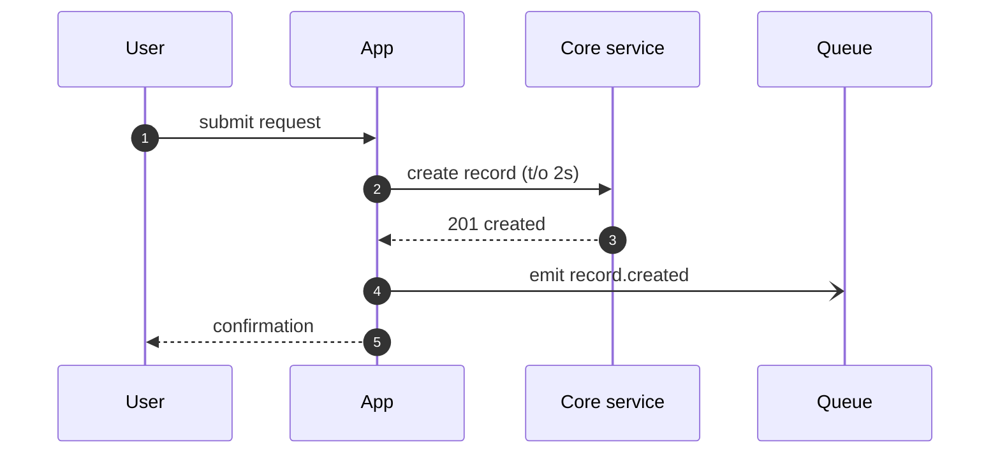
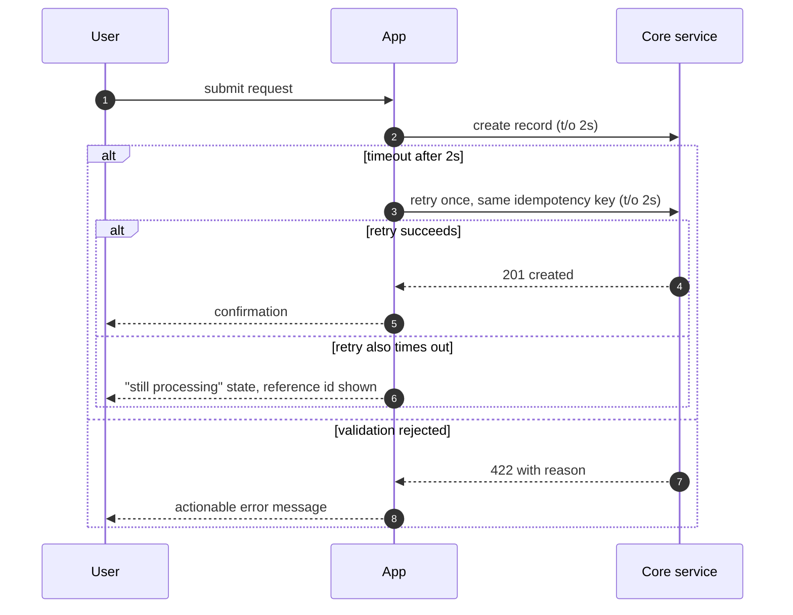

# Sequence Diagrams: `<flow or feature name>`

Stage: DESIGN, feeds [Gate 3: architecture and risks reviewed](../../os/STAGE-GATES.md)
Knowledge: [causal loop diagram](../../frameworks/systems/causal-loop-diagram.md)
Skill: manual

**What checks this.** A filled copy is bound to Gate 3 once it carries the artifact block, which `python3 tools/init_product.py <product> --stamp` writes from this template's own frontmatter. Approving Gate 3 with `pmos gate --bank-id design` then records the copy's revision, and any later edit makes that approval stale until the gate is proved again. Gate 3 is signed by the architect or senior engineer, the product owner and the security reviewer, per [os/STAGE-GATES.md](../../os/STAGE-GATES.md). No tool checks whether what you write is right; the people who sign the gate do. This paragraph is generated by `python3 tools/what_checks.py`.

Filled example: [Harbourgate web and app card authorisation](../../examples/harbourgate-sequence-diagram.md)

<!-- One diagram per flow that crosses a system boundary or holds money, data, or a
     user in suspense. The happy path is the cheap half; a sequence diagram earns
     review time when it shows what happens on timeout, rejection, and retry. A flow
     with no drawn error path is a flow whose error path will be designed in
     production. -->

**Flow:** `<name>` · **Author:** `<name>` · **Date:** `<YYYY-MM-DD>` · **Status:** `<Draft / In review / Gate 3 approved>`
**Source of the flow:** `<link to the PRD story or FRD requirement this draws>`

## Conventions

<!-- House rules for every diagram in this repo. Mermaid arrow meanings:
       A->>B   solid arrow: synchronous call, caller waits
       A-)B    open arrow: asynchronous message, caller does not wait
       B-->>A  dashed arrow: reply to a synchronous call
     Wrap failure branches in alt/else blocks. Mark every synchronous call with its
     timeout in the message label; a call with no timeout is an infinite one. -->

1. Synchronous calls carry their timeout: `charge (t/o 2s)`.
2. Asynchronous messages name the queue or topic in the label.
3. Every alt block has at least one failure branch.
4. Participants use system names from the [solution architecture one-pager](solution-architecture.md), verbatim.
5. Never label a call synchronous (`->>`) when the caller does not actually wait for
   a reply; a trap here is invisible until the timeout column goes empty and nobody
   can say what happens if the call never returns.

## 1. Happy path

<!-- Replace the skeleton with your flow. Keep one diagram per scenario; a diagram
     with more than three alt blocks should be split. -->

**Scenario:** [one phrase naming the specific case this diagram draws]
**Participants:** [list, matching the solution architecture one-pager's system names verbatim]

<!-- A trap: naming a participant here that the solution architecture one-pager does
     not carry. This fails silently until a reviewer checks both files side by
     side, and even then it is unclear whether the diagram or the architecture is
     the error. -->

## 2. Failure and timeout paths

<!-- One diagram or one alt block per failure class: downstream timeout, downstream
     rejection, duplicate submission. Show what the user sees in each branch. -->

**Failure classes drawn above:**

| Failure class | Trigger | What the user or caller sees |
|---|---|---|
| [timeout] | [condition that triggers it] | [message or state shown] |
| [rejection or another class] | [condition that triggers it] | [message or state shown] |

<!-- A trap: drawing only the timeout branch and calling the flow failure-aware,
     while a duplicate submission or a validation rejection never appears in this
     file at all. This fails when a "what the user sees" cell is left blank;
     silence there means production discovers the message first, not this
     review. -->

## 3. Open questions from drawing the flow

<!-- Drawing a sequence almost always surfaces an undecided behavior. Log each one
     here with an owner, then move it to the decision log or the risk register.
     This section must be empty, with the rows dispositioned, before Gate 3. -->

| Question surfaced | Owner | Moved to ([decision log](../execution/decision-log.md) / [risk register](../execution/risk-register.md) row) |
|---|---|---|
| | | |

## Exit gate

- [ ] Every synchronous call shows a timeout
- [ ] Every flow has at least one failure or timeout diagram, not just the happy path
- [ ] Each failure branch shows what the user or caller sees
- [ ] Retries state their idempotency mechanism
- [ ] Participant names match the solution architecture one-pager
- [ ] Section 3 questions are all dispositioned to a log or register
