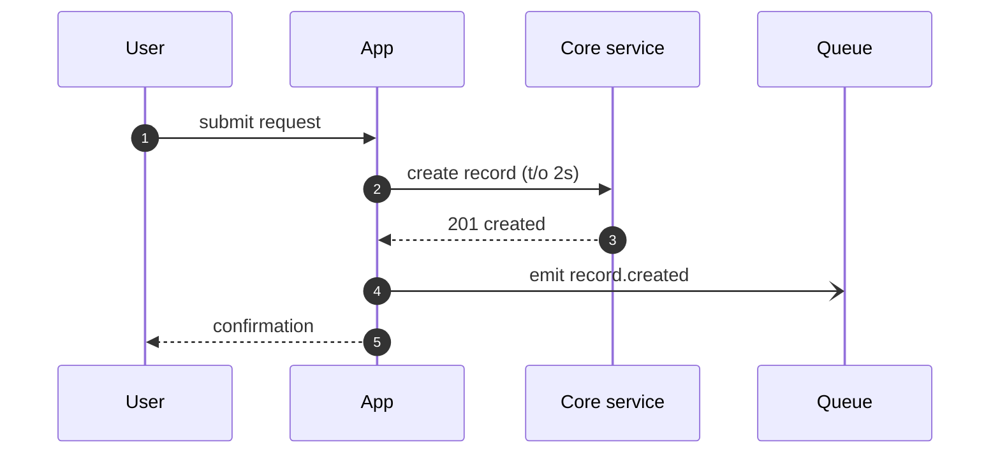
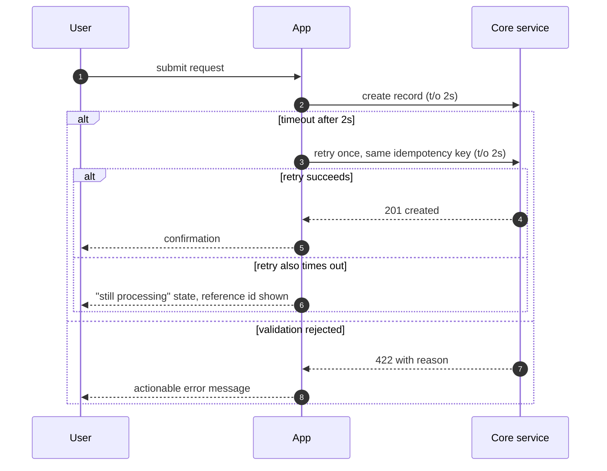

# Sequence Diagrams: `<flow or feature name>`

Stage: DESIGN, feeds [Gate 3: architecture and risks reviewed](../../os/STAGE-GATES.md)
Knowledge: [knowledge index](../../knowledge/INDEX.md)
Skill: manual

<!-- One diagram per flow that crosses a system boundary or holds money, data, or a
     user in suspense. The happy path is the cheap half; a sequence diagram earns
     review time when it shows what happens on timeout, rejection, and retry. A flow
     with no drawn error path is a flow whose error path will be designed in
     production. -->

**Flow:** `<name>` · **Author:** `<name>` · **Date:** `<YYYY-MM-DD>`
**Source of the flow:** `<link to the PRD story or FRD requirement this draws>`

## Conventions

<!-- House rules for every diagram in this repo. Mermaid arrow meanings:
       A->>B   solid arrow: synchronous call, caller waits
       A-)B    open arrow: asynchronous message, caller does not wait
       B-->>A  dashed arrow: reply to a synchronous call
     Wrap failure branches in alt/else blocks. Mark every synchronous call with its
     timeout in the message label; a call with no timeout is an infinite one. -->

1. Synchronous calls carry their timeout: `charge (t/o 2s)`.
2. Asynchronous messages name the queue or topic in the label.
3. Every alt block has at least one failure branch.
4. Participants use system names from the solution architecture one-pager, verbatim.

## 1. Happy path

<!-- Replace the skeleton with your flow. Keep one diagram per scenario; a diagram
     with more than three alt blocks should be split. -->

## 2. Failure and timeout paths

<!-- One diagram or one alt block per failure class: downstream timeout, downstream
     rejection, duplicate submission. Show what the user sees in each branch. -->

## 3. Open questions from drawing the flow

<!-- Drawing a sequence almost always surfaces an undecided behavior. Log each one
     here with an owner, then move it to the decision log or the risk register.
     This section must be empty, with the rows dispositioned, before Gate 3. -->

| Question surfaced | Owner | Moved to (decision log / risk register row) |
|---|---|---|
| | | |

## Exit gate

- [ ] Every synchronous call shows a timeout
- [ ] Every flow has at least one failure or timeout diagram, not just the happy path
- [ ] Each failure branch shows what the user or caller sees
- [ ] Retries state their idempotency mechanism
- [ ] Participant names match the solution architecture one-pager
- [ ] Section 3 questions are all dispositioned to a log or register
