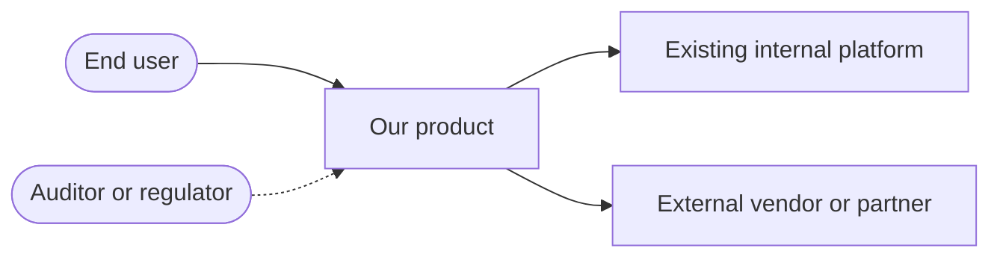

# Solution Architecture One-Pager: `<initiative name>`

Stage: DESIGN, feeds [Gate 3: architecture and risks reviewed](../../os/STAGE-GATES.md)
Knowledge: [knowledge index](../../knowledge/INDEX.md)
Skill: [drafting-agent](../../agents/drafting-agent.md)

<!-- The one-pager is the document an executive or a partner team actually reads. It
     sits above the system design document: one initiative may span several systems,
     and this page says how the pieces fit and what is bought versus built. If you
     cannot fit it on roughly one page, the initiative is not yet understood well
     enough to review. -->

**Initiative:** `<name>` · **Architect:** `<name>` · **Product owner:** `<name>`
**Status:** Draft / In review / Approved · **Date:** `<YYYY-MM-DD>`

## 1. Context diagram

<!-- The system in its world: users, our platform, external parties. No internals.
     Replace the skeleton. -->

## 2. Capability map

<!-- Break the initiative into capabilities, not features: things the business must be
     able to do. Each capability is delivered by exactly one system; if two systems
     share one, the boundary is wrong. -->

| Capability | Delivered by (system) | Build / buy / reuse | Status today |
|---|---|---|---|
| | | | |

## 3. Integration points

<!-- Every line that crosses a system boundary in the context diagram gets a row. The
     detail lives in the integrations document; this table is the map. -->

| From | To | Purpose (one clause) | Detail |
|---|---|---|---|
| `<system>` | `<system>` | `<what crosses and why>` | `<link to the filled integrations.md row>` |

## 4. Build vs buy rationale

<!-- For each capability marked build or buy above, the reasoning in two or three
     sentences. The honest test for build: is this capability something customers
     choose us for? If not, the burden of proof sits on building it. Record the
     switching cost of the buy option now, while nobody is defending a sunk cost. -->

| Capability | Decision | Rationale | Switching cost if we are wrong |
|---|---|---|---|
| | | | |

## 5. What this commits us to

<!-- Two to four bullets an executive should sign up for with eyes open: the ongoing
     cost, the vendor relationship, the team that must exist, the migration that
     becomes unavoidable. -->

- `<commitment 1>`
- `<commitment 2>`

## Exit gate

- [ ] The context diagram shows every external party, including auditors where relevant
- [ ] Every capability maps to exactly one delivering system
- [ ] Every boundary-crossing line has a row in section 3 with a link to integration detail
- [ ] Every build or buy decision records a rationale and a switching cost
- [ ] The commitments in section 5 have been read by someone with budget authority
