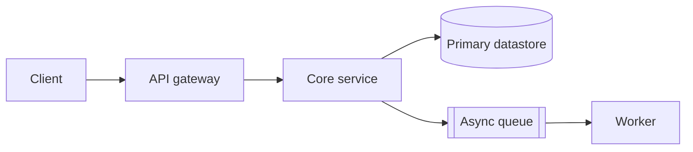

# System Design Document: `<system or change name>`

Stage: DESIGN, feeds [Gate 3: architecture and risks reviewed](../../os/STAGE-GATES.md)
Knowledge: [Cagan on the four risks](../../knowledge/cagan-product-teams.md)
Skill: [architect agent](../../agents/architect-agent.md)

<!-- One document per system or per major change to a system. Write it before code,
     revise it during review, freeze it at Gate 3. After the gate, changes to the
     decisions in here go through a new ADR (templates/architecture/adr.md), not
     through silent edits to this file. -->

**System:** `<name>` · **Design owner:** `<name>` · **Reviewers:** `<names>`
**Status:** Draft / In review / Approved · **Date:** `<YYYY-MM-DD>`
**Feeds from:** `<link to the PRD and FRD this design implements>`

## 1. Goals

<!-- Three to six bullets. Each goal is testable: someone can check whether the built
     system meets it. "Fast" is not a goal; "p95 read latency under 300 ms at 100
     requests per second" is. Pull numbers from the NFR document rather than inventing
     new ones here. -->

- `<goal 1, with its number or its source>`
- `<goal 2>`
- `<goal 3>`

## 2. Non-goals

<!-- What this design deliberately does not solve. Non-goals are the cheapest scope
     control you have: every reviewer who wants to add one more thing gets pointed
     here. State each with the reason it is out. -->

- `<non-goal 1, and why it is out of scope for this design>`
- `<non-goal 2>`

## 3. Context and constraints

<!-- The facts the design cannot change: existing systems it must live with, team
     skills, budget ceilings, compliance boundaries, deadlines that are real. A
     constraint with no source is an assumption; move it to the assumptions register. -->

| Constraint | Type (technical / organizational / regulatory / budget) | Source |
|---|---|---|
| | | |

## 4. Design overview and diagram

<!-- One paragraph saying how the system works, readable by a PM who will never open
     the code. Then one diagram. Mermaid renders on GitHub; replace the skeleton below
     with your components. Keep it under 12 nodes; past that, split the design. -->

`<one-paragraph summary of the approach>`

## 5. Components

<!-- One row per box in the diagram. "Owner" is a person or a team that exists today. -->

| Component | Responsibility (one sentence) | Owner | New or existing | Depends on |
|---|---|---|---|---|
| | | | | |

## 6. Alternatives considered

<!-- Minimum two real alternatives, including "do nothing" or "buy instead of build"
     where honest. An alternatives section with one straw man is a decision already
     made wearing a review costume. For the chosen option, the reasoning lives in
     section 7; for each rejected option, say what would have to change for it to win. -->

| Alternative | Summary | Why not chosen | What would change the answer |
|---|---|---|---|
| | | | |

## 7. Tradeoffs accepted

<!-- Every design buys something by giving something up. Name the price out loud so
     nobody discovers it in an incident review. -->

- We chose `<property gained>` over `<property given up>` because `<reason>`.
- We chose `<property gained>` over `<property given up>` because `<reason>`.

## 8. Cross-cutting concerns

<!-- Do not duplicate content that has its own template. Link the filled documents. -->

- Data model: `<link to the filled data-model.md>`
- API contracts: `<link to the filled api-contract.md>`
- Integrations: `<link to the filled integrations.md>`
- Security: `<link to the filled security-architecture.md>`
- Observability: `<link to the filled observability.md>`
- Risks raised by this design: `<row numbers in the risk register>`

## Exit gate

<!-- Check these before Gate 3 review. An unchecked box is a reason to postpone the
     review, not a note for the minutes. -->

- [ ] Every goal in section 1 has a number or names the document that holds the number
- [ ] Non-goals are stated and at least one scope request has been pointed at them
- [ ] The diagram matches the component table: same boxes, same names
- [ ] At least two real alternatives are recorded with reasons and reversal conditions
- [ ] Every component has an owner who knows they own it
- [ ] The cross-cutting links in section 8 resolve to filled documents, not blank templates
- [ ] New risks from this design are rows in the risk register with owners
